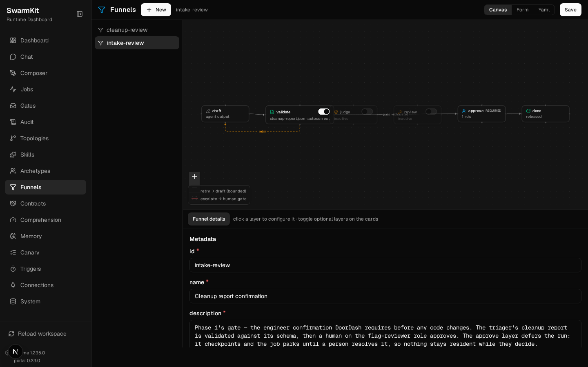
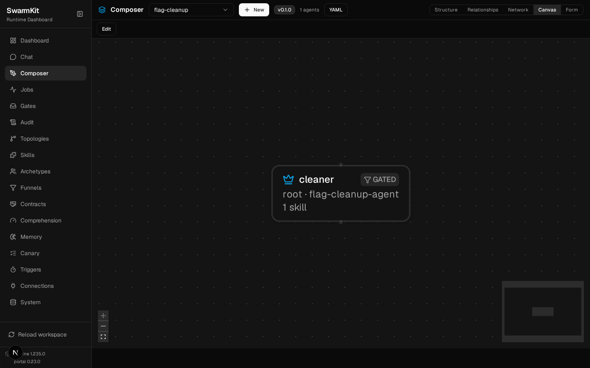

# Case study: agentic feature-flag cleanup, as data

DoorDash recently described an AI system that retires stale feature flags across 623 repositories —
60,000+ flags, ~1,000 stale — with agents doing the code changes and humans signing off. It's a
great, concrete piece of agent engineering ([InfoQ write-up](https://www.infoq.com/news/2026/09/doordash-feature-flag-cleanup/)).

Reading it, what struck me is that DoorDash built — on Google's ADK, with custom worktree and
validation plumbing — almost exactly the seams SwarmKit ships as its core. So here's the same system
expressed as **topology-as-data**: no orchestration code, the governance and isolation are the
runtime's, and the whole thing runs deterministically on the mock provider. The example is in the
repo at [`examples/flag-cleanup/`](https://github.com/delivstat/swarmkit/tree/main/examples/flag-cleanup).

## What DoorDash built

Two phases:

1. **Orchestration & review** — an orchestrator agent pulls stale-flag tickets from Jira, searches
   the repos, queries the experimentation platform (over MCP) for rollout metadata, and writes a
   cleanup report an engineer confirms before anything changes.
2. **Automated cleanup** — cleanup agents work concurrently in **isolated git worktrees**, remove
   the flag and its dependency-injected wrapper, inline the winning branch, fix the tests, run the
   build + tests + coverage + static analysis, and open a PR **only after every check passes** — a
   one-hour budget per agent.

Their reported numbers: of 50 flags, 31 merged first pass, 14 needed a revision, 5 needed an
engineer; ~13.8 minutes and $4.79 per flag versus one-to-two hours by hand.

Now map each piece to a SwarmKit primitive.

## The cleanup agent → a harness executor

The cleanup agent is the whole point, and it's exactly what SwarmKit's **harness executor** is: a
coding harness (Claude Code, or any) run in an **ephemeral git worktree** — produces a diff, never
integrates — under a **budget**, reaching its tools through a **governed MCP gateway** where every
call is permission-tiered and audited.

```yaml
# archetypes/flag-cleanup-agent.yaml
kind: Archetype
metadata: { id: flag-cleanup-agent, name: Flag cleanup agent }
role: root
executor:
  kind: harness
  ref: claude-code
  config:
    budget:
      max_wall_clock_minutes: 60   # DoorDash's one-hour ceiling, declared
      max_turns: 40
      max_cost_usd: 8.0
```

The worktree isolation, the budget stop, and the per-tool audit trail aren't code you write — they
come with the executor. DoorDash's "$4.79 / 13.8 min per flag" is just the run's usage totals and
duration on the job row.

## "PR only after checks pass, and a human signs off" → a funnel

A `Funnel` chains *validate → judge → review → approve* into one gate on a node. For the cleanup
diff: the harness runs the build and tests itself (they show in its tool trail), a **decision skill**
judges the diff, and a **human approves** — the only exit, and where the PR is opened. A finding
routes the critique **back to the harness** for a bounded revision (their "14 needed a revision").

```yaml
# funnels/cleanup-review.yaml
kind: Funnel
metadata: { id: cleanup-review }
judge:
  skill: code-review        # verdict pass | needs-revision → route-back on a finding
  threshold: 0.8
  max_retries: 2
approve:
  rules:
    - scope: flags:approve  # a human-only scope — no agent can hold it
      roles: [flag-reviewer]
      quorum: any
  exclude_author: true
```

`flags:approve` is a reserved human-identity scope; the cleanup literally cannot merge itself. And
the approve layer **defers** the run — it checkpoints and the job parks until a person resolves it,
so nothing stays resident while an engineer decides (their "engineer confirmation before
proceeding").

## The orchestrator's report → a coordinator with an approve gate

Phase 1 is a model agent that produces a cleanup report, shape-checked for free by `output_schema`,
and gated by an `intake-review` funnel whose `approve` layer is the engineer confirmation. Its tools
— Jira, code search, the experimentation platform — are MCP servers, governed through the same
gateway.

Here is that funnel in the portal — the fixed *draft → validate → judge → review → approve*
pipeline, with the **validate** layer active (the report checked against `cleanup-report.json`, with
autocorrect), the automated middle layers off for this gate, and **approve** as the only exit. The
`retry → draft` edge is the bounded loop; `escalate → human gate` is what happens when it is
exhausted — validation drives the retry, it never silently advances:



Validation here is deterministic and free — a JSON Schema check, no LLM — and it runs *before* the
judge or a human ever sees the artifact, so a malformed report is corrected or bounced, not
reviewed.

## What's SwarmKit, and what's yours

Here's the honest line, and it's the interesting part. SwarmKit runs **one bounded, governed cleanup
per flag** — the harness, its gate, its record. The **daily fan-out across 623 repos and the Jira
ticket lifecycle are the calling application's job** — a cron reads stale flags and starts a run per
flag over `POST /run` with a shared correlation id; SwarmKit runs each and keeps the record. That's
not a gap; it's the design: sequencing across weeks is application logic, and keeping it out of the
runtime is why the runtime stays a runtime.

## It runs

The example is runnable and deterministic — the **real** `claude-code` adapter driven by a scripted
`stream-json` transcript through the **real** funnel gate (only the subprocess launch is faked). No
keys, no network:

```
$ uv run python examples/flag-cleanup/demo.py

① Clean removal — harness → diff → code-review passes → reviewer approves
   harness (claude-code, worktree, net=deny) draft#1: tools=Read → Edit → Edit → Bash  cost=$0.18  status=success
   code-review → PASS 0.93  advance
   ✓ alice signed off → open PR
   GATE: APPROVED

② Route-back — first diff leaves a leftover reference; the review catches it
   harness (claude-code, worktree, net=deny) draft#1: tools=Read → Edit → Edit → Bash  cost=$0.31  status=success
   code-review → NEEDS-REVISION 0.40  ⇒ route back
     finding: "flags.py still carries the checkout_v2_enabled key and unused import"
   ↩ route-back — critique to the harness: "flags.py still carries the checkout_v2_enabled key and unused import"
   harness (claude-code, worktree, net=deny) draft#2, revised: tools=Read → Edit → Edit → Bash  cost=$0.18  status=success
   code-review → PASS 0.93  advance
   ✓ alice signed off → open PR
   GATE: APPROVED
```

The second scenario is the one that matters: the first diff inlines the branch but leaves a stale
reference behind, the review catches it, and the critique routes back to the harness — the exact
failure path DoorDash's revisions handle.

The topology in the portal's composer, `cleaner` carrying its **GATED** badge — the funnel is on the
node, visible, not buried in code:



## Try it

```bash
git clone https://github.com/delivstat/swarmkit && cd swarmkit
uv run python examples/flag-cleanup/demo.py
uv run swarmkit validate examples/flag-cleanup/workspace --require --require-verified
```

The whole system is `examples/flag-cleanup/` — two topologies, two archetypes, two funnels, three
skills, a role registry. No orchestration code. That's the claim SwarmKit is making: the governance,
the isolation, and the human gates are the runtime's; what you write is the shape.
