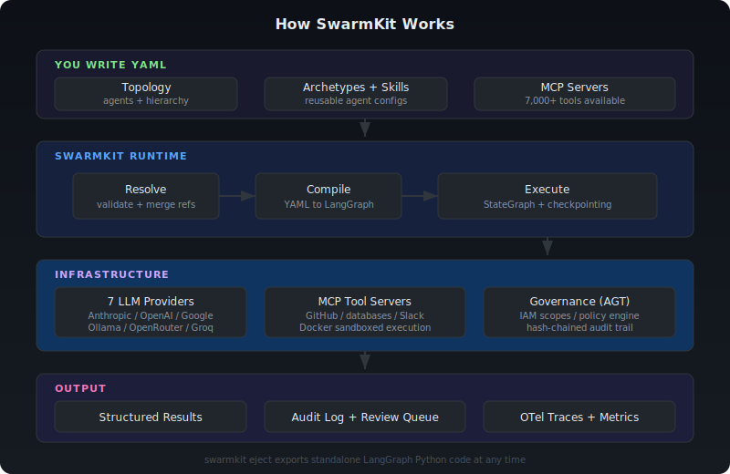

# SwarmKit

**Multi-agent AI swarms as YAML, not code.**

Define agents, skills, and governance in a topology file. SwarmKit compiles it to LangGraph and runs it.

---

## The problem

Building multi-agent systems with LangGraph means writing hundreds of lines of Python for every topology: node functions, edge routing, state management, tool wiring, governance, error handling. Change the agent structure and you're refactoring code, not configuration.

## The fix

```yaml
# A complete 10-agent code review swarm. No Python.
apiVersion: swarmkit/v1
kind: Topology
metadata:
  name: code-review
agents:
  root:
    id: supervisor
    archetype: supervisor-leader
    children:
      - id: engineering-leader
        archetype: engineering-leader
        children:
          - id: code-reviewer
            archetype: code-analyst
            skills: [code-quality-review, security-scan]
          - id: github-reader
            archetype: github-reader
            skills: [github-pr-read]
      - id: qa-leader
        archetype: qa-leader
        children:
          - id: test-analyst
            archetype: test-analyst
            skills: [test-coverage-review, run-tests]
```

```bash
uv tool install swarmkit-runtime
swarmkit run my-swarm/ code-review --input "Review PR #49"
```

SwarmKit compiles this YAML to a LangGraph `StateGraph`, wires MCP tool servers, enforces governance policies, and runs the swarm. You keep the full power of LangGraph (checkpointing, streaming, state management) without writing the boilerplate.

## Why SwarmKit over alternatives

| | SwarmKit | LangGraph (raw) | CrewAI | Claude Agent SDK |
|---|---|---|---|---|
| Agent definition | YAML topology | Python code | Python classes | Code + config |
| Multi-agent orchestration | Declarative hierarchy + DAG | Manual graph construction | Role-based | Single agent loop |
| Tool integration | 7,000+ MCP servers via YAML config | Build or wire yourself | Built-in + MCP | Built-in harness + MCP |
| Governance / permissions | IAM scopes + policy engine (AGT) | DIY | None | None |
| Audit trail | Hash-chained, append-only | DIY | None | None |
| Human-in-the-loop | Native approval gates in YAML | Manual interrupt points | None | None |
| Escape hatch | `swarmkit eject` to pure LangGraph (planned) | N/A | None | None |
| Model support | 7 providers (Anthropic, OpenAI, Google, Ollama, ...) | Any | Multiple | Claude only |

## Quick start

### Install

```bash
curl -LsSf https://astral.sh/uv/install.sh | sh   # install uv if you don't have it
uv tool install swarmkit-runtime
```

### Create and run a swarm

```bash
# Create a workspace through conversation (you never write YAML)
swarmkit init my-swarm/

# Run it
swarmkit run my-swarm/ my-topology --input "Do the thing"

# Or use the reference code review swarm out of the box
swarmkit run reference/ code-review --input "Review PR #49 on delivstat/swarmkit"
```

### 30-second workflow

```bash
swarmkit init my-swarm/                                # conversational workspace creation
swarmkit validate my-swarm/ --tree                     # validate + show agent tree
swarmkit run my-swarm/ my-topology --input "Greet us"  # run end-to-end
swarmkit chat my-swarm/ my-topology                    # multi-turn conversation
swarmkit author skill my-swarm/                        # add skills conversationally
swarmkit edit my-swarm/ --input "Add a security scan"  # modify via conversation
```

## How it works



## Key features

### Topology as data

Swarms are YAML files, not Python. Declare agents, hierarchy, skills, model preferences, and IAM scopes. The runtime interprets them — no code generation.

### Skills as the only extension

Need custom logic? Write a skill (LLM prompt or MCP server), not a Python plugin. SwarmKit's CLI can even write skills for you:

```bash
swarmkit author skill my-swarm/                # single-agent authoring
swarmkit author skill my-swarm/ --thorough     # multi-agent authoring swarm
swarmkit author mcp-server my-swarm/           # generate an MCP server
```

### 7,000+ tools via MCP

Wire any MCP server in YAML. GitHub, databases, Slack, browsers, filesystems — no building tools from scratch:

```yaml
mcp_servers:
  - id: github
    transport: stdio
    command: ["npx", "-y", "@modelcontextprotocol/server-github"]
    env:
      GITHUB_PERSONAL_ACCESS_TOKEN: "${GITHUB_TOKEN}"
```

Sandboxed execution available: `sandboxed: true` runs MCP servers in Docker with `--network=none` and read-only mounts.

### Governance built in

Every tool call goes through `evaluate_action` before execution. IAM scopes per agent. Hash-chained audit trail via Microsoft AGT. Mock provider for dev, AGT for production:

```yaml
governance:
  provider: agt
  config:
    policies_dir: ./policies
```

### 7 model providers

Auto-detected from environment variables. Mix providers within a single topology:

| Provider | Env var | Example |
|---|---|---|
| Anthropic | `ANTHROPIC_API_KEY` | `claude-sonnet-4-6` |
| Google | `GOOGLE_API_KEY` | `gemini-2.5-flash` |
| OpenAI | `OPENAI_API_KEY` | `gpt-4o` |
| OpenRouter | `OPENROUTER_API_KEY` | `meta-llama/llama-3.3-70b-instruct` |
| Groq | `GROQ_API_KEY` | `llama-3.3-70b-versatile` |
| Together | `TOGETHER_API_KEY` | `meta-llama/llama-3.3-70b` |
| Ollama | (always available) | `llama3.3` |

### Observability (M6 — shipped)

Every run records structured audit events to SQLite. OpenTelemetry traces, metrics, governance circuit breakers, notifications, and a local prompt ring buffer are built in.

```bash
swarmkit status my-swarm/                      # recent runs from audit store
swarmkit logs my-swarm/ --last 3               # detailed events (--run-id, --agent filters)
swarmkit why <run-id> my-swarm/                # LLM explains what happened
swarmkit ask "Which agents are slowest?" -w .  # conversational observer (--run scoping)
swarmkit debug my-swarm/ --span-id <id>        # retrieve prompts locally
swarmkit review list my-swarm/                 # pending human reviews
swarmkit gaps my-swarm/                        # recorded skill gaps
```

**Coming soon:** OpenTelemetry integration (traces + metrics), intent drift detection, local prompt ring buffer, governance circuit breakers.

## Reference topologies

Ships with production-quality topologies you can use immediately:

**Code Review Swarm** — 3 leaders (Engineering, QA, Ops), 10 agents. Fetches PRs via GitHub MCP, reviews code quality + security + test coverage, HITL approval for deployment:

```bash
swarmkit run reference/ code-review --input "Review PR #49 on delivstat/swarmkit"
```

**Skill Authoring Swarm** — 6 specialist agents create SwarmKit artifacts through conversation, grounded by the Knowledge MCP Server:

```bash
swarmkit author skill my-workspace/ --thorough
```

**16 archetypes** and **20 skills** included under [`reference/`](https://github.com/delivstat/swarmkit/tree/main/reference/).

## Real-world example

The [`examples/sterling-oms/`](https://github.com/delivstat/swarmkit/tree/main/examples/sterling-oms/) workspace demonstrates reasoning over 1,000+ API javadocs with multiple MCP servers (ChromaDB vector search, FTS5 keyword search, CDT config server) — a production-grade setup for enterprise domain knowledge.

## Roadmap

See the [Implementation Plan](architecture/implementation-plan.md) for the full 4-phase roadmap.

### Phase 1 — Foundation (complete)

| # | Milestone | Status |
|---|---|---|
| M0 | Schemas (5 artifact types, dual-language validators, codegen) | Done |
| M1 | Topology loading and resolution | Done |
| M2 | GovernanceProvider + AGT integration | Done |
| M2.5 | ModelProvider abstraction (7 built-in providers) | Done |
| M3 | LangGraph compiler (capability + coordination + DAG) | Done |
| M3.5 | Conversational authoring (`swarmkit init/author/edit`) | Done |
| M4 | Decision skills, structured output, review queue, HITL | Done |
| M5 | MCP integration (stdio + HTTP, sandboxed servers, governance gating) | Done |

### Phase 2 — Runtime completion (current)

| # | Milestone | Status |
|---|---|---|
| M6 | Observability: AuditProvider, OTel traces + metrics, ring buffer, circuit breakers, notifications, CLI rewrite, audit redaction | Done |
| M6.5 | Workspace env configuration: `workspace.env.yaml` + `SWARMKIT_ENV` switching | Done |
| M7 | Intent drift detection: IntentObserver, schema extension, compiler wiring, authoring integration | Done |

### Phase 3-4 — Ecosystem + production readiness

| # | Milestone | Status |
|---|---|---|
| M8 | Knowledge + skills ecosystem: skill registry CLI, user knowledge server | Planned |
| M9 | Reference topologies: code review + skill authoring swarms runnable e2e | Planned |
| M10 | Eject + execution modes: `swarmkit eject`, HTTP server, canary deployments | Planned |
| M11 | Launch prep: docs site, PyPI/npm publish, expertise packages | Planned |

## For LLMs

SwarmKit docs are designed for LLM consumption. The repo ships [`llms.txt`](https://github.com/delivstat/swarmkit/blob/main/llms.txt) at the root:

```bash
swarmkit knowledge-pack -o pack.md    # bundle everything for any LLM
swarmkit knowledge-server             # live MCP server for Claude Code / Cursor
```
