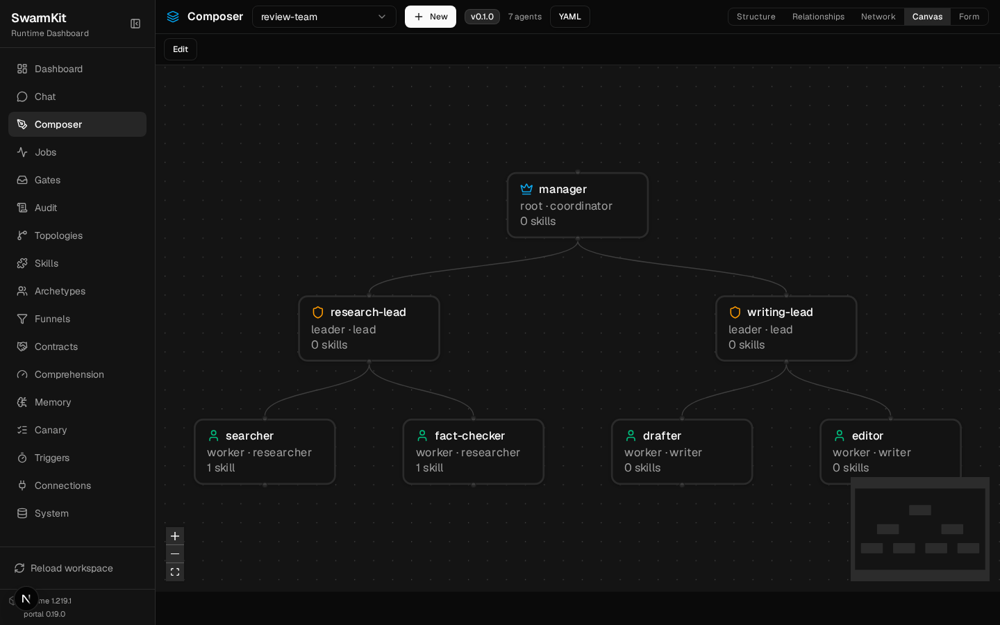
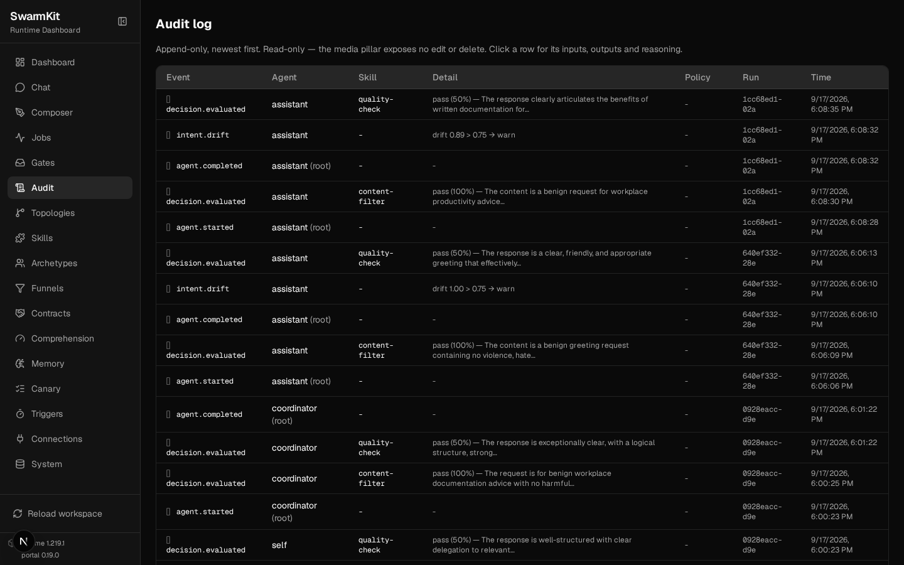
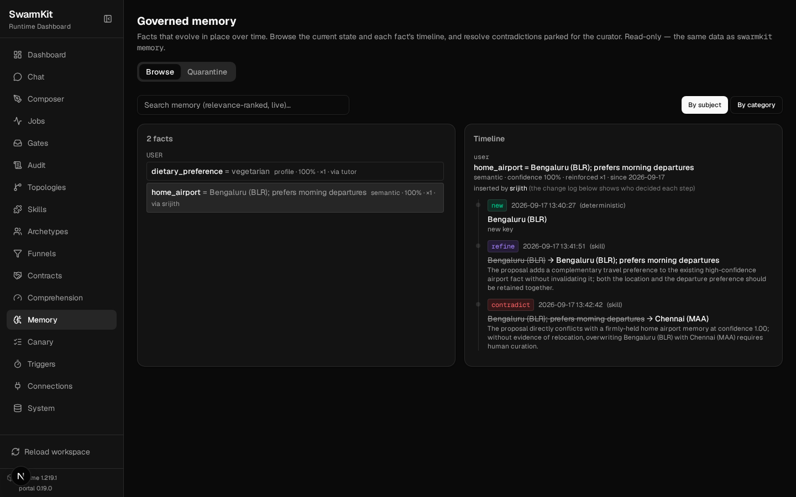
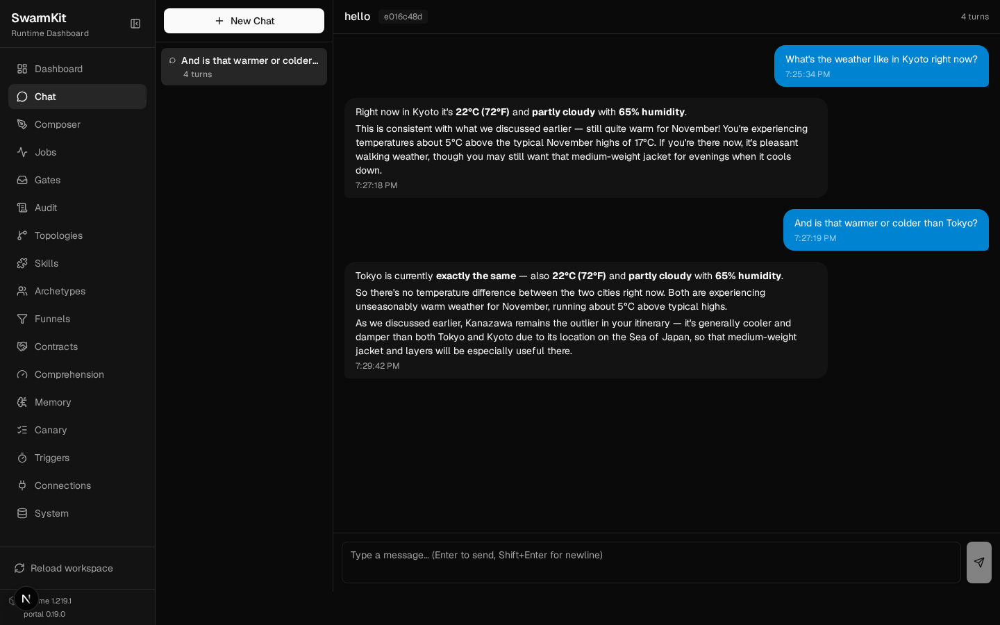
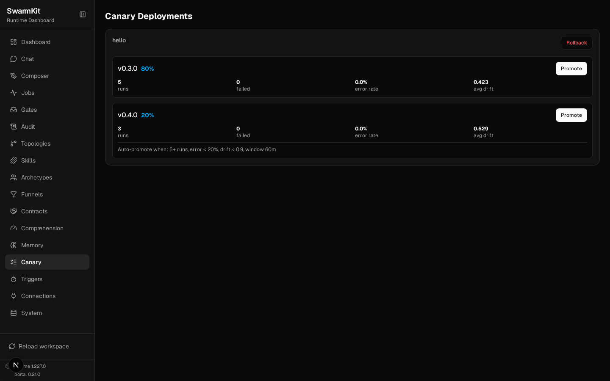

# SwarmKit

<div class="sk-home" markdown>

<section class="sk-hero" markdown>

<h1>The open-source <em>AI platform runtime</em>.</h1>

<p class="lead">Define agents, tools and governance as data, not code. SwarmKit runs them under real gates, records every step, and grows them — from a single agent to a multi-agent swarm — through a portal, a CLI and an HTTP API that ship together.</p>

<div class="sk-cta">
  <a class="primary" href="getting-started/install/">Install in 30 seconds</a>
  <a href="tutorials/">22-level guided tutorial</a>
  <a href="portal/">See the portal</a>
  <a href="https://github.com/delivstat/swarmkit">GitHub</a>
</div>

<video autoplay muted loop playsinline preload="metadata" poster="img/tutorials/15-job-full.png">
  <source src="img/portal/portal-tour.mp4" type="video/mp4">
  <source src="img/portal/portal-tour.webm" type="video/webm">
</video>

<div class="sk-stats">
  <div><strong>11</strong> open artifact schemas</div>
  <div><strong>5</strong> skill backings — MCP, prompt, command, composed, agent</div>
  <div><strong>2</strong> executor kinds — a model, or a coding harness as a node</div>
  <div><strong>12</strong> bundled model providers, declared in YAML</div>
  <div><strong>7,000+</strong> MCP servers wire in as config</div>
  <div><strong>~4,000</strong> tests in CI</div>
</div>

</section>

<div class="sk-yaml" markdown>

<div markdown>

## A swarm is a file

Ten agents, three leaders, tools, a human gate on deployment — and no Python. Change the structure and you edit configuration, not code. Every artifact is open YAML any conformant runtime can run, and the portal edits the same file you would.

The runtime compiles it to a LangGraph `StateGraph`, starts the tools it needs, enforces the governance you declared, and hands you a run you can replay. A node runs on a **model** by default — or on a **coding harness** (Claude Code, Codex, Gemini CLI, opencode) as the executor, editing files and running tests under the very same gates and audit.

[Level 1: Hello World →](tutorials/01-hello-world.md){ .md-button }

</div>

```yaml
# A complete code review swarm.
apiVersion: swarmkit/v1
kind: Topology
metadata:
  name: code-review
agents:
  root:
    id: supervisor
    archetype: supervisor-leader
    children:
      - id: engineering-leader
        archetype: engineering-leader
        children:
          - id: code-reviewer
            archetype: code-analyst
            skills: [code-quality-review, security-scan]
          - id: github-reader
            archetype: github-reader
            skills: [github-pr-read]
      - id: qa-leader
        archetype: qa-leader
        children:
          - id: test-analyst
            archetype: test-analyst
            skills: [test-coverage-review, run-tests]
```

</div>

## What you get

<div class="sk-grid" markdown>

<div class="sk-card" markdown>
<div class="shot"></div>
<div class="body" markdown>
### Topologies you can see
Hierarchies, parallel workers, DAG dependencies — drawn from the YAML on the canvas, edited as a form or as the file.
<a class="more" href="tutorials/04-multi-agent/">Multi-agent →</a>
</div>
</div>

<div class="sk-card" markdown>
<div class="shot"></div>
<div class="body" markdown>
### Every run, explained
Which agent fired, what each cost, the span waterfall, the exact prompt a model saw. `trace`, `why`, `ask`, `debug` from the terminal; the same on the job page.
<a class="more" href="tutorials/08-observability/">Observability →</a>
</div>
</div>

<div class="sk-card" markdown>
<div class="shot"></div>
<div class="body" markdown>
### Gates that hold
Decision skills run before an agent sees input and after it answers. A funnel judges the artifact, then two named people approve — quorum enforced by the runtime, not the prompt.
<a class="more" href="tutorials/07-governance/">Governance →</a>
</div>
</div>

<div class="sk-card" markdown>
<div class="shot"></div>
<div class="body" markdown>
### An audit trail nobody can edit
Append-only from the agents' side: verdicts, tool calls with their policy decision, drift scores, gate resolutions — with the reasoning attached.
<a class="more" href="tutorials/08-observability/#the-same-thing-in-the-portal">Audit →</a>
</div>
</div>

<div class="sk-card" markdown>
<div class="shot"></div>
<div class="body" markdown>
### One primitive: the skill, five backings
A capability is always a skill — an MCP tool, an LLM prompt, a local command, a composition of skills, or another agent (local or remote over A2A). MCP is just the largest of the five: 7,000+ servers wire in as a few lines of `mcp_servers`, with permission tiers, declared `effects` and sandboxing — a `readonly` server cannot write, whatever the model asks.
<a class="more" href="tutorials/03-skills/">Skills →</a>
</div>
</div>

<div class="sk-card" markdown>
<div class="shot"></div>
<div class="body" markdown>
### Two memories, one of them curated
Runs remember what they learned. Facts that matter are reconciled on write, quarantined on conflict, and resolved by a person — with the full history of every change.
<a class="more" href="tutorials/09-conversations-memory/">Memory →</a>
</div>
</div>

<div class="sk-card" markdown>
<div class="shot"></div>
<div class="body" markdown>
### Chat, API, MCP — same run
`swarmkit chat`, `POST /run`, SSE streams, a conversation API, and every topology as a tool for Claude Desktop or Cursor. A chat started in the terminal continues in the browser.
<a class="more" href="tutorials/11-serve-api/">Serve →</a>
</div>
</div>

<div class="sk-card" markdown>
<div class="shot"></div>
<div class="body" markdown>
### Ship a new version safely
Two versions of one topology side by side, traffic split by weight, promotion when the error rate and drift say so — or by hand, or rolled back. Cron and signed webhooks start runs on their own.
<a class="more" href="tutorials/12-triggers-canary/">Triggers & canary →</a>
</div>
</div>

<div class="sk-card" markdown>
<div class="shot"></div>
<div class="body" markdown>
### Grows by conversation
Describe a skill, a topology or a whole workspace; an agent drafts it, validates it against the schema, and writes it only after you say yes. Gaps an agent hits are logged for the next one.
<a class="more" href="tutorials/13-authoring-review/">Authoring →</a>
</div>
</div>

</div>

## Thirty seconds to a running swarm

<div class="sk-steps">
<div>
<strong>Install</strong>
<p><code>uv tool install "swarmkit-runtime[ui]"</code> — the CLI and server, with the portal.</p>
</div>
<div>
<strong>Write a workspace</strong>
<p>Or let <code>swarmkit init</code> write it from a sentence. A workspace is a directory of YAML.</p>
</div>
<div>
<strong>Run it</strong>
<p><code>swarmkit run . hello --input "…"</code> — or <code>swarmkit serve .</code> and open the portal.</p>
</div>
<div>
<strong>Read what happened</strong>
<p><code>swarmkit trace</code>, <code>why</code>, <code>ask</code>, <code>debug</code>. Then add a gate, a tool, a second agent.</p>
</div>
</div>

```bash
curl -LsSf https://astral.sh/uv/install.sh | sh
uv tool install "swarmkit-runtime[ui]"   # [ui] is the portal; without it `swarmkit serve` is API-only
swarmkit init my-swarm            # a conversation; it writes the YAML
swarmkit run my-swarm hello --input "Say hello to the team."
swarmkit serve my-swarm           # the portal at http://127.0.0.1:8000
```

## Watch it

<div class="sk-videos" markdown>
<figure markdown>
<video controls preload="none" playsinline poster="img/portal/dashboard.png">
  <source src="img/portal/portal-tour.mp4" type="video/mp4">
  <source src="img/portal/portal-tour.webm" type="video/webm">
</video>
<figcaption>The portal in two minutes — composer, canvas, jobs, gates, audit. <a href="portal/">Screenshots and the tour →</a></figcaption>
</figure>
<figure markdown>
<video controls preload="none" playsinline poster="sdlc-example/assets/img/funnels-01-overview.png">
  <source src="sdlc-example/assets/videos/funnels.mp4" type="video/mp4">
</video>
<figcaption>A funnel in a real delivery workspace: validate, judge, then a multi-party human approval. <a href="sdlc-example/">The SDLC walkthrough →</a></figcaption>
</figure>
</div>

## Learn it in 22 levels

Every level builds on one workspace. Every transcript is a real run, every YAML block is validated and run in CI, every screenshot is the portal on that workspace.

<div class="sk-levels">
<a href="tutorials/01-hello-world/">1 · Hello World<span>install, validate, run</span></a>
<a href="tutorials/02-archetypes/">2 · Archetypes<span>reusable agent configs</span></a>
<a href="tutorials/03-skills/">3 · Skills<span>capability, decision</span></a>
<a href="tutorials/04-multi-agent/">4 · Multi-agent<span>hierarchy, parallel, DAG</span></a>
<a href="tutorials/05-mcp-tools/">5 · MCP tools<span>servers, tiers, sandbox</span></a>
<a href="tutorials/06-structured-delegation/">6 · Structured delegation<span>plans, scopes, dual model</span></a>
<a href="tutorials/07-governance/">7 · Governance<span>gates, breakers, approval</span></a>
<a href="tutorials/08-observability/">8 · Observability<span>trace, why, ask, OTel</span></a>
<a href="tutorials/09-conversations-memory/">9 · Memory<span>chat, curated facts</span></a>
<a href="tutorials/10-knowledge-rag/">10 · Knowledge & RAG<span>search server, grounding</span></a>
<a href="tutorials/11-serve-api/">11 · Serve & API<span>jobs, SSE, auth, MCP</span></a>
<a href="tutorials/12-triggers-canary/">12 · Triggers & canary<span>cron, webhooks, versions</span></a>
<a href="tutorials/13-authoring-review/">13 · Authoring<span>init, author, gaps</span></a>
<a href="tutorials/14-packaging/">14 · Packaging<span>publish, install, mcp-serve</span></a>
<a href="tutorials/15-production-example/">15 · Production example<span>a webhook-driven review</span></a>
<a href="tutorials/16-pipelines/">16 · Sequencing<span>defer, resume, contracts</span></a>
<a href="tutorials/17-harness-executors/">17 · Harness executors<span>Claude Code as a node</span></a>
<a href="tutorials/18-funnels-approval/">18 · Funnels & approval<span>quorum, roles</span></a>
<a href="tutorials/19-command-packs-attachments/">19 · Packs & attachments<span>a binary as a skill</span></a>
<a href="tutorials/20-agents-calling-agents/">20 · Agents calling agents<span>A2A, pack:workspace</span></a>
<a href="tutorials/21-providers-storage-operations/">21 · Operations<span>providers, Postgres, eval</span></a>
<a href="tutorials/22-fleet/">22 · Fleet<span>control plane, enrolment</span></a>
</div>

## Why not just write the code?

| | SwarmKit | LangGraph (raw) | CrewAI | Claude Agent SDK |
|---|---|---|---|---|
| Agent definition | YAML topology | Python code | Python classes | Code + config |
| Multi-agent orchestration | Declarative hierarchy + DAG + task plans | Manual graph construction | Role-based | Single agent loop |
| Node execution | A model, or a coding harness (Claude Code, Codex, Gemini CLI, opencode) — same gates | DIY | Model | Built-in harness (Claude only) |
| Skills (extensions) | 5 backings: MCP (7,000+), prompt, command, composed, agent | Build or wire yourself | Built-in + MCP | Built-in harness + MCP |
| Governance | Decision-skill gates, IAM scopes, circuit breakers, funnels | DIY | None | None |
| Human approval | Structural: quorum, roles, defer-and-resume | Manual interrupt points | None | None |
| Audit trail | Append-only, with reasoning | DIY | None | None |
| Observability | Trace, drift, OTel, `why`/`ask`, prompt ring buffer | DIY | Minimal | Minimal |
| Lock-in | Open YAML + OSS runtime | N/A | Python classes | Vendor SDK |
| Models | 12 providers, declared as YAML | Any | Multiple | Claude only |

You keep LangGraph underneath — checkpointing, streaming, state — without writing its boilerplate, and the runtime records every step.

<div class="sk-band" markdown>

## Built to be read by machines too

Docs are consumed by LLMs as much as by people. **[`/llms.txt`](llms.txt)** is the compact index; **[`/llms-full.txt`](llms-full.txt)** inlines the whole corpus. `swarmkit knowledge-server` serves the same corpus to Claude Code or Cursor over MCP, and `swarmkit mcp-serve` turns any workspace into tools an assistant can call.

[The complete playbook →](guides/building-swarms.md){ .md-button } [Reference →](reference/cli.md){ .md-button } [Design notes →](architecture/design-overview.md){ .md-button }

</div>

</div>
