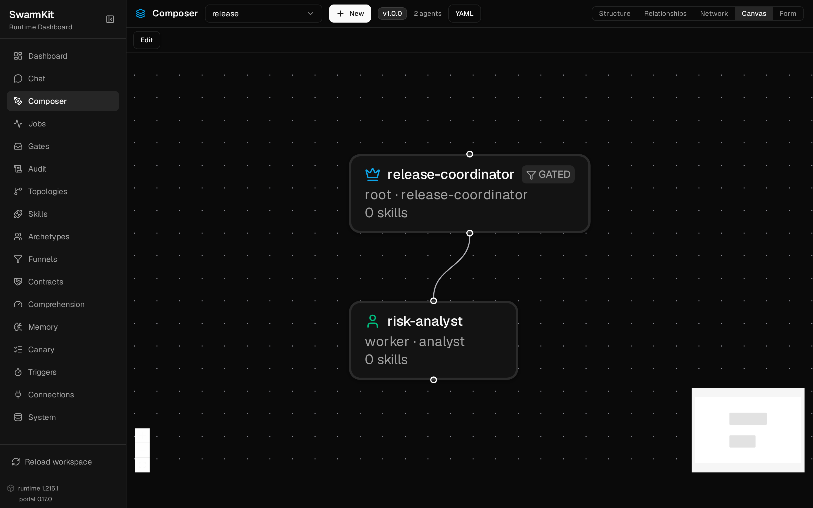
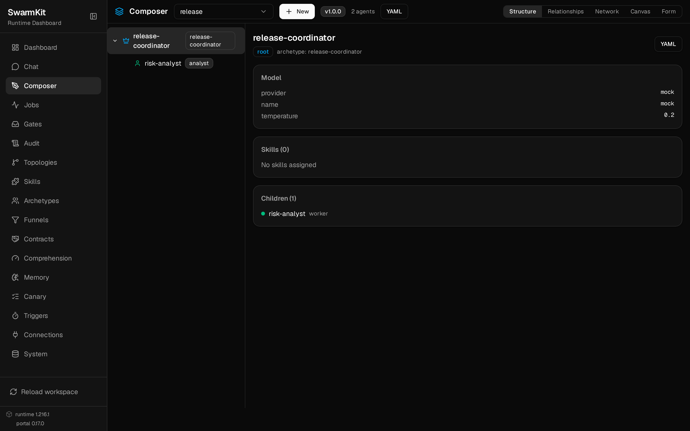
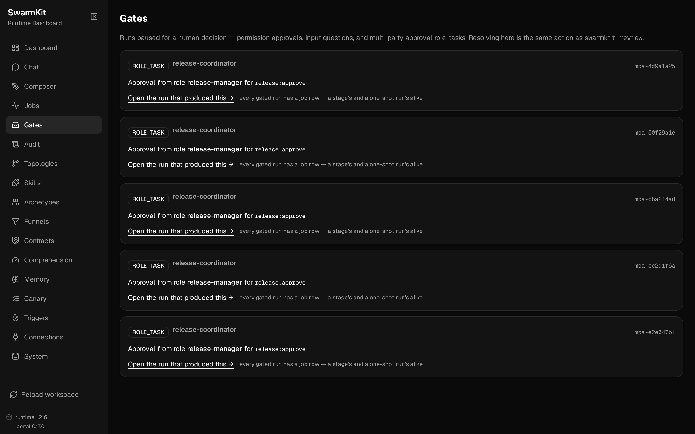
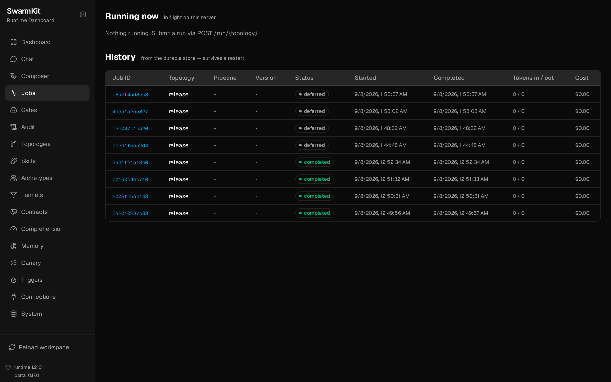
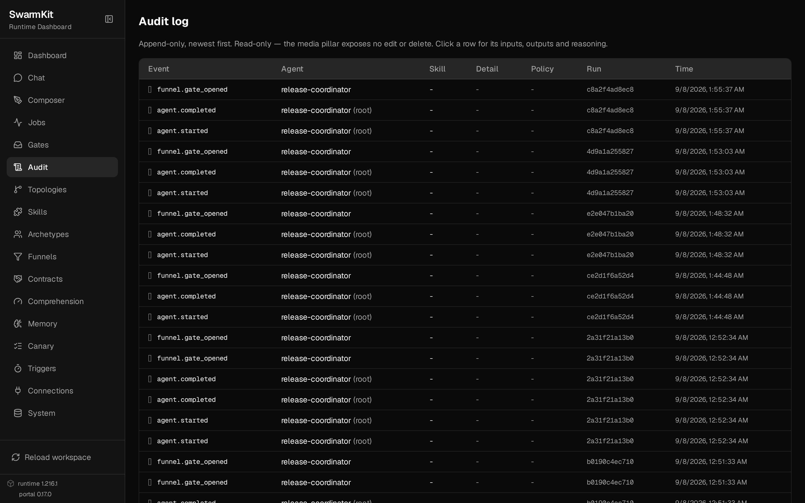
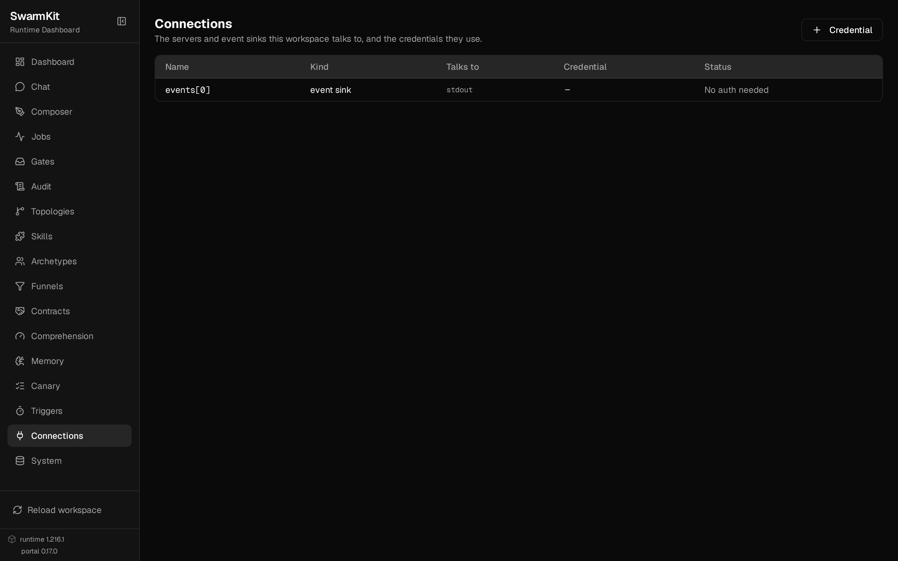
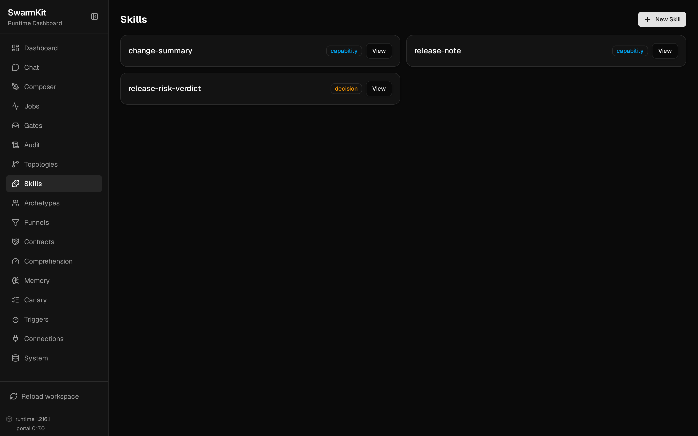
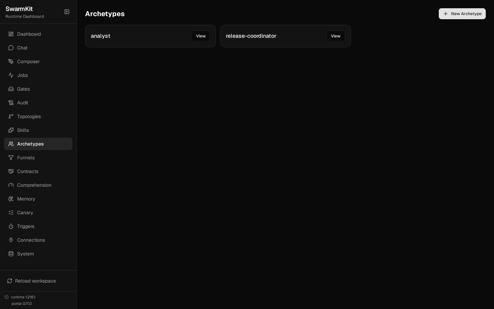

# The portal

`pip install "swarmkit-runtime[ui]"` and `swarmkit serve` host this at the same origin as the API.
There is no separate deployment.

Every image below is **generated from the version in the tree** by `scripts/media/capture.mjs`
driving a real `swarmkit serve` — so they go stale when someone forgets to run the script, rather
than silently. The workspace is [`examples/showcase/`](https://github.com/delivstat/swarmkit/tree/main/examples/showcase),
which runs with no API keys and no network.

<video controls preload="none" playsinline muted poster="img/portal/canvas.png" style="width:100%;border-radius:8px">
  <source src="img/portal/portal-tour.mp4" type="video/mp4">
  <source src="img/portal/portal-tour.webm" type="video/webm">
  <track kind="captions" srclang="en" label="English" src="img/portal/portal-tour.vtt">
  <a href="img/portal/portal-tour.mp4">Download the tour (MP4)</a>
</video>

*H.264 first, `playsinline` for iOS, captions burned into the frames as well as tracked — the
player matches the SDLC walkthrough's, which is the configuration known to work on a phone.*

## The swarm as a graph

The topology is YAML. The canvas renders it — nothing is drawn by hand, and the `GATED` badge is
the funnel the coordinator must pass.



The same topology as structure, with each agent's model, skills and children read back from the
file:



## A run waiting on a person

`release-manager` must confer `release:approve`. No agent can hold that scope, whatever its prompt
says — the policy engine enforces it (design §8.7).



## What ran, and what it cost



## The append-only trail

No update or delete path is exposed to an agent, ever (design §8.3).



## What the workspace can reach

Servers, event sinks and the credentials they use — including whether each credential **resolves
right now**, which is the failure that is otherwise invisible until a run gets an auth error.



## The catalogue





## Regenerating these

```bash
swarmkit serve examples/showcase/workspace --port 8140 &
curl -X POST localhost:8140/run/release -d '{"input":"…"}'   # so the gate screens have content
node scripts/media/capture.mjs --serve http://127.0.0.1:8140 --out docs/site/img/portal
```

Playwright records **VP8/WebM**, which Safari does not play, so the recording is transcoded before
publishing — the script prints the command:

```bash
ffmpeg -i tour.webm -vf scale=1280:800 \
       -c:v libx264 -profile:v high -level:v 4.0 -pix_fmt yuv420p \
       -preset slow -crf 26 -movflags +faststart -an tour.mp4
```

`scale` and `-level` are not decoration: they match the SDLC walkthrough's files, which play on
phones this page's first attempt did not. The MP4 is also a quarter of the WebM's size — list it
**first** in the `<video>` element, and keep `playsinline`, or iOS will not play it inline.

The script refuses to photograph a 404 — the first run of it saved the portal's own not-found page
as `connections.png`, because the serve was hosting a build from before that page existed.
