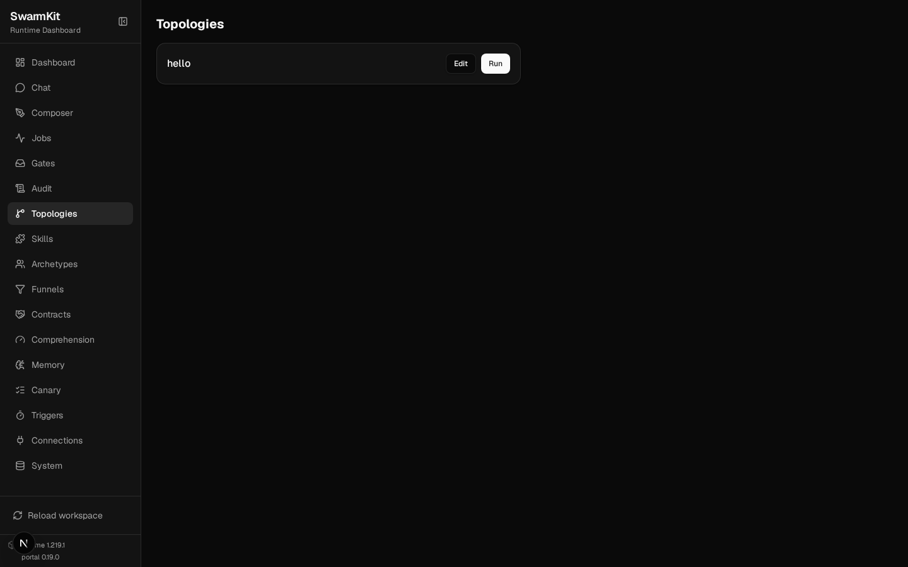
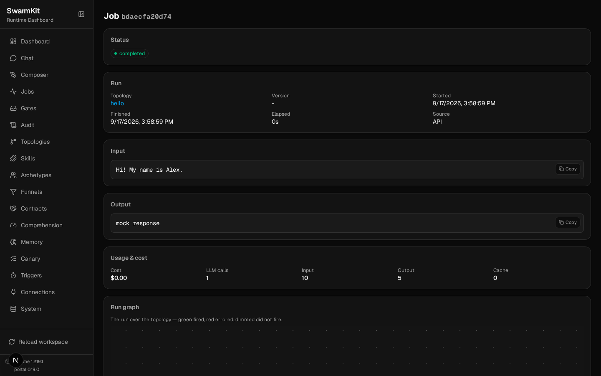
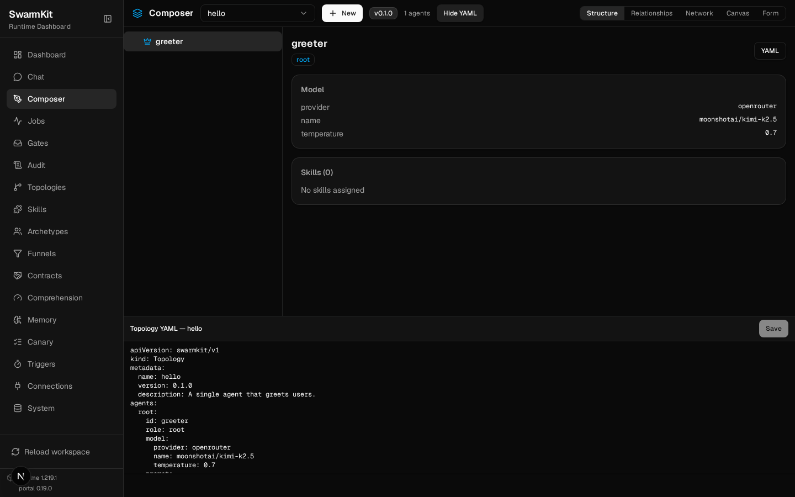

# Level 1: Hello World

Build your first SwarmKit workspace — one agent that greets users.

## What you'll learn

- Installing SwarmKit
- Creating a workspace by hand (two YAML files)
- Running a topology with `swarmkit run`
- Validating with `swarmkit validate`, and reading what it says

The finished workspace is in the repo at `examples/tutorials/01-hello-world/`; every command below
was run against it on the mock provider, and the output shown is what it printed.

## Install

```bash
# Install uv (Python package manager) if you don't have it
curl -LsSf https://astral.sh/uv/install.sh | sh

# Install SwarmKit — [ui] is the web portal `swarmkit serve` hosts (Level 11); the server itself is built in
uv tool install "swarmkit-runtime[ui]"

# Verify
swarmkit --help
```

<details>
<summary>New to the terminal?</summary>

Open your terminal (Terminal on Mac, Command Prompt or WSL on Windows). Copy each command and press Enter. The `$` symbol means "type this in the terminal" — don't type the `$` itself.

</details>

## Build it

Create a project directory:

```bash
mkdir my-swarm && cd my-swarm
```

### 1. Workspace file

Every SwarmKit project starts with `workspace.yaml` — it defines your workspace:

```yaml
# workspace.yaml
apiVersion: swarmkit/v1
kind: Workspace
metadata:
  id: my-swarm
  name: My First Swarm
  description: Learning SwarmKit step by step.
governance:
  provider: mock
```

`governance.provider: mock` means no real policy enforcement — right for learning.

### 2. Topology file

A topology defines which agents exist and how they connect. Create `topologies/hello.yaml`:

```bash
mkdir topologies
```

```yaml
# topologies/hello.yaml
apiVersion: swarmkit/v1
kind: Topology
metadata:
  name: hello              # the topology's id — lowercase, dashes; this is what you run
  version: 0.1.0
  description: A single agent that greets users.
agents:
  root:
    id: greeter
    role: root
    model:
      provider: openrouter
      name: moonshotai/kimi-k2.5
      temperature: 0.7
    prompt:
      system: |
        You are a friendly greeter. When someone sends you a message,
        respond with a warm, personalized greeting. Keep it short —
        2-3 sentences max.
```

That's it — one agent (`greeter`) with a system prompt. `role: root` makes it the entry point. A
topology's `metadata.name` is its id, and it must be lowercase-kebab because it becomes a route
(`POST /run/hello`) and a skill id (Level 20).

### 3. Validate

```bash
swarmkit validate . --tree
```

```
✓ workspace: my-swarm
  topologies: 1   (hello)
  skills:     1   (topology-hello)
  archetypes: 0   (—)
  triggers:   0   (—)

topology: hello
  greeter (role=root)
    model: openrouter/moonshotai/kimi-k2.5

reachability: 0 declared, all wired

verification: 1 topology root(s)
  hello/greeter (root): no funnel — its output is checked by nothing
```

Three things to read here. `skills: 1` — you wrote no skill; the runtime exposes every topology as
one (`topology-hello`) so other agents can call it later. `reachability` says nothing you declared is
dead configuration. And `verification` tells you, honestly, that this agent's answer is whatever the
model says — nothing checks it yet. Level 18 fixes that.

### 4. Run it

The mock provider needs no key and answers deterministically — use it while the shape is what you
are learning:

```bash
SWARMKIT_PROVIDER=mock swarmkit run . hello --input "Hi! My name is Alex."
```

```
[greeter] thinking... (kimi-k2.5)
[greeter] done (0.0s)
mock response
```

For a real greeting, give the provider its key — the topology already names OpenRouter:

```bash
export OPENROUTER_API_KEY=your-key-here
swarmkit run . hello --input "Hi! My name is Alex."
```

Or run the same topology on a local model without editing it — `SWARMKIT_PROVIDER` overrides the
provider for one run (install [Ollama](https://ollama.ai), `ollama pull llama3.2`):

```bash
SWARMKIT_PROVIDER=ollama SWARMKIT_MODEL=llama3.2 swarmkit run . hello --input "Hi! My name is Alex."
```

```
[greeter] thinking... (llama3.2)
[greeter] done (4.1s)
Hi Alex! It's a nice thing to meet you. How are you doing today?
```

(A model you have not pulled answers with Ollama's `404 Not Found` — pull it first.)

`swarmkit providers list .` shows every provider and whether its key is set (Level 21).

### 5. Try more options

```bash
# See the resolved agents without running anything
swarmkit run . hello --input test --dry-run

# Verbose — per-agent calls, tools, timing
swarmkit run . hello --input "Hello!" --verbose

# Machine-readable validation, for CI
swarmkit validate . --json
```

`--dry-run` prints:

```
── dry run: hello ──

Agents:
  greeter (root) — openrouter/moonshotai/kimi-k2.5
Governance: MockGovernanceProvider

No LLM or MCP calls made. Use without --dry-run to execute.
```

and `--verbose` ends with a run summary:

```
── run summary ──
  greeter                  root          3ms
  total events: 2
```

### 6. See it in the portal

`swarmkit serve .` hosts the same workspace over HTTP, and with the `[ui]` extra the portal too:

```bash
uv tool install "swarmkit-runtime[ui]"
SWARMKIT_PROVIDER=mock swarmkit serve .            # → http://127.0.0.1:8000
```

Every topology is a card with **Run**; every run is a job with its input, output, cost and run graph:





The file you wrote is the same thing the portal edits. **Composer → hello → YAML** shows
`topologies/hello.yaml`; Save writes it back through the same validation `swarmkit validate` runs,
and the runtime reloads. Everything in these tutorials that is shown as a file can be edited here
instead:



## What happened

1. `workspace.yaml` told SwarmKit this directory is a workspace and which governance provider to use
2. `topologies/hello.yaml` defined one agent with a system prompt
3. `swarmkit validate` loaded and resolved everything — and reported what it could not vouch for
4. `swarmkit run` compiled the topology to a graph, sent your input to the model, printed the output

## Your workspace so far

```
my-swarm/
├── workspace.yaml
└── topologies/
    └── hello.yaml
```

## Next

[Level 2: Archetypes](02-archetypes.md) — make your agent config reusable.
