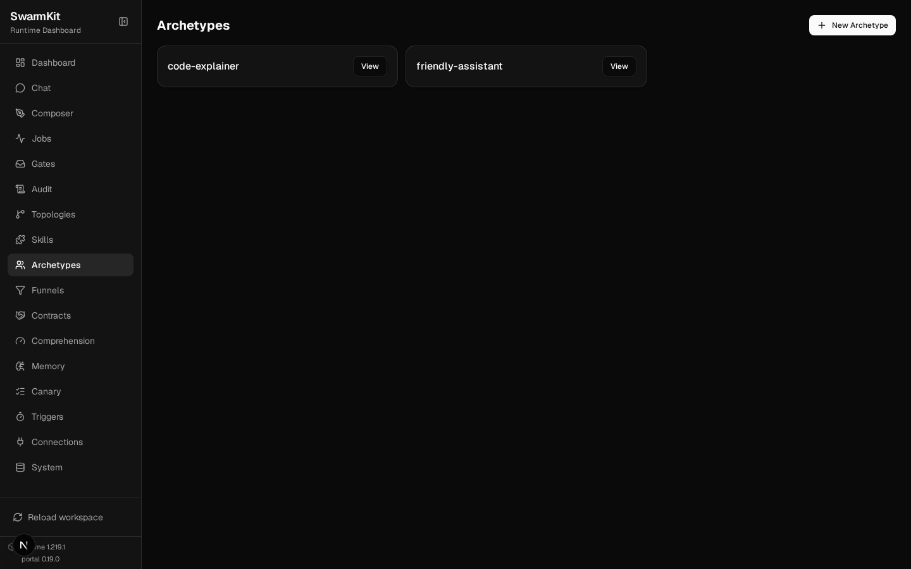
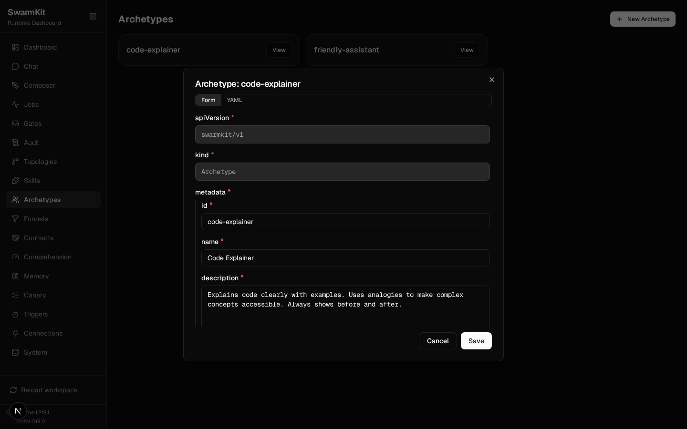

# Level 2: Archetypes

Extract agent configuration into reusable archetypes — define once, use across topologies.

## What you'll learn

- Creating archetype files
- Model configuration (provider, temperature, max_tokens)
- System prompts and persona
- Referencing archetypes from topologies
- Provenance tracking

The finished workspace is `examples/tutorials/02-archetypes/`; every command below was run against
it on the mock provider.

## Why archetypes?

In Level 1, the agent's model and prompt were inline in the topology. That works for one agent, but when you have 10 agents across 3 topologies, you don't want to repeat the same config everywhere. Archetypes solve this — define the agent's personality once, reference it by ID.

## Build it

### 1. Create an archetype

```bash
mkdir archetypes
```

```yaml
# archetypes/friendly-assistant.yaml
apiVersion: swarmkit/v1
kind: Archetype
metadata:
  id: friendly-assistant
  name: Friendly Assistant
  description: >
    A warm, helpful assistant that answers questions clearly
    and concisely. Good default for general-purpose agents.
role: root
defaults:
  model:
    provider: openrouter
    name: moonshotai/kimi-k2.5
    temperature: 0.7
    max_tokens: 2048
  prompt:
    system: |
      You are a friendly, helpful assistant. Answer questions
      clearly and concisely. If you don't know something, say so
      honestly. Keep responses under 200 words unless the user
      asks for more detail.
provenance:
  authored_by: human
  version: 1.0.0
```

Key fields:
- `role` — `root` | `leader` | `worker`; it should match the role of the agent that instantiates it. This archetype will be a topology's root, so `root`.
- `defaults.model` — model configuration (provider, name, temperature, max_tokens)
- `defaults.prompt.system` — the system prompt
- `provenance` — who authored this, and its version (both required)

### 2. Create a second archetype

```yaml
# archetypes/code-explainer.yaml
apiVersion: swarmkit/v1
kind: Archetype
metadata:
  id: code-explainer
  name: Code Explainer
  description: >
    Explains code clearly with examples. Uses analogies to make
    complex concepts accessible. Always shows before and after.
role: root
defaults:
  model:
    provider: openrouter
    name: deepseek/deepseek-chat-v3-0324
    temperature: 0.3
    max_tokens: 4096
  prompt:
    system: |
      You are a code explainer. When given code or a programming
      concept, explain it clearly using:
      1. A one-sentence summary
      2. A real-world analogy
      3. A simple code example
      Keep it practical — no theory without examples.
provenance:
  authored_by: human
  version: 1.0.0
```

Notice the different model — `deepseek/deepseek-chat-v3-0324` with lower temperature (0.3) for more precise code explanations.

### 3. Update the topology to use archetypes

```yaml
# topologies/hello.yaml — updated
apiVersion: swarmkit/v1
kind: Topology
metadata:
  name: hello
  version: 0.2.0
  description: A single agent using an archetype.
agents:
  root:
    id: assistant
    role: root
    archetype: friendly-assistant
```

That's it — `archetype: friendly-assistant` pulls in the model config and prompt from the archetype file.

### 4. Create a second topology

```yaml
# topologies/explain.yaml
apiVersion: swarmkit/v1
kind: Topology
metadata:
  name: explain
  version: 0.1.0
  description: Explains code concepts clearly.
agents:
  root:
    id: explainer
    role: root
    archetype: code-explainer
```

### 5. Override archetype defaults

You can override any archetype field in the topology:

```yaml
# topologies/explain.yaml — with override
agents:
  root:
    id: explainer
    role: root
    archetype: code-explainer
    model:
      temperature: 0.1    # more deterministic than archetype default
    prompt:
      system: |
        You are a Python specialist. Only explain Python code.
        Use type hints in all examples.
```

The topology override wins — the archetype provides defaults, the topology can customize. Fields
you do not override keep the archetype's value: here `explainer` still runs on
`deepseek/deepseek-chat-v3-0324`, at temperature 0.1 with the Python-specialist prompt.

### 6. Validate and run

```bash
swarmkit validate . --tree
```

```
✓ workspace: my-swarm
  topologies: 2   (explain, hello)
  skills:     2   (topology-explain, topology-hello)
  archetypes: 2   (code-explainer, friendly-assistant)
  triggers:   0   (—)

topology: explain
  explainer (role=root, archetype=code-explainer)
    model: openrouter/deepseek/deepseek-chat-v3-0324

topology: hello
  assistant (role=root, archetype=friendly-assistant)
    model: openrouter/moonshotai/kimi-k2.5
```

The tree shows each agent with the archetype it came from and the model it resolved to — which is
how you check an override landed.

```bash
SWARMKIT_PROVIDER=mock swarmkit run . hello --input "What's the weather like in Tokyo?"
SWARMKIT_PROVIDER=mock swarmkit run . explain --input "What is a decorator in Python?" --verbose
```

`--verbose` on the second confirms the model the override left in place:

```
--- [explainer] calling deepseek/deepseek-chat-v3-0324 ---
  tools: []
  input: What is a decorator in Python?...
```

In the portal, each archetype is a card; **View** opens the same file as a form (every field the
schema defines) or as YAML, and Save writes it back:





## Model configuration reference

```yaml
defaults:
  model:
    provider: openrouter          # a provider id — `swarmkit providers list` shows them all
    name: moonshotai/kimi-k2.5
    temperature: 0.7              # 0.0 = deterministic … 2.0
    max_tokens: 2048              # max output length
    tool_model: gpt-4o-mini       # a cheaper model for tool-calling turns (Level 6, dual model)
    tool_provider: openai         # its provider
    options: {}                   # provider-specific extras, passed through
```

## Provenance options

```yaml
provenance:
  authored_by: human              # human | authored_by_swarm | vendor_published
  version: 1.0.0                  # semver
  # authored_date: "2026-01-01"  # optional
  # registry: npm                 # optional, for published archetypes
  # vendor: delivstat             # optional
```

## Your workspace so far

```
my-swarm/
├── workspace.yaml
├── archetypes/
│   ├── friendly-assistant.yaml
│   └── code-explainer.yaml
└── topologies/
    ├── hello.yaml
    └── explain.yaml
```

## Next

[Level 3: Skills](03-skills.md) — give your agents tools and capabilities.
