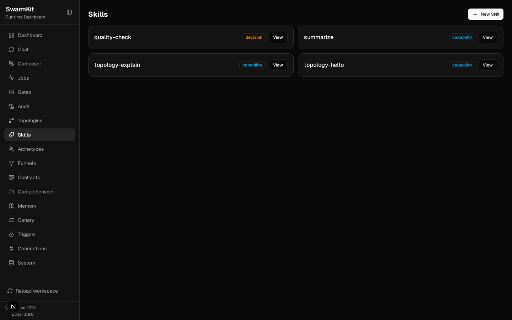
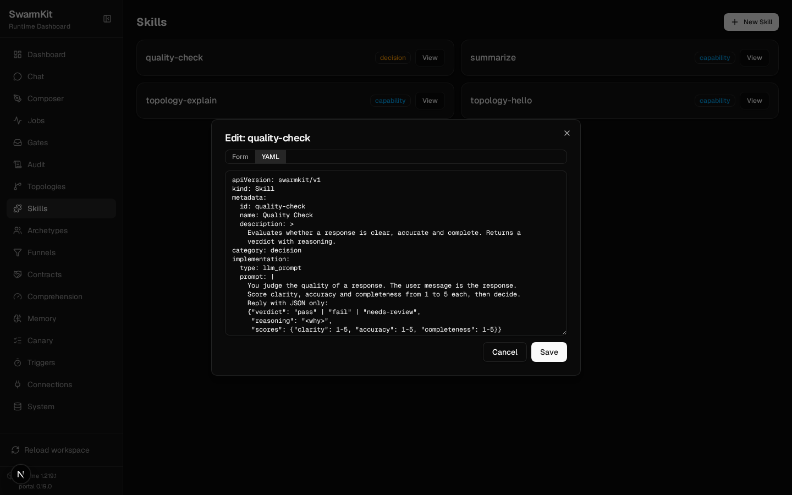

# Level 3: Skills

Give your agents capabilities — tools they can call and judgements they can make.

## What you'll learn

- The four skill categories (capability, decision, coordination, persistence)
- The five implementation backings (`llm_prompt`, `mcp_tool`, `composed`, `command`, `agent`)
- Binding skills to archetypes, and adding or replacing them in a topology
- Output schemas, and the one thing a decision skill must return
- Constraints (timeout, retry, on_failure) and per-skill audit control

The finished workspace is `examples/tutorials/03-skills/`; every command below was run against it.

## Why skills?

Without skills, agents can only generate text. With skills they can read files, call APIs, judge
outputs, search databases and delegate. Skills are SwarmKit's **only** extension primitive — when
you need behaviour, you write a skill, whatever backs it:

| `implementation.type` | What runs | Level |
|---|---|---|
| `llm_prompt` | one model call with the skill's prompt as its system prompt | this one |
| `mcp_tool` | a tool on an MCP server declared in `workspace.yaml` | 5 |
| `composed` | several skills, with a strategy (e.g. parallel consensus) | 7 |
| `command` | a local binary from a workspace command pack | 19 |
| `agent` | another topology, here or on a remote instance | 20 |

## Build it

### 1. A capability skill (LLM prompt)

Not every skill needs a server. The simplest is a structured prompt:

```bash
mkdir skills
```

```yaml
# skills/summarize.yaml
apiVersion: swarmkit/v1
kind: Skill
metadata:
  id: summarize
  name: Summarize
  description: Summarize text into 3-5 bullet points, one clear sentence each.
category: capability
implementation:
  type: llm_prompt
  prompt: |
    You summarize. The user message is the text to summarize.
    Reply with 3-5 bullet points; each bullet is one clear sentence.
    Do not add commentary before or after the bullets.
constraints:
  timeout_seconds: 30
  retry:
    attempts: 2
    backoff: exponential
  on_failure: fallback
audit:
  log_inputs: summary
  log_outputs: full
provenance:
  authored_by: human
  version: 1.0.0
```

How an `llm_prompt` skill runs: the `prompt` becomes the **system prompt** of one model call, and
whatever the calling agent passed the tool is the **user message**. There is no template
substitution — write the prompt to address "the user message", as above.

`constraints` says what happens when the call is slow or fails: 30 s timeout, two retries with
exponential backoff, and then `on_failure: fallback` — the failure reaches the agent as a tool
error it can act on (`fail` ends the run; `escalate_to_human` files a review item instead).
`audit` controls what the audit log records per skill: inputs as a summary, outputs in full;
`redact: ["$.api_key"]` would drop a field from both.

### 2. A decision skill

Decision skills evaluate something and return a verdict. The schema requires them to declare their
`outputs`, and the outputs must include `reasoning` — an audit or a review needs the rationale next
to the verdict, and the schema will not let you leave it out:

```yaml
# skills/quality-check.yaml
apiVersion: swarmkit/v1
kind: Skill
metadata:
  id: quality-check
  name: Quality Check
  description: >
    Evaluates whether a response is clear, accurate and complete.
    Returns a verdict with reasoning.
category: decision
implementation:
  type: llm_prompt
  prompt: |
    You judge the quality of a response. The user message is the response.
    Score clarity, accuracy and completeness from 1 to 5 each, then decide.
    Reply with JSON only:
    {"verdict": "pass" | "fail" | "needs-review",
     "reasoning": "<why>",
     "scores": {"clarity": 1-5, "accuracy": 1-5, "completeness": 1-5}}
outputs:
  type: object
  required: [verdict, reasoning]
  properties:
    verdict:
      type: string
      enum: [pass, fail, needs-review]
    reasoning:
      type: string
    scores:
      type: object
provenance:
  authored_by: human
  version: 1.0.0
```

A decision skill granted to an agent is a tool it can call. Bound under a topology's
`governance.decision_skills` it becomes a **gate** on the agent's output that the runtime runs for
it — Level 7.

### 3. An MCP-backed skill

The same skill shape with a different backing — a tool on a server:

```yaml
implementation:
  type: mcp_tool
  server: filesystem     # an `mcp_servers` entry in workspace.yaml
  tool: read_file
```

A skill naming a server the workspace does not declare **fails the workspace load** — not the first
run that reaches for it. That is why this one is not in this level's workspace: Level 5 declares
the server and adds it.

### 4. Bind skills to an archetype

```yaml
# archetypes/friendly-assistant.yaml — updated
apiVersion: swarmkit/v1
kind: Archetype
metadata:
  id: friendly-assistant
  name: Friendly Assistant
  description: >
    A warm, helpful assistant that answers questions clearly and
    concisely, and can summarize what it is given.
role: root
defaults:
  model:
    provider: openrouter
    name: moonshotai/kimi-k2.5
    temperature: 0.7
    max_tokens: 2048
  prompt:
    system: |
      You are a friendly, helpful assistant. Answer questions
      clearly and concisely. When the user gives you a long text,
      use the summarize tool rather than summarizing it yourself.
  skills:
    - summarize
provenance:
  authored_by: human
  version: 1.0.0
```

The prompt tells the model *when* to use the tool. A model that is merely given a tool will often
answer in prose instead; naming the situation is what makes it reach for the skill.

### 5. Add or replace skills in a topology

```yaml
# topologies/hello.yaml
apiVersion: swarmkit/v1
kind: Topology
metadata:
  name: hello
  version: 0.3.0
  description: A single agent using an archetype.
agents:
  root:
    id: assistant
    role: root
    archetype: friendly-assistant
    skills_additional:
      - quality-check    # added to the archetype's skills; `skills:` would replace them
```

`skills_additional` merges onto the archetype's list. `skills` replaces it entirely.

## Validate and run

```bash
swarmkit validate . --tree
```

```
✓ workspace: my-swarm
  topologies: 2   (explain, hello)
  skills:     4   (quality-check, summarize, topology-explain, topology-hello)
  archetypes: 2   (code-explainer, friendly-assistant)
  triggers:   0   (—)

topology: hello
  assistant (role=root, archetype=friendly-assistant)
    model: openrouter/moonshotai/kimi-k2.5
    skills: summarize, quality-check
```

```bash
SWARMKIT_PROVIDER=mock swarmkit run . hello --input "Summarize this text." --verbose
```

```
--- [assistant] calling moonshotai/kimi-k2.5 ---
  tools: ['summarize', 'quality-check']
  input: Summarize this text....
  tool_calls: []
  text: ['mock response']
```

The `tools:` line is the proof the skills were offered. The mock provider never calls a tool, so
`tool_calls` is empty; on a real model the same run shows the call and its execution — this is a
local `qwen3.5:4b` through Ollama:

```
  tools: ['summarize', 'quality-check']
  tool_calls: ['summarize']
  [assistant] calling summarize {}
  executing: summarize
```

The portal's Skills page lists every skill with its category — including the two you did not write
(Level 20) — and **View** opens the file as a form or as YAML to edit in place:





## Skill categories

| Category | Purpose | Example |
|---|---|---|
| `capability` | Do something (read, write, compute) | Read file, call API, summarize |
| `decision` | Evaluate and return a verdict with reasoning | Quality check, security scan |
| `coordination` | Coordinate between agents | Peer handoff, escalate to a human |
| `persistence` | Record state for later | Governed memory write |

## Your workspace so far

```
my-swarm/
├── workspace.yaml
├── archetypes/
│   ├── friendly-assistant.yaml
│   └── code-explainer.yaml
├── skills/
│   ├── summarize.yaml
│   └── quality-check.yaml
└── topologies/
    ├── hello.yaml
    └── explain.yaml
```

## Next

[Level 4: Multi-Agent](04-multi-agent.md) — build a team of agents that delegate to each other.
