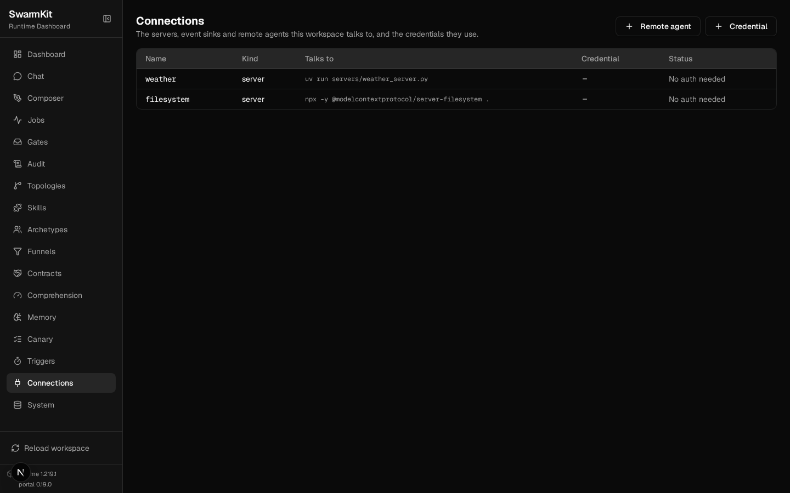

# Level 5: MCP Tools

Give your agents real tools that interact with the world — files, APIs, databases, browsers.

## What you'll learn

- Declaring MCP servers in `workspace.yaml` — a published one and one you wrote
- Writing a stdio MCP server in one Python file
- Permission tiers (`open`, `cautious`, `strict`, `readonly`) and declared `effects`
- Watching a tool call happen, and watching one be refused
- Sandboxing, environment variables and credentials

The finished workspace is `examples/tutorials/05-mcp-tools/`. The transcripts are from real runs on
OpenRouter; the weather server runs locally with no key.

## What is MCP?

Model Context Protocol is a standard for connecting agents to tools. Instead of building
integrations, you wire existing servers — there are thousands, for GitHub, databases, Slack, file
systems, browsers. A SwarmKit skill with `implementation.type: mcp_tool` names a server and a tool
on it; the runtime starts the server when a topology needs it and routes every call through
governance.

## Build it

### 1. Write a server

```bash
mkdir servers
```

```python
# servers/weather_server.py
# /// script
# dependencies = ["mcp>=1.0,<2"]
# ///
"""A small weather MCP server — one stdio tool, mock data."""

from __future__ import annotations

import json

from mcp.server.fastmcp import FastMCP

server = FastMCP("weather")


@server.tool()
def get_weather(city: str) -> str:
    """Current weather for a city (mock data; a real server would call an API here)."""
    return json.dumps(
        {"city": city, "temperature": "22°C", "condition": "Partly cloudy", "humidity": "65%"}
    )


if __name__ == "__main__":
    server.run()
```

The `# /// script` header is what lets `uv run servers/weather_server.py` install `mcp` on first
use — your workspace needs no project file. The `<2` pin matters: `mcp` 2.x renamed `FastMCP`, and
without the pin the server fails to import the day 2.x ships. (It did, while this level was being
checked.)

### 2. Declare the servers

```yaml
# workspace.yaml — updated
apiVersion: swarmkit/v1
kind: Workspace
metadata:
  id: my-swarm
  name: My First Swarm
  description: Learning SwarmKit step by step.
governance:
  provider: mock

mcp_servers:
  # A server you wrote: one Python file, launched as a subprocess. `open` — the tool is harmless
  # and local, so calls skip the governance check.
  - id: weather
    transport: stdio
    command: ["uv", "run", "servers/weather_server.py"]
    permission: open

  # A published server, fetched by npx on first start. `readonly` allows only tools declared to
  # read — the ones listed under `effects`; anything else is denied rather than guessed at.
  - id: filesystem
    transport: stdio
    command: ["npx", "-y", "@modelcontextprotocol/server-filesystem", "."]
    permission: readonly
    effects:
      read_file: read
      list_directory: read
```

Commands run with the workspace root as their working directory, so `servers/weather_server.py`
and `.` resolve there.

### 3. Skills over the tools

```yaml
# skills/get-weather.yaml
apiVersion: swarmkit/v1
kind: Skill
metadata:
  id: get-weather
  name: Get Weather
  description: Get the current weather for a city.
category: capability
implementation:
  type: mcp_tool
  server: weather          # the id in workspace.yaml
  tool: get_weather        # the tool the server exposes
provenance:
  authored_by: human
  version: 1.0.0
```

```yaml
# skills/read-file.yaml
apiVersion: swarmkit/v1
kind: Skill
metadata:
  id: read-file
  name: Read File
  description: Read the contents of a file from the workspace.
category: capability
implementation:
  type: mcp_tool
  server: filesystem
  tool: read_file
provenance:
  authored_by: human
  version: 1.0.0
```

A skill that names a server the workspace does not declare fails `swarmkit validate` — the
mismatch is caught at load, not at the first call.

Grant `get-weather` to the assistant archetype (`skills: [summarize, get-weather]`) and tell it
when to use it: *"When asked about the weather, use the get-weather tool and report what it
returns."*

### 4. Run it

```bash
swarmkit run . hello --input "What is the weather in Tokyo?" --verbose
```

```
[assistant] thinking... (kimi-k2.5)
--- [assistant] calling moonshotai/kimi-k2.5 ---
  tools: ['summarize', 'get-weather', 'quality-check']
  tool_calls: ['get-weather']
  [assistant] calling get-weather {"city": "Tokyo"}
  executing: get-weather
  [mcp args: {'city': 'Tokyo'}]
  [assistant] got results: get-weather (130B) | waiting for model... (turn 1)
[assistant] done (11.4s)
The weather in Tokyo is currently **22°C** and **partly cloudy**, with **65%** humidity.

── run summary ──
  assistant                root      11447ms
  skills called: 1
```

The server was started for the run (only servers a topology needs are started), the model called
the tool with structured arguments, the result came back, the model answered from it.

### 5. Watch a call be refused

Add a `write-file` skill over the filesystem server's `write_file` and a `files` topology whose
root has `skills: [read-file, write-file]`. The server is `readonly`, and `write_file` is not in its
`effects` map:

```bash
swarmkit run . files --input "Write 'hi' into scratch.txt using write-file, then tell me what happened." --verbose
```

```
  tools: ['read-file', 'write-file']
  tool_calls: ['write-file']
  [reader] calling write-file {"path": "scratch.txt", "content": "hi"}
  executing: write-file
  [reader] got results: write-file (190B) | waiting for model... (turn 1)
[reader] done (10.6s)
I attempted to write 'hi' to scratch.txt, but the operation was **denied**.
The server returned an error indicating that it has a `readonly` permission setting that prevents
write operations. …
```

No `scratch.txt` exists afterwards. The refusal reached the model as a tool error it could explain,
and the audit log has the call with `policy_decision: deny`. Reading works the same way and
succeeds — `read_file` is declared `read`.

### 6. Permission tiers

| Tier | Behaviour |
|------|----------|
| `open` | No governance call — for local, harmless tools |
| `cautious` (default) | Every call is evaluated by the governance provider with the tool's declared effect |
| `strict` | Every call needs explicit approval |
| `readonly` | Only tools declared `read` (in `effects`, or by the server's own `readOnlyHint`) are allowed; `write` and *unknown* are denied |

`permission_overrides: {list_tables: open}` sets one tool's tier; `effects` says what each tool does,
and is the half you control — it wins over the server's annotation.

### 7. Sandboxing, env and credentials

```yaml
mcp_servers:
  - id: untrusted-tool
    transport: stdio
    command: ["python", "some_tool.py"]
    sandboxed: true                     # runs in a container, no network, workspace read-only
    sandbox_image: python:3.11-slim     # optional

  - id: github
    transport: stdio
    command: ["npx", "-y", "@modelcontextprotocol/server-github"]
    env:
      GITHUB_PERSONAL_ACCESS_TOKEN: "{credential.github-token}"   # never the literal

credentials:
  github-token:
    source: env
    config:
      env: GITHUB_TOKEN
```

`{credential.<name>}` resolves through the workspace `credentials` block at launch and keeps the
secret out of the runtime's own environment. `${VAR}` and `${VAR:-default}` interpolate from the
environment in every artifact ([Environment configuration](../reference/env-config.md)). The
portal's Connections page shows every server, what it talks to, and whether its credential
resolves:



## Your workspace so far

```
my-swarm/
├── workspace.yaml          # now has mcp_servers
├── archetypes/
├── servers/
│   └── weather_server.py
├── skills/
│   ├── get-weather.yaml
│   ├── read-file.yaml
│   ├── write-file.yaml
│   └── ...
└── topologies/
    ├── files.yaml
    └── ...
```

## Next

[Level 6: Structured Delegation](06-structured-delegation.md) — task plans, scopes, and the dual model pattern.
