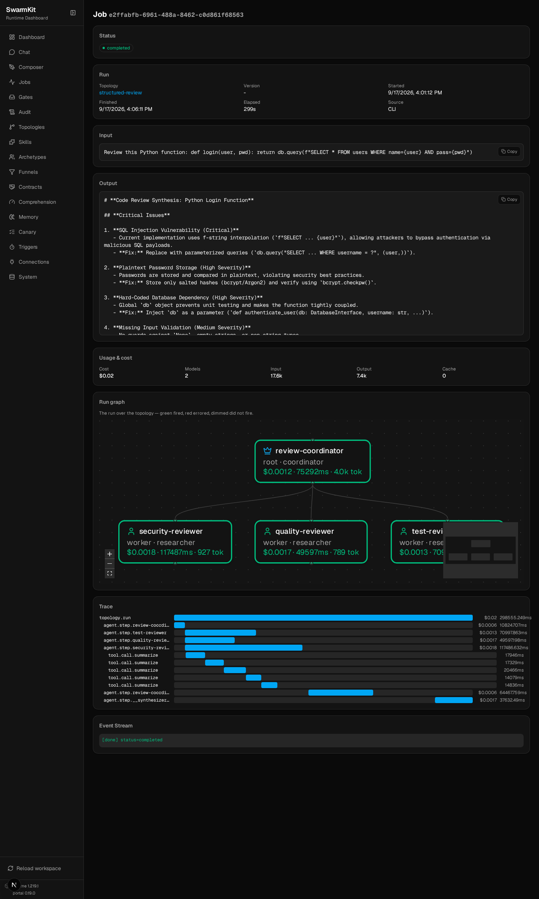

# Level 6: Structured Delegation

Move from "delegate and hope" to a plan the runtime executes: coordinators write task plans,
workers run them in dependency order, and a synthesis step writes the answer from every result.

## What you'll learn

- Task plans and scopes — the tools a coordinator gets when it has several children
- Two-phase planning (research → scope → targeted tasks) and `scope_required`
- Dual model: one model for the tool loop, another for the words
- Synthesis configuration — a single-context pass over every result
- Run state on disk, `swarmkit checkpoints` and `--resume`

The finished workspace is `examples/tutorials/06-structured-delegation/`. The transcript is one real
run on OpenRouter: about 300 s, 13 model calls, $0.02.

## Why structured delegation?

In Level 4 the coordinator wrote a plan because it had two independent children — you saw
`create-task-plan` in its tool list. This level turns the knobs on that machinery:

- the coordinator creates a **plan** with named, ordered tasks; the runtime dispatches them
- independent tasks run **in parallel**; dependent tasks wait
- the plan and every result are **saved to disk** as they happen, so a crashed run resumes
- a **synthesis** pass reads every result in one context and writes the document

## Build it

### 1. A topology with planning and synthesis

```yaml
# topologies/structured-review.yaml
apiVersion: swarmkit/v1
kind: Topology
metadata:
  name: structured-review
  version: 0.1.0
  description: >
    Coordinator creates a task plan, workers execute in parallel,
    results are synthesized into a final review.
runtime:
  planning:
    scope_required: true
    two_phase: true
  synthesis:
    provider: openrouter
    model: deepseek/deepseek-chat-v3-0324
    prompt: |
      You are synthesizing a code review from several specialists.
      Combine their findings into one actionable review, critical issues first:
      ## Critical issues
      ## Recommendations
      ## Summary
agents:
  root:
    id: review-coordinator
    role: root
    archetype: coordinator
    prompt:
      system: |
        You are a code review coordinator. When given code to review, plan the
        review as tasks for your specialists, then synthesize their findings.
        Specialists: security-reviewer (vulnerabilities), quality-reviewer
        (patterns, naming, error handling), test-reviewer (coverage).
    children:
      - id: security-reviewer
        role: worker
        archetype: researcher
        prompt:
          system: |
            You are a security reviewer. Analyze code for injection, XSS/CSRF,
            hardcoded secrets and insecure dependencies. Return a structured list
            of findings, five at most.
      - id: quality-reviewer
        role: worker
        archetype: researcher
        prompt:
          system: |
            You review code quality: architecture, DRY, error handling, naming.
            Return a structured list of findings, five at most.
      - id: test-reviewer
        role: worker
        archetype: researcher
        prompt:
          system: |
            You review test coverage: critical paths, edge cases, test quality.
            Return a structured list of findings, five at most.
```

- `planning.scope_required: true` — the coordinator must `create-scope` before anything is
  synthesized; synthesis is blocked until a scope exists.
- `planning.two_phase: true` — phase 1 (research tasks) → scope → phase 2 (targeted tasks). The
  compiler injects the checkpoint between them; the prompt does not have to.
- `synthesis` — when set, the compiler adds a final step that loads **every** task result into one
  context and asks the named model to write the document with this prompt. The coordinator does
  not have to hold everything in its head.

### 2. Dual model on the coordinator

```yaml
# archetypes/coordinator.yaml — model block
  model:
    provider: openrouter
    name: deepseek/deepseek-chat-v3-0324   # the model that writes the answer
    temperature: 0.3
    tool_provider: openrouter
    tool_model: moonshotai/kimi-k2.5        # the model that drives the tool loop (plans, reads results)
```

The first call of a turn goes to `name`; the tool-loop turns that follow — planning, reading
results, creating the scope — go to `tool_model`. Put the cheap, tool-reliable model on the loop
and the model you want writing on `name`. `--verbose` prints `tool model: kimi-k2.5` when the
switch happens.

### 3. Run it

```bash
swarmkit run . structured-review \
  --input 'Review this Python function: def login(user, pwd): return db.query(f"SELECT * FROM users WHERE name={user} AND pass={pwd}")' \
  --verbose
```

```
[review-coordinator] thinking... (deepseek-chat-v3-0324)
  tools: ['create-task-plan', 'read-task-result', 'create-scope', 'read-scope']
  tool_calls: ['create-task-plan']
[review-coordinator] created task plan: 3 tasks
[review-coordinator] executing task batch: security-review, quality-review, test-review
[security-reviewer] thinking... (kimi-k2.5)
[quality-reviewer] thinking... (kimi-k2.5)
[test-reviewer] thinking... (kimi-k2.5)
[quality-reviewer] done (49.6s)
  task 'quality-review' completed (5 findings)
[test-reviewer] done (71.0s)
  task 'test-review' completed (5 findings)
[security-reviewer] done (117.5s)
  task 'security-review' completed (5 findings)
[review-coordinator] thinking... (deepseek-chat-v3-0324)
  [review-coordinator] tool model: kimi-k2.5
[review-coordinator] scope created: 7 requirements, 4 constraints
[review-coordinator] created task plan: 4 tasks
  Auto-fixed: task 'write-review-document' (self) now depends on [security-review, quality-review, test-review]
[review-coordinator] executing task batch: write-review-document
  task 'write-review-document' completed (5 findings)
[synthesizer] loading all results for single-context synthesis...
[synthesizer] 4 results, 15,895 chars total context. Calling deepseek/deepseek-chat-v3-0324...
[synthesizer] tokens: 3,506 in / 861 out / 4,367 total (37.6s)
[synthesizer] done. Output: 3,594 chars.
# **Code Review Synthesis: Python Login Function**

## **Critical Issues**

1. **SQL Injection Vulnerability (Critical)**
   - Current implementation uses f-string interpolation …
   - **Fix:** Replace with parameterized queries …
2. **Plaintext Password Storage (High Severity)** …
```

Read the sequence: three tasks in one batch, dispatched together (the three `thinking...` lines are
adjacent; the durations overlap); the scope written after the research phase, as `two_phase`
requires; a self-task the planner **auto-wired** to depend on all three reviews so it ran last; then
the synthesizer, in one call, over every result.

### 4. Read it back

```bash
swarmkit trace e2ffabfb-6961-488a-8462-c0d861f68563 -w .
```

```
Total tokens: 24,977 (input: 17,603 / output: 7,374) across 13 LLM call(s)

Agent Call Graph:
review-coordinator (deepseek/deepseek-chat-v3-0324), 1,753 tokens
  └─→ test-reviewer (moonshotai/kimi-k2.5), 627 tokens
  └─→ quality-reviewer (moonshotai/kimi-k2.5), 789 tokens
  └─→ security-reviewer (moonshotai/kimi-k2.5), 927 tokens
    ├── summarize ✓ (17946ms)
    …
review-coordinator (deepseek/deepseek-chat-v3-0324), 2,269 tokens
__synthesizer__ (deepseek/deepseek-chat-v3-0324), 4,367 tokens

Tokens by model:
  deepseek/deepseek-chat-v3-0324              8,389 (in: 7,232 / out: 1,157)
  moonshotai/kimi-k2.5                       16,588 (in: 10,371 / out: 6,217)
```

The portal's job page shows the same run: the run graph with cost and tokens per node, and the
trace as a timeline — three parallel bars for the reviewers, the synthesizer last:



### 5. What is on disk, and resuming

Every plan, scope and result is written under `.swarmkit/run-state/<run-id>/` as it happens:

```
.swarmkit/run-state/e2ffabfb-696…/
├── tasks.json            # the plan and each task's status
├── scope.json
├── security-review.md    # one file per task result
├── quality-review.md
├── test-review.md
├── write-review-document.md
└── synthesis-output.md
```

A run that dies mid-plan resumes from that record rather than from zero:

```bash
swarmkit checkpoints -w .
```

```
Last checkpointed run: e2ffabfb-6961-488a-8462-c0d861f68563

Checkpointed threads (1):
  e2ffabfb-6961-48...  6 steps ← resumable

Resume: swarmkit run . <topology> --resume
```

```bash
swarmkit run . structured-review --input "Review the code" --resume
```

## Planning modes

| Config | Behaviour |
|---|---|
| (none) | With ≥2 independent children the coordinator still gets plan tools; nothing is enforced |
| `scope_required: true` | `create-scope` must happen before synthesis |
| `two_phase: true` | research → scope → targeted tasks, with the checkpoint injected by the compiler |
| `synthesis:` | a final single-context pass over every result, by the named model and prompt |

## Your workspace so far

```
my-swarm/
├── archetypes/
│   └── coordinator.yaml           # now dual-model
└── topologies/
    └── structured-review.yaml     # planning + synthesis
```

## Next

[Level 7: Governance & Safety](07-governance.md) — add guardrails that prevent agents from going wrong.
