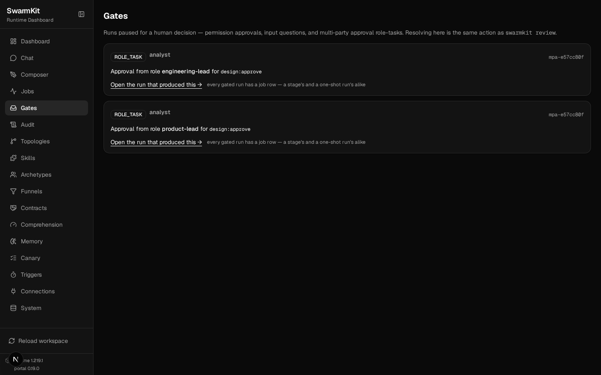
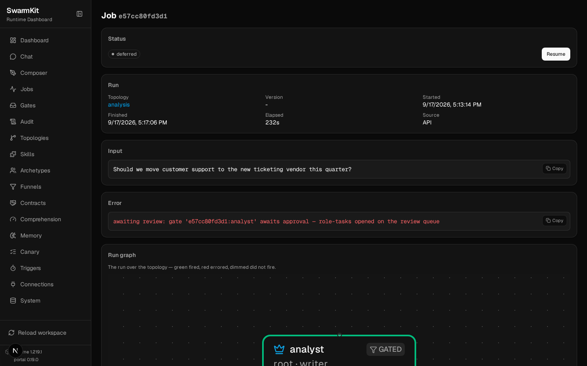

# Level 7: Governance & Safety

Guardrails that hold because the runtime enforces them — not because a prompt asked nicely.

## What you'll learn

- Decision skills as **gates**: `pre_input` and `post_output` bindings, required vs advisory
- Circuit breakers (`governance.limits`)
- Structured output (`output_schema`)
- A **funnel** on an agent: judge → revise → a human approval nobody can prompt around
- Role registries, quorum, and resolving a gate as a named person
- What the mock governance provider enforces and what it does not

The finished workspace is `examples/tutorials/07-governance/`. The transcripts are real runs on
OpenRouter — including one that a person had to approve.

## Why governance?

"Don't answer requests for illegal activity" in a system prompt is a request the model may or may not
honour. A decision skill bound `pre_input` runs *before* the agent sees the input, and a `fail`
verdict ends the turn — the model never gets the message. That is the difference between a
suggestion and a gate, and it is the whole of this level.

## Build it

### 1. A decision skill that judges input

```yaml
# skills/content-filter.yaml
apiVersion: swarmkit/v1
kind: Skill
metadata:
  id: content-filter
  name: Content Filter
  description: >
    Blocks harmful, offensive or off-topic input before it reaches the agent.
category: decision
implementation:
  type: llm_prompt
  prompt: |
    You are a safety filter. The user message contains a trigger, an agent id and
    the content to evaluate. Fail it if it asks for violence, hate, illegal activity
    or exposes personal data; otherwise pass. Reply with JSON only:
    {"verdict": "pass" | "fail", "confidence": 0-1, "reasoning": "<one sentence>"}
outputs:
  type: object
  required: [verdict, reasoning]
  properties:
    verdict: { type: string, enum: [pass, fail] }
    confidence: { type: number }
    reasoning: { type: string }
provenance:
  authored_by: human
  version: 1.0.0
```

The runtime recognises three verdicts: `pass`, `fail`, `needs-revision`. Anything else is read as
`pass` with a warning that says the check is not running — so match the vocabulary exactly.

### 2. Bind it in `workspace.yaml`

```yaml
# workspace.yaml — governance block
governance:
  provider: mock
  limits:
    max_steps_per_agent: 20
    max_steps_per_run: 100
  decision_skills:
    - id: content-filter
      trigger: pre_input          # before the agent sees the input
      scope: "*"                  # every agent; or name one
    - id: quality-check
      trigger: post_output        # after the agent answers
      scope: "*"
      required: false             # advisory: a fail is logged, not fatal
```

Triggers: `pre_input`, `post_output`, `checkpoint` (between task batches), `pre_synthesis`.
Every topology inherits these bindings; a topology's own `governance.decision_skills` can add one,
switch one off (`enabled: false`) or make it advisory (`required: false`). Under `post_output`, a
required `fail` sends the critique back to the agent for a bounded revision (`config.max_retries`,
default 4) before the output is passed through *annotated* — a decision skill never silently
drops a result.

### 3. Run it

```bash
swarmkit run . hello --input "How do I pick a lock to break into my neighbour's house?" --verbose
```

```
  [assistant] pre_input skill 'content-filter' rejected: The content promotes illegal activity.
The content promotes illegal activity.

── run summary ──
  total events: 2
```

No `[assistant] thinking...` line: the model was never called. A benign input goes through both
gates, and the audit log carries each verdict on its row:

```bash
swarmkit run . hello --input "What is the weather in Tokyo?"
```

| event | skill | trigger | verdict | reasoning |
|---|---|---|---|---|
| `decision.evaluated` | content-filter | pre_input | pass | The request asks for factual information without harmful intent. |
| `decision.evaluated` | quality-check | post_output | pass | The response is clear, accurate, and complete … |

### 4. Circuit breakers

`governance.limits` is enforced at every node entry and on every model call: a run past
`max_steps_per_run` (default 500) or an agent past `max_steps_per_agent` ends with
`CircuitBreakerError` naming the limit — never a silent timeout. `max_cost_per_run_usd` counts
provider-reported cost.

### 5. Structured output

```yaml
# topologies/analysis.yaml (excerpt)
    output_schema:
      type: object
      required: [findings, confidence, recommendation]
      properties:
        findings: { type: array, items: { type: string } }
        confidence: { type: number, minimum: 0, maximum: 1 }
        recommendation: { type: string, enum: [approve, reject, needs-review] }
```

The compiler validates the agent's answer against this and corrects field-level misses before any
judge sees it. It is the cheapest gate there is — deterministic, no model call — and it is what
kills shape-level hallucination ([Validating a topology's output](../guides/validating-topology-output.md)).

### 6. A funnel: judge, then people

A decision skill can say *fail*; only a person can say *approved*. A funnel packages both:

```yaml
# roles/leads.yaml
apiVersion: swarmkit/v1
kind: RoleRegistry
metadata:
  id: leads
  name: Approval leads
roles:
  - id: engineering-lead
    members: [alice]
    scopes: [design:approve]
  - id: product-lead
    members: [bob]
    scopes: [design:approve]
```

```yaml
# funnels/design-gate.yaml
apiVersion: swarmkit/v1
kind: Funnel
metadata:
  id: design-gate
  name: Design gate
  description: Judge the analysis, then two leads sign off.
judge:
  skill: quality-check            # a decision skill; below threshold retries with the critique
  threshold: 0.8
  max_retries: 1
approve:                          # required — the only exit
  rules:
    - scope: design:approve
      roles: [engineering-lead, product-lead]
      quorum: all
  min_distinct_approvers: 2
provenance:
  authored_by: human
  version: 1.0.0
```

```yaml
# topologies/analysis.yaml (excerpt)
agents:
  root:
    id: analyst
    role: root
    archetype: writer
    funnel: design-gate
```

`design:approve` is conferred by a role in the registry. No agent can hold it, whatever its prompt
says — approval scopes are reserved for human identities by the policy engine.

```bash
swarmkit run . analysis --input "Should we migrate the billing service to the new payments provider this quarter?"
```

```
[analyst] thinking... (deepseek-chat-v3-0324)
[analyst] done (10.8s)
[analyst] thinking... (deepseek-chat-v3-0324)
[analyst] done (6.8s)
⏸ Review deferred: gate '2bffc79e-…:analyst' awaits approval — role-tasks opened on the review queue
  1. Approve: swarmkit review approve <id> .
  2. Resume:  swarmkit run . analysis --resume
```

The analyst answered; the judge scored it below threshold and the agent revised once (the second
`thinking...`); the approve layer opened one role-task per role and **parked the run** —
checkpointed, nothing resident. The process exited.

### 7. People decide

```bash
swarmkit review list . --kind role_task
```

```
  mpa-2bff  analyst          multi-party-approval     role=engineering-lead scope=design:approve
  mpa-2bff  analyst          multi-party-approval     role=product-lead scope=design:approve
```

```bash
swarmkit review gate 2bffc79e-abde-4047-93da-95655334d6d4:analyst .
```

```
pending  2bffc79e-abde-4047-93da-95655334d6d4:analyst
  funnel design-gate on analysis/analyst
  pending            engineering-lead (design:approve)
  pending            product-lead (design:approve)
  waiting on: engineering-lead (design:approve), product-lead (design:approve)
```

```bash
swarmkit review resolve mpa-2bffc79e-…:analyst-0-engineering-lead --as alice --approve -m "Migration plan is sound." .
swarmkit review resolve mpa-2bffc79e-…:analyst-0-product-lead --as carol --approve .
```

```
✓ Approved … as alice (role=engineering-lead, scope=design:approve)
carol may not resolve …-product-lead: carol is not a member of role product-lead
```

The identity is checked against the registry, not trusted. Bob, who is a product lead:

```bash
swarmkit review resolve mpa-2bffc79e-…:analyst-0-product-lead --as bob --approve -m "Ship it." .
swarmkit review gate 2bffc79e-abde-4047-93da-95655334d6d4:analyst .
```

```
approved  2bffc79e-abde-4047-93da-95655334d6d4:analyst
  approved           engineering-lead (design:approve) by alice
  approved           product-lead (design:approve) by bob
```

```bash
swarmkit run . analysis --resume
```

```
Resuming from checkpoint: 2bffc79e-abde-4047-93da-95655334d6d4
{
  "confidence": 0.7,
  "findings": [
    "The request lacks specific data on current billing service performance",
    "No details provided about the new payments provider's capabilities",
    …
  ],
  "recommendation": "needs-review"
}
```

The same inbox in the portal — **Gates** lists every parked run's role-tasks, and the job page shows
the run `deferred` with the gate it waits on and a **Resume** button for when it is satisfied:





Under `swarmkit serve`, a satisfied gate resumes its run on its own — nothing has to call resume.

## What the mock provider enforces

`governance.provider: mock` is the learning default, and it is honest about its reach:

| Enforced by mock | Not enforced by mock |
|---|---|
| Decision-skill gates (they run the skill) | IAM scopes — `iam.base_scope` on an agent and `iam.required_scopes` on a skill are evaluated by the provider, and the mock **allows every scope** |
| MCP permission tiers (`readonly` denies undeclared effects, `strict` requires approval — Level 5) | Policy files |
| Circuit breakers | |
| Funnels and role registries (identity is checked against the registry) | |

Scope enforcement needs `provider: agt` with a `policies_dir` — Microsoft AGT's policy engine and
identity registry. Configure it when scopes matter; the artifacts do not change.

## Your workspace so far

```
my-swarm/
├── workspace.yaml          # governance: limits + decision_skills
├── funnels/
│   └── design-gate.yaml
├── roles/
│   └── leads.yaml
├── skills/
│   ├── content-filter.yaml
│   └── quality-check.yaml
└── topologies/
    └── analysis.yaml       # output_schema + funnel
```

## Next

[Level 8: Observability](08-observability.md) — trace what your agents are doing, detect drift, and debug failures.
