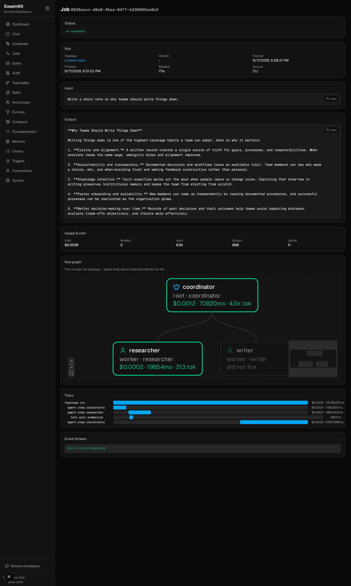

# Level 8: Observability & Debugging

See what your agents did — the call graph, the tokens, the gates that fired, the exact prompt a
model saw — and ask the runtime to explain a run in plain language.

## What you'll learn

- The six read-side commands: `status`, `logs`, `trace`, `why`, `ask`, `debug`
- The audit log and the job page in the portal
- Intent drift detection on an agent
- OpenTelemetry spans and the built-in metrics
- The prompt ring buffer (what the model actually saw, kept local)

The finished workspace is `examples/tutorials/08-observability/` — Level 7's workspace plus one
block. Every transcript below is from a real run on OpenRouter.

## Two runs to look at

Everything the runtime does is recorded in `.swarmkit/` under the workspace: the audit log
(`audit.sqlite`), run traces (`logs/`), and the prompt ring buffer (`prompts.sqlite`). Make two runs
so there is something to read:

```bash
swarmkit run . hello --input "In two sentences, why should a team write things down?"
swarmkit run . content-team --input "Write a short note on why teams should write things down."
```

The second is the coordinator/researcher/writer team from Level 4 with Level 7's gates still bound
— a plan of two tasks, one delegated, one synthesised:

```
[coordinator] created task plan: 2 tasks
  - research -> researcher
  - synthesize -> self (after: research)
[coordinator] executing task batch: research
[researcher] thinking... (kimi-k2.5)
  [researcher] calling summarize {}
  executing: summarize
[researcher] done (19.9s)
  task 'research' completed (5 findings)
[coordinator] executing task batch: synthesize
  task 'synthesize' completed (1 findings)
[coordinator] done (21.7s)
**Why Teams Should Write Things Down**
…
```

## The read side

### 1. `status` — is anything wrong?

```bash
swarmkit status .
```

```
topology             agents   duration   issues   source
-----------------------------------------------------------------
content-team         3         90673ms   0        audit
hello                1          8405ms   0        audit
```

One line per run, newest first. `issues` counts failed gates, denied tool calls and errors.

### 2. `logs` — what happened, in order

```bash
swarmkit logs . --last 1            # also: --topology content-team, --agent researcher, --run-id <id>
```

```
── audit store ──
  coordinator              started  (root)
  coordinator              decision.evaluated
  coordinator              done     11362ms
  coordinator              started  (root)
  coordinator              decision.evaluated
  researcher               started  (worker)
  researcher               skill    summarize
  researcher               done     19854ms
  researcher               decision.evaluated
  coordinator              started  (root)
  self                     decision.evaluated
  coordinator              done     59457ms
```

Every `decision.evaluated` is a Level 7 gate firing — `content-filter` before each agent's input,
`quality-check` after each output. `--format markdown` gives the same for a report.

### 3. `trace` — the call graph and the bill

```bash
swarmkit trace -w .                 # list runs
swarmkit trace 0928eacc-d9e -w .    # one run (a unique prefix of the id is enough)
```

```
Run: 0928eacc-d9e8-45ae-8477-b336695ee6e2
Topology: content-team
Duration: 170.7s
Total tokens: 7,405 (input: 6,517 / output: 888) across 5 LLM call(s)

Agent Call Graph:
coordinator (deepseek/deepseek-chat-v3-0324), 2,128 tokens
  └─→ researcher (moonshotai/kimi-k2.5), 213 tokens
    ├── summarize ✓ (2957ms)
coordinator (deepseek/deepseek-chat-v3-0324), 2,372 tokens

Tokens by agent:
  coordinator                       6,666 (in: 6,177 / out: 489)
  researcher                          739 (in: 340 / out: 399)

Tokens by model:
  deepseek/deepseek-chat-v3-0324              4,500 (in: 4,375 / out: 125)
  moonshotai/kimi-k2.5                        2,905 (in: 2,142 / out: 763)
```

Who called whom, which tools ran (with timing and a ✓/✗), and tokens split two ways — by agent
tells you which role is expensive, by model tells you what the dual-model setup from Level 6 is
buying you.

### 4. `why` — explain this run

```bash
swarmkit why 0928eacc-d9e .
```

```
FLOW: The root coordinator opened the run but produced an empty result (0 chars, 11,362 ms) at
12:28:43; it then invoked a researcher worker at 12:28:45, and a final coordinator pass starting
at 12:30:23 yielded the sole substantive output (1,351 chars) at 12:31:22. TIMING: That final
coordinator run consumed 59,457 ms—roughly 3× the researcher's 19,854 ms … SKILLS: The researcher
called a summarization skill at 12:28:52, yet inputs were empty, so it returned a placeholder "no
text was provided" response … ISSUES: No policy denials or trust failures occurred—all verdicts
passed …
```

A model reads the run's events and writes the paragraph. It is an *interpretation* — the "empty
result" it flags is the coordinator's planning turn, which ends in a delegation rather than text —
but it found the real waste in this run: the researcher called `summarize` with no arguments and
got a placeholder back. That is worth fixing in the researcher's prompt, and `why` is how you find
it without reading forty events.

### 5. `ask` — a question about the workspace

```bash
swarmkit ask "Which agent took the longest and why?" -w .
```

```
The `coordinator` agent took the longest, with one run in the `content-team` topology completing
in 59,457 ms (nearly a minute). As the `root` agent, it accrued overhead from multiple policy
evaluation cycles—specifically `quality-check` and `content-filter` decisions—while orchestrating
the `researcher` worker. By contrast, the `researcher` finished in only 19,854 ms because it
performed a single allowed skill (`summarize`) before completing. The `assistant` in the `hello`
topology was fastest at 8,405 ms, though it triggered an `intent.drift` event.
```

`ask` gets the workspace's inventory (topologies, skills, archetypes) and the last 200 audit events
as context; `--run <id-or-topology>` narrows the events to one run. The `intent.drift` it mentions is the next section.

### 6. `debug` — what did the model actually see?

```bash
swarmkit debug . --agent researcher --last 1
```

```
  span:     587edf73e99a4d20bcf7b903f62ce0ae
  run:      0928eacc-d9e8-45ae-8477-b336695ee6e2
  agent:    researcher
  step:     7
  model:    deepseek/deepseek-chat-v3-0324
  time:     2026-09-17T12:29:09.955308+00:00
  prompt:   [user]
Summarize the following research findings into 3-5 bullet points. Each bullet should be one
concise sentence capturing a key finding. Focus on specific names, IDs, and data — not generic …
  response: - Written documentation reduces ambiguity by establishing a single source of truth for
goals, processes, and responsibilities.
- Recording decisions and workflows creates an auditable trail, improvi…
  metadata: {"provider": "openrouter"}
```

Every prompt and response goes into a ring buffer at `.swarmkit/prompts.sqlite` — the full text,
not a summary. It never leaves the machine: the OTel exporter sends spans and metrics, and this
buffer is how a span id in a dashboard becomes the prompt behind it (`--span-id`). `--run-id`
dumps a whole run.

## The same thing in the portal

`swarmkit serve .` and open the portal. **Audit** is the log — append-only, newest first; a row's
Detail column carries the verdict and reasoning of a gate, or the score of a drift check:


**Jobs** → a run is the trace as a page: status, input and output, cost split by model, the run
graph over the topology (green fired, dimmed did not — the writer was never needed for this
plan), and the span waterfall:



Runs started from the CLI appear here too (`Source: CLI`) — it is one audit store.

## Intent drift detection

An agent can wander from what it was asked. `intent_monitoring` scores every final answer against
the original input and acts when the distance crosses a threshold. It goes on an agent (or at the
top of a topology as the default for every agent in it):

```yaml
# topologies/hello.yaml — one block added
apiVersion: swarmkit/v1
kind: Topology
metadata:
  name: hello
  version: 0.3.0
  description: A single agent using an archetype.
agents:
  root:
    id: assistant
    role: root
    archetype: friendly-assistant
    skills_additional:
      - quality-check    # added to the archetype's skills; `skills:` would replace them
    intent_monitoring:
      enabled: true
      threshold: 0.75       # 0.5 = aggressive, 0.75 = balanced, 0.9 = permissive
      on_drift: warn        # log | warn | nudge
```

The same block is editable in the portal — **Composer**, pick `hello`, switch to the YAML tab —
and saves back to this file.

```bash
SWARMKIT_VERBOSE=1 swarmkit run . hello --input "In two sentences, why should a team write things down?" --verbose
```

```
--- [assistant] calling moonshotai/kimi-k2.5 ---
  tools: ['summarize', 'get-weather', 'quality-check']
  tool_calls: []
  text: ['Writing things down creates a shared record that prevents miscommunication and helps team members al']
[assistant] done (4.1s)
  [drift] sentence-transformers not installed. Using TF-IDF fallback (less accurate).
  Install for better drift detection: pip install sentence-transformers
  [drift] score=0.8850 threshold=0.75 → warn
Writing things down creates a shared record that prevents miscommunication and helps team members
align on decisions and next steps. It also preserves institutional knowledge, …
```

| `on_drift` | What happens |
|---|---|
| `log` | An `intent.drift` audit event with the score, nothing else |
| `warn` | The event, plus the `[drift]` line under `--verbose` |
| `nudge` | The event, plus a message to the agent: *"You are drifting from your original goal. Refocus on: …"* |

The event is in `swarmkit logs` as `intent.drift`, in the audit page as `drift 0.89 > 0.75 → warn`,
and in the metrics as `swarmkit.agent.drift.score` / `swarmkit.agent.drift.breaches.total`.

Be honest about the number: the score is `1 − cosine similarity` between the embedding of the
input and the embedding of the output. With `sentence-transformers` installed that is a semantic
distance and 0.75 is a reasonable line. Without it the runtime falls back to TF-IDF, which for
two short texts that share few words is close to 1.0 whatever they mean — the run above is a
perfectly on-topic answer scoring 0.885. Install the model (`pip install sentence-transformers`;
~80 MB, downloaded once) before trusting the threshold, and start with `log` until you have seen
a few scores from your own topology.

## OpenTelemetry

```bash
SWARMKIT_OTEL_EXPORTER=console swarmkit run . hello --input "Say hello."      # print spans
SWARMKIT_OTEL_ENDPOINT=http://localhost:4318 swarmkit run . hello --input …  # OTLP: Grafana, Jaeger, …
```

```json
{
    "name": "agent.step.assistant",
    "context": {"trace_id": "0x410aa51997d9fafb9d216cc963e92b19", "span_id": "0x03c0c47c5e43c56d"},
    "parent_id": "0x65e5fe13e7bf80df",
    "attributes": {
        "swarmkit.agent.id": "assistant",
        "swarmkit.agent.role": "root",
        "swarmkit.model.id": "moonshotai/kimi-k2.5",
        "swarmkit.model.tokens_in": 165,
        "swarmkit.model.tokens_out": 50,
        "swarmkit.model.cost_usd": 0.000212686,
        "swarmkit.executor.kind": "model"
    }
}
{
    "name": "topology.run",
    "attributes": {
        "swarmkit.run.id": "640ef332-28e0-4986-a5a2-a143989ae326",
        "swarmkit.topology.id": "hello",
        "swarmkit.workspace.id": "my-swarm",
        "swarmkit.run.llm_calls": 1,
        "swarmkit.model.tokens_in": 165,
        "swarmkit.model.tokens_out": 50,
        "swarmkit.model.cost_usd": 0.000212686
    }
}
```

One `topology.run` span per run, one `agent.step.<id>` per agent turn, one `tool.call.<name>` per
tool call (with the arguments and the result as attributes). The metrics the runtime emits:

| Metric | Kind |
|---|---|
| `swarmkit.runs.total`, `swarmkit.runs.duration_ms` | counter, histogram |
| `swarmkit.agent.steps.total` | counter |
| `swarmkit.tool.calls.total`, `swarmkit.tool.duration_ms` | counter, histogram |
| `swarmkit.governance.decisions.total` | counter |
| `swarmkit.approval.wait_ms` | histogram — how long gates waited on a person (Level 7) |
| `swarmkit.agent.drift.score`, `swarmkit.agent.drift.breaches.total` | histogram, counter |
| `swarmkit.compression.bytes_saved.total`, `swarmkit.compression.ratio` | counter, histogram |

`SWARMKIT_OTEL_HEADERS` and `SWARMKIT_OTEL_API_KEY` carry the collector credential
([Environment configuration](../reference/env-config.md)).

## Your workspace so far

```
my-swarm/
├── workspace.yaml
├── .swarmkit/               # created by the first run — audit.sqlite, logs/, prompts.sqlite
├── archetypes/ · skills/ · servers/ · funnels/ · roles/
└── topologies/
    └── hello.yaml           # now with intent_monitoring
```

## Next

[Level 9: Conversations & Memory](09-conversations-memory.md) — multi-turn chat and agents that remember.
