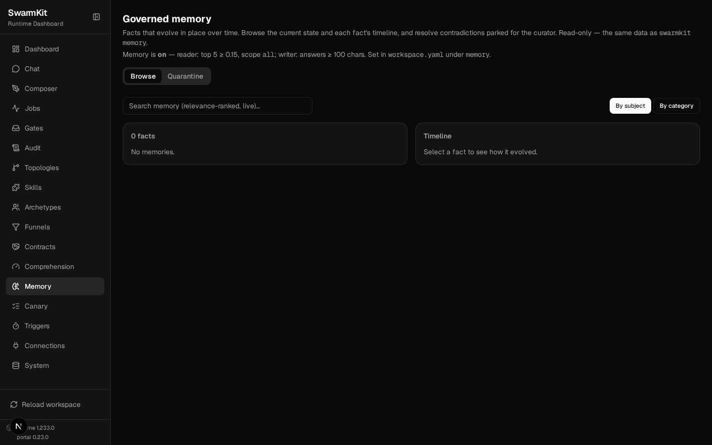

# Level 9: Conversations & Memory

Agents that hold a conversation, remember what earlier runs learned, and treat the facts a person
curated as established.

## What you'll learn

- Multi-turn chat with `swarmkit chat`, resuming, and the same conversation in the portal
- **Workspace memory**: what a run remembered by itself (`memory-reader` / `memory-writer`)
- **Governed memory**: facts that are reconciled on write, quarantined on conflict, and resolved by
  a person — `swarmkit memory`, the `governed-memory` skill, the Memory page
- Where all of it is stored

The finished workspace is `examples/tutorials/09-conversations-memory/` — Level 8 plus two
bindings, two skill files and one topology. Every transcript is a real run on OpenRouter.

## There are two memories

| | workspace memory | governed memory |
|---|---|---|
| what it holds | `{topic, context, key_points, tags}` — a summary of a turn | `{subject, attribute, value}` — one fact |
| written by | `memory-writer`, automatically, after a run | the `governed-memory` skill, `swarmkit memory add`, `POST /memory` |
| reviewed | no | reconcile-on-write; a contradiction is quarantined for a person |
| read by | `memory-reader`, before a run | `memory-reader`, before a run — curated facts first |
| CLI / UI | — | `swarmkit memory search / get / quarantine / resolve`; **Memory** page |

Both live in the workspace's configured store (`storage.runtime` — SQLite in `.swarmkit/` by
default, Postgres when you say so), like jobs, the audit log and conversations. Nothing here is a
file you have to back up separately.

## Part 1 — workspace memory

### 1. It is already on

There is nothing to bind. Since runtime **1.233.0** memory is on by default: `memory-reader` runs
before every agent and `memory-writer` after, both advisory (`required: false` — a memory that
cannot be read or written costs the context, never the run), and the two governed-memory skills
of Part 2 are bundled. A workspace that never mentions memory remembers. The knobs, and the
off switch, live in one block:

```yaml
# workspace.yaml — optional; absent means exactly this
memory:
  enabled: true
  reader:
    max_results: 5
    similarity_threshold: 0.15
    search_scope: all           # user | all | both
  writer:
    min_output_length: 100      # greetings are not worth remembering
```

`memory-writer` is one model call per run whose answer clears `min_output_length` — the price of
remembering, paid by default. Raise the threshold before you reach for `enabled: false`. If you
bind `memory-reader` or `memory-writer` yourself under `governance.decision_skills` (a narrower
`scope`, say), your binding is used as written and the automatic one for that id is skipped;
binding one next to `enabled: false` is a resolution error, not a coin toss.

```bash
swarmkit validate . --require
```

```
reachability: 2 declared, all wired
  decision_skill 'hello:memory-reader:pre_input' declared on topology hello — at pre_input: wired
  decision_skill 'hello:memory-writer:post_output' declared on topology hello — at post_output: wired
```

The portal's **Memory** page says what is in force (`GET /memory/config` is the same data):



### 2. A run that is worth remembering

```bash
swarmkit run . hello --input "I'm planning a two-week trip to Japan in November — Tokyo, Kyoto and Kanazawa. What should I know about the weather and what to pack?"
```

```
[assistant] thinking... (kimi-k2.5)
  [assistant] calling get-weather {"city": "Tokyo"}
  [assistant] calling get-weather {"city": "Kyoto"}
  [assistant] calling get-weather {"city": "Kanazawa"}
  [assistant] got results: get-weather (130B), get-weather (130B), get-weather (133B) | waiting for model... (turn 1)
[assistant] done (50.2s)
Great question! I checked the current weather for all three cities, but since you're traveling in
**November**, let me share what to typically expect during that month, along with packing tips.
…
```

After the answer, `memory-writer` asked a model whether the turn was worth keeping and what to keep.
This is what it stored — `topic`, `context`, `key_points`, `tags`, extracted by the model, not
copied:

```json
{
  "id": "mem-20260917T131924-0",
  "topic": "Japan travel planning - November weather and packing",
  "context": "User is planning a two-week trip to Japan in November visiting Tokyo, Kyoto, and Kanazawa. They wanted to know what weather to expect and what clothing/gear to pack for those conditions.",
  "key_points": [
    "November is cool autumn weather: Tokyo/Kyoto highs ~17°C (63°F), lows ~8-10°C; Kanazawa slightly cooler at 15-16°C days, 7°C nights",
    "Kanazawa is damper and more prone to rain/cloud cover due to Sea of Japan location",
    "Layering is essential: medium-weight jacket, sweaters, thermal base layers for Kanazawa and evenings",
    "Late November brings peak autumn foliage; generally dry and sunny in Tokyo/Kyoto"
  ],
  "tags": ["travel", "japan", "tokyo", "kyoto", "kanazawa", "november", "packing", "weather"],
  "source_agent": "assistant"
}
```

### 3. A later run that needs it

A different run, a different day, no conversation history:

```bash
SWARMKIT_VERBOSE=1 swarmkit run . hello --input "Remind me — where was I planning to go, and when?" --verbose
```

```
  [assistant] memory context injected
--- [assistant] calling moonshotai/kimi-k2.5 ---
  input: WORKSPACE MEMORY — relevant prior conversations for this user:
Topic: Japan travel planning - November weather and packing
Context: User is planning a two-week trip to Japan in November visiting Toky...
[assistant] done (13.5s)
As we discussed previously, you're planning a two-week trip to Japan in November, visiting Tokyo,
Kyoto, and Kanazawa.
```

`memory-reader` searched the store with the input, found the entry, and prepended it to what the
agent sees — with an instruction to use it as its own recollection rather than announce a
database. Search is lexical: the score is how much of the question's content words the memory
covers (`similarity_threshold: 0.15` = at least 15% of them). *"Remind me — where was I planning
to go"* scores 0.40 against that entry; *"how do I cook rice"* scores 0.

### 4. The same thing as a conversation

`swarmkit chat` keeps the turns of one conversation together and hands the whole history to the
topology on every turn — the swarm sees a longer input, not a special mode:

```bash
swarmkit chat . hello
```

```
> What's the weather like in Kyoto right now?
  [assistant] memory context injected
  [assistant] calling get-weather {"city": "Kyoto"}
[assistant] done (19.5s)
Right now in Kyoto it's **22°C (72°F)** and **partly cloudy** with **65% humidity**.

This is consistent with what we discussed earlier — still quite warm for November! …

> And is that warmer or colder than Tokyo?
  [assistant] calling get-weather {"city": "Tokyo"}
[assistant] done (17.6s)
Tokyo is currently **exactly the same** — also **22°C (72°F)** and **partly cloudy** …

As we discussed earlier, Kanazawa remains the outlier in your itinerary …

> exit

Conversation saved: e016c48d
Resume with: swarmkit chat ... --resume e016c48d
```

Inside a chat: `exit` / `quit` / `/quit` end it, `/clear` starts the context over (MCP servers
stay up), `/model <provider/model>` switches the model for the rest of the session. Conversations
are listed and resumed by id or prefix:

```bash
swarmkit conversations .
```

```
Recent conversations:
  1. [e016c48d] hello (4 turns)
     "And is that warmer or colder than Tokyo?"
     2026-09-17T13:59:42

Resume with: swarmkit chat <workspace> <topology> --resume <id>
Or use: swarmkit conversations <workspace> --pick
```

Every turn is a job (`Source: chat` in **Jobs**, linked by the conversation id), and the portal's
**Chat** page is the same conversation store — a chat started from the CLI continues in the browser:


### 4b. Switching it off

The same second question on a copy of the workspace with memory switched off:

```yaml
# workspace.yaml
memory:
  enabled: false
```

```bash
SWARMKIT_VERBOSE=1 swarmkit run . hello --input "Remind me — where was I planning to go, and when?"
```

```
[assistant] done (5.1s)
Could you share those details with me? I'd be happy to help you with information about your destination—like checking the weather there if you'd like!
```

No `memory context injected`, nothing recalled, and `swarmkit validate --require` lists no memory
bindings. One more thing the flag does: it stops bundling the governed-memory skills of Part 2, so
a topology that *grants* `governed-memory` (the `tutor` below) no longer resolves —

```
error: Agent 'tutor' references skill 'governed-memory' which is not defined in this workspace.
  try   Define a skill with id='governed-memory' under skills/, or change the reference to an existing one.
```

— which is the right answer: a workspace with memory off should not have an agent that writes it.
Copy the skill into `skills/` if you want governed memory without the automatic reader and writer.

## Part 2 — governed memory

Workspace memory is whatever a run happened to record. Some facts deserve more: a correction a
person made, a decision that should not be re-litigated. Governed memory is curated — every write
is reconciled against what is already there, a contradiction is quarantined instead of applied, and
resolving one is a human action.

### 5. It is on too — writing is the grant

The two skills behind governed memory ship with the runtime and are loaded unless your workspace
defines its own (a copy in `skills/` wins):

- `governed-memory` (`category: persistence`) — the skill an agent calls to propose facts. Its
  presence is what builds the store.
- `memory-reconcile` (`category: decision`) — the judge for a **changed** value: `update`
  (supersede), `refine` (merge the detail in) or `contradict` (quarantine). New keys and
  identical restatements are handled deterministically, without a model.

Reading needs nothing: `memory-reader` renders curated facts first. Writing is a grant, made
deliberately, per agent:

```yaml
# topologies/tutor.yaml
apiVersion: swarmkit/v1
kind: Topology
metadata:
  name: tutor
  version: 0.1.0
  description: A single assistant that can write governed memory.
agents:
  root:
    id: tutor
    role: root
    archetype: friendly-assistant
    skills_additional:
      - governed-memory    # write access to curated memory — grant deliberately
```

### 6. An agent proposes facts

```bash
swarmkit run . tutor --input "Two things to remember about me: I'm vegetarian, and my home airport is Bengaluru (BLR)."
```

```
--- [tutor] calling moonshotai/kimi-k2.5 ---
  tools: ['summarize', 'get-weather', 'governed-memory']
  tool_calls: ['governed-memory']
  [tutor] calling governed-memory {"input": "User is vegetarian and their home airport is Bengaluru (BLR)."}
  executing: governed-memory
  [tutor] got results: governed-memory (346B) | waiting for model... (turn 1)
[tutor] done (29.8s)
Got it! I've noted that you're vegetarian and your home airport is Bengaluru (BLR). I'll keep that
in mind for future conversations.
```

The skill turned the sentence into candidates and wrote each through the governed path; the tool
result told the agent what happened to them (`2 candidate(s) written: 2 new`), which is why it can
say "noted" truthfully.

```bash
swarmkit memory search ""          # empty query: everything, by confidence
```

```
  user · home_airport = Bengaluru (BLR)
      type=profile confidence=1.00 reinforced x1
  user · dietary_preference = vegetarian
      type=profile confidence=1.00 reinforced x1
```

### 7. A person refines, and something contradicts

`swarmkit memory add` writes through the same path an agent writes through — reconcile included:

```bash
swarmkit memory add user home_airport "Bengaluru (BLR); prefers morning departures"
```

```
refine     user/home_airport
```

The judge read the current value and the proposal and decided the new detail belongs *with* the
old, not instead of it. Now a bad import asserts something else:

```bash
swarmkit memory add user home_airport "Chennai (MAA)" --source old-crm-import
```

```
contradict  user/home_airport — NOT written; quarantined for review
  the trusted memory is unchanged. Resolve with: swarmkit memory resolve <id>
```

The command exits non-zero: a contradiction is not a success, and a seeding script must not read
it as one. The trusted value stands until a person decides:

```bash
swarmkit memory quarantine
```

```
  #1  user::home_airport
      proposed: 'Chennai (MAA)'  vs current: 'Bengaluru (BLR); prefers morning departures'
      The proposal directly conflicts with a firmly-held home airport memory at confidence 1.00;
      without evidence of relocation, overwriting Bengaluru (BLR) with Chennai (MAA) requires
      human curation.
```

```bash
swarmkit memory resolve 1 --by alice --reject      # or --accept, which applies it as an update
```

```
rejected #1 (trusted value stands)
```

Every step is in the fact's append-only history — who decided, deterministic or skill:

```bash
swarmkit memory get user home_airport --history
```

```
  user · home_airport = Bengaluru (BLR); prefers morning departures
      type=semantic confidence=1.00
    2026-09-17T13:40:27  new       ∅ → Bengaluru (BLR)  (deterministic)
    2026-09-17T13:41:51  refine    Bengaluru (BLR) → Bengaluru (BLR); prefers morning departures  (skill)
    2026-09-17T13:42:42  contradict Bengaluru (BLR); prefers morning departures → Chennai (MAA)  (skill)
```

The **Memory** page is the same data: browse by subject, click a fact for its timeline, and the
**Quarantine** tab is where a curator resolves in the browser:


### 8. A curated fact reaches an agent

Any agent under the `memory-reader` binding — no write grant needed:

```bash
SWARMKIT_VERBOSE=1 swarmkit run . hello --input "I'm flying to Tokyo next month — which airport do I leave from, and what should I keep in mind about food?" --verbose
```

```
  [assistant] memory context injected
--- [assistant] calling moonshotai/kimi-k2.5 ---
  input: <curated-memory>
Established facts for this workspace:
- user · home_airport: Bengaluru (BLR); prefers morning departures
</curated-memory>
I'm flying to Tokyo next month — which airport do I leave f...
[assistant] done (14.5s)
Based on your profile, you leave from **Bengaluru (BLR)** — and since you prefer morning departures,
aim for flights that depart in the AM to match your preference.
…
```

Curated facts arrive in a labelled, delimited block *before* workspace memory, because they went
through review and workspace memory did not. Retrieval is by relevance to the input, so a fact is
injected when the question is about it — `dietary_preference` did not match this question's words
and was not included; ask about food by name and it is.

## Where it all lives

```
my-swarm/
├── workspace.yaml               # nothing memory-specific — or a `memory:` block to tune / switch off
├── topologies/
│   ├── tutor.yaml               # holds governed-memory (bundled with the runtime; a skills/ copy wins)
│   └── ...
└── .swarmkit/
    └── store.sqlite             # jobs, conversations, workspace memory, governed memory —
                                 # or Postgres, when `storage.runtime` says so (Level 21)
```

One store, resolved once from `storage.runtime`. Conversations, workspace memory and governed
memory are tables in it, next to jobs and usage; point the workspace at Postgres and all of them
move together.

## Next

[Level 10: Knowledge & RAG](10-knowledge-rag.md) — give your agents a knowledge base.
