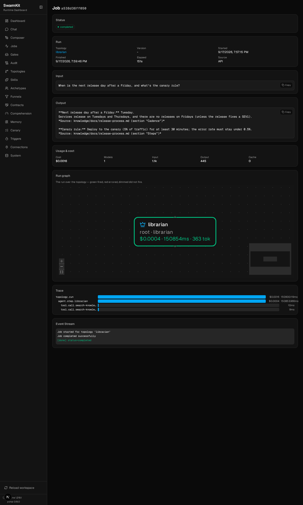

# Level 10: Knowledge & RAG

An agent that answers from your documents, cites where each answer came from, and says so when
the documents do not cover the question — with a gate that checks the citing.

## What you'll learn

- A knowledge base as an MCP server: full-text first, vector search when you need it, same tool
  contract for both
- The built-in **docs-reader** server (CSV, text, images, diagrams) and MarkItDown for PDF/DOCX
- A `librarian` archetype that searches before it answers
- Grounding: a `grounding-check` decision skill on the answer, and what the runtime checks by itself
- The built-in SwarmKit knowledge server, and what it is actually for

The finished workspace is `examples/tutorials/10-knowledge-rag/` — Level 9 plus a `knowledge/`
directory, two servers and one topology. Every transcript is a real run on OpenRouter.

## Build it

### 1. The documents

A small handbook — three markdown files and a CSV — under `knowledge/docs/`:

```
knowledge/docs/
├── expense-policy.md     # meals, travel, submitting
├── on-call.md            # rota, severities, handover, compensation
├── release-process.md    # cadence, steps, rollback
└── vendors.csv           # vendor, category, contract_end, annual_cost_inr, owner
```

Anything the search server can read goes here. Ingestion is the server's job, at startup.

### 2. A search server

One file, no external services: every markdown file is split on headings, each section goes into
an in-memory SQLite FTS5 table, and one tool searches it.

```python
# servers/search_server.py
# /// script
# dependencies = ["mcp>=1.0,<2"]
# ///
"""A knowledge-search MCP server: full-text search over knowledge/docs, no external services."""

from __future__ import annotations

import json
import os
import re
import sqlite3
from pathlib import Path

from mcp.server.fastmcp import FastMCP

server = FastMCP("knowledge-search")
_db = sqlite3.connect(":memory:")


def _sections(path: Path) -> list[tuple[str, str]]:
    """Split a markdown file on headings: [(heading, body), ...]."""
    heading, body, out = path.stem, [], []
    for line in path.read_text(encoding="utf-8").splitlines():
        if line.startswith("#"):
            if body:
                out.append((heading, "\n".join(body).strip()))
            heading, body = line.lstrip("# ").strip(), []
        else:
            body.append(line)
    if body:
        out.append((heading, "\n".join(body).strip()))
    return [(h, b) for h, b in out if b]


def _index() -> int:
    root = Path(os.environ.get("KNOWLEDGE_DIR", "knowledge/docs"))
    _db.execute("CREATE VIRTUAL TABLE docs USING fts5(source, heading, body)")
    n = 0
    for path in sorted(root.rglob("*")):
        if path.suffix in (".md", ".txt"):
            for heading, body in _sections(path):
                _db.execute("INSERT INTO docs VALUES (?, ?, ?)", (str(path), heading, body))
                n += 1
    _db.commit()
    return n


@server.tool()
def search_knowledge(query: str, limit: int = 3) -> str:
    """Search the knowledge base. Returns the best-matching sections as JSON: source file,
    heading, text. Cite the source when you use one."""
    terms = " OR ".join(re.findall(r"[A-Za-z0-9]+", query))
    rows = _db.execute(
        "SELECT source, heading, body FROM docs WHERE docs MATCH ? ORDER BY rank LIMIT ?",
        (terms, limit),
    ).fetchall()
    return json.dumps(
        [{"source": s, "heading": h, "text": b} for s, h, b in rows], indent=2, ensure_ascii=False
    )


if __name__ == "__main__":
    print(f"indexed {_index()} sections", file=__import__("sys").stderr)
    server.run()
```

The tool's docstring is what the model reads as the tool description — *"cite the source when
you use one"* is an instruction to the agent, placed where the agent looks for it.

### 3. Declare the servers

```yaml
# workspace.yaml — two more servers
mcp_servers:
  # Full-text search over knowledge/docs — one file, no external service. `open`: local, read-only.
  - id: knowledge-search
    transport: stdio
    command: ["uv", "run", "servers/search_server.py"]
    env:
      KNOWLEDGE_DIR: knowledge/docs
    permission: open

  # Built into the runtime: CSV, draw.io, SVG, images and plain files, with directory listing.
  - id: docs-reader
    transport: stdio
    command: ["swarmkit", "docs-reader", "--workspace", "."]
    permission: readonly
    effects:
      read_csv: read
      read_text: read
      list_files: read
```

`swarmkit docs-reader` exposes `read_csv`, `read_text`, `list_files`, `view_image` (returns the
image to a multimodal model), `read_drawio` and `read_svg`. It does **not** parse PDF or Word —
that is MarkItDown's job, and the two are meant to sit side by side:

```yaml
  - id: markitdown
    transport: stdio
    command: ["uvx", "markitdown-mcp"]     # one tool: convert_to_markdown(uri) — PDF, DOCX, XLSX, PPTX
```

### 4. Skills and a librarian

Three skills over the servers (`search-knowledge` → `search_knowledge`, `read-csv` → `read_csv`,
`list-files` → `list_files`), and an archetype that is told how to behave:

```yaml
# archetypes/librarian.yaml
apiVersion: swarmkit/v1
kind: Archetype
metadata:
  id: librarian
  name: Librarian
  description: Answers questions from the company handbook and cites where the answer came from.
role: root
defaults:
  model:
    provider: openrouter
    name: moonshotai/kimi-k2.5
    temperature: 0.2
    max_tokens: 2048
  prompt:
    system: |
      You answer questions about company policy from the handbook. Always search first
      (search-knowledge); answer only from what the search returns and name the source file
      for each fact. If the handbook does not cover the question, say so — do not guess.
      For questions about vendors or contracts, read knowledge/docs/vendors.csv with read-csv.
  skills:
    - search-knowledge
    - read-csv
    - list-files
provenance:
  authored_by: human
  version: 1.0.0
```

### 5. A gate on the citing

The prompt *asks* for sources. A decision skill bound `post_output` *checks* for them, and a
`fail` sends the answer back for revision (Level 7):

```yaml
# skills/grounding-check.yaml
apiVersion: swarmkit/v1
kind: Skill
metadata:
  id: grounding-check
  name: Grounding Check
  description: >
    Fails an answer that states handbook facts without citing a source, or that cites a source
    the answer's facts do not appear in.
category: decision
implementation:
  type: llm_prompt
  prompt: |
    You check whether an answer is grounded. The user message is the agent's final answer,
    which may quote search results it retrieved.
    - pass: every factual claim about company policy is attributed to a source file, or the
      answer says it could not find the information.
    - fail: it states policy facts (amounts, limits, deadlines, names) with no source, or
      contradicts the sources it quotes.
    Reply with JSON only: {"verdict": "pass" | "fail", "reasoning": "<one sentence>"}
outputs:
  type: object
  required: [verdict, reasoning]
  properties:
    verdict:
      type: string
      enum: [pass, fail]
    reasoning:
      type: string
provenance:
  authored_by: human
  version: 1.0.0
```

```yaml
# topologies/librarian.yaml
apiVersion: swarmkit/v1
kind: Topology
metadata:
  name: librarian
  version: 0.1.0
  description: One agent that searches the handbook and cites its sources.
governance:
  decision_skills:
    - id: grounding-check
      trigger: post_output    # judged after every answer; a fail makes the agent revise
      scope: "*"
agents:
  root:
    id: librarian
    role: root
    archetype: librarian
```

A topology-level `governance.decision_skills` adds to the workspace's bindings — this topology
runs under the content filter, quality check and memory from earlier levels *and* the grounding
gate. Both files are editable in the portal's **Composer** (the topology) and **Skills** page (the
skill, as a form or as YAML).

### 6. Run it

```bash
SWARMKIT_VERBOSE=1 swarmkit run . librarian --input "What's the daily meal limit when travelling, and can I claim a beer with dinner?" --verbose
```

```
indexed 11 sections
--- [librarian] calling moonshotai/kimi-k2.5 ---
  tools: ['search-knowledge', 'read-csv', 'list-files']
  tool_calls: ['search-knowledge']
  [librarian] calling search-knowledge {"query": "daily meal limit travelling travel alcohol beer dinner expense claim"}
  executing: search-knowledge
  [librarian] got results: search-knowledge (837B) | waiting for model... (turn 1)
[librarian] done (21.7s)
**Daily meal limit while travelling:** Up to **₹2,500 per day** (or the local equivalent).
*Source: knowledge/docs/expense-policy.md — "Meals"*

**Can you claim a beer with dinner?** **No** — alcohol is not reimbursable.
*Source: knowledge/docs/expense-policy.md — "Meals"*
```

`swarmkit logs . --last 1` shows the gates around it — `content-filter` before, then the tool
call, then `grounding-check` and `quality-check` on the answer, then the memory writer:

```
  librarian                started  (root)
  librarian                decision.evaluated
  librarian                skill    search-knowledge
  librarian                decision.evaluated
  librarian                decision.evaluated
  librarian                done     53741ms
```

A question the CSV answers — the agent picks the right tool from the prompt:

```bash
swarmkit run . librarian --input "Which vendor contract expires first, and who owns it?"
```

```
  [librarian] calling read-csv {"path": "knowledge/docs/vendors.csv"}
[librarian] done (15.0s)
Based on the vendor data in **knowledge/docs/vendors.csv**, the contract that expires first is:

- **Vendor:** PagerPost
- **Expiration Date:** 2026-11-30
- **Owner:** platform
…
```

And one the handbook does not cover. This is the run that matters — an ungrounded assistant
answers it anyway:

```bash
swarmkit run . librarian --input "What is our parental leave policy?"
```

```
  [librarian] calling search-knowledge {"query": "parental leave policy"}
  [librarian] calling list-files {"directory": "knowledge/docs"}
  [librarian] calling search-knowledge {"query": "leave policy maternity paternity"}
  [librarian] calling search-knowledge {"query": "HR policy benefits employee handbook"}
[librarian] done (35.1s)
The handbook does not contain a parental leave policy. The available documents cover:

- **expense-policy.md** — Travel expenses, meal reimbursements, receipt requirements
- **on-call.md** — On-call rotation and incident response procedures
- **release-process.md** — Software release procedures
- **vendors.csv** — Vendor contact information

You may need to check with HR or your manager for parental leave benefits, as this is not
documented in the company handbook I have access to.
```

It searched three ways, listed the directory to be sure, and said no. The gate passed it: "says
it could not find the information" is a grounded answer.

In the portal the run's job page shows the two `tool.call.search-knowledge` spans under the agent
step, with the query and the result as attributes:



### 7. Vector search, same contract

Full-text search finds sections that share words with the question. *"Who do I page if nobody
answers?"* shares none with the on-call rota's *"the secondary is paged only when the primary does
not acknowledge"*. A vector index finds it by meaning. `servers/vector_search_server.py` in the
finished workspace is the same server over an embedded ChromaDB collection — same
`search_knowledge(query, limit)` tool, same JSON back — so switching is one line in
`workspace.yaml`:

```yaml
  - id: knowledge-search
    transport: stdio
    command: ["uv", "run", "servers/vector_search_server.py"]   # dependencies: mcp, chromadb
    env:
      KNOWLEDGE_DIR: knowledge/docs
      CHROMADB_PATH: knowledge/chromadb
    permission: open
```

```
search_knowledge("who do I page if nobody answers", 1)
[{"source": "knowledge/docs/on-call.md", "heading": "Rota",
  "text": "The platform team runs a weekly rota … the secondary is paged only when the primary
           does not acknowledge within 15 minutes."}]
```

The first start downloads ChromaDB's default embedding model (all-MiniLM-L6-v2, ~80 MB) and
takes a few minutes to install; after that it is local and offline. Nothing in the topology,
archetype or skill changed — the index is the server's business.

### 8. What the runtime grounds by itself

The `grounding-check` skill judges prose. For **structured** output the runtime does it without a
model: a worker with the default findings schema (Level 6) returns `{"findings": [{"fact",
"source"}]}`, the runtime fills empty `source` fields from the tool calls that produced the turn,
and a finding with no source is recorded as a `grounding.checked` audit event with the unsourced
claims listed. A for loop, not a judge — deterministic, free, and on every worker turn.

### 9. The built-in knowledge server is something else

`swarmkit knowledge-server` is also an MCP server, but its corpus is **SwarmKit itself** — the
design notes, schemas and reference skills — for an AI assistant that is helping you write
workspaces: `search_docs`, `get_schema`, `list_schemas`, `get_design_note`,
`list_reference_skills`, `validate_workspace`, `get_error_reference`, `read_workspace_file`. It is
the authoring assistant's knowledge base, not yours; it runs inside a SwarmKit checkout and is
covered with the other AI-IDE integrations in [Level 14](14-packaging.md).

## Your workspace so far

```
my-swarm/
├── workspace.yaml               # + knowledge-search, docs-reader
├── knowledge/
│   └── docs/                    # the handbook
├── servers/
│   ├── search_server.py         # FTS5
│   └── vector_search_server.py  # ChromaDB, same tool
├── archetypes/
│   └── librarian.yaml
├── skills/
│   ├── search-knowledge.yaml · read-csv.yaml · list-files.yaml
│   └── grounding-check.yaml
└── topologies/
    └── librarian.yaml           # grounding-check bound post_output
```

## Next

[Level 11: Serve & HTTP API](11-serve-api.md) — run the workspace as a service and call it from anywhere.
