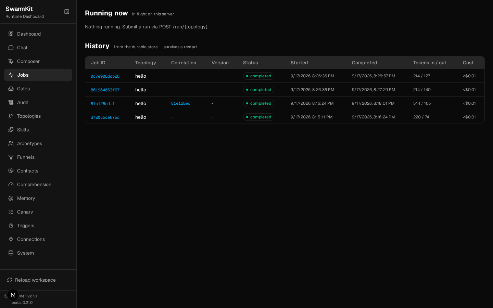
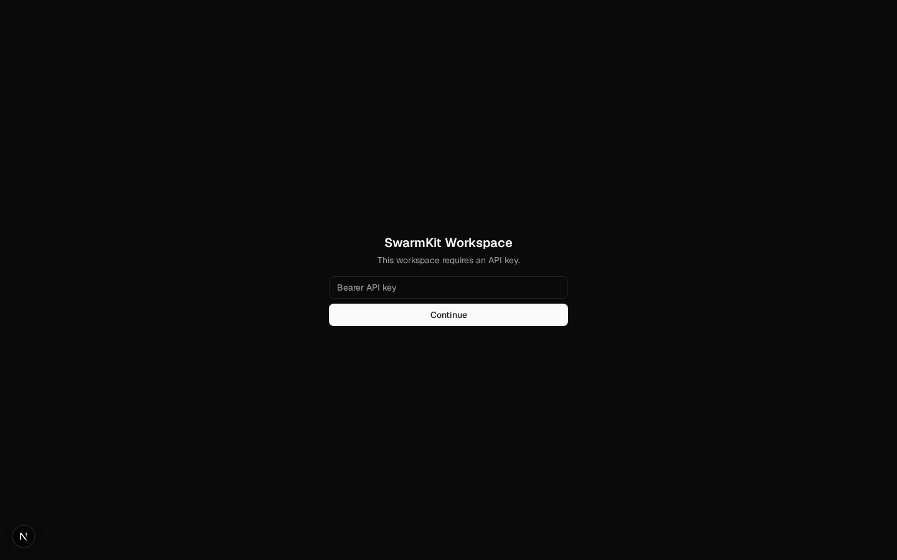
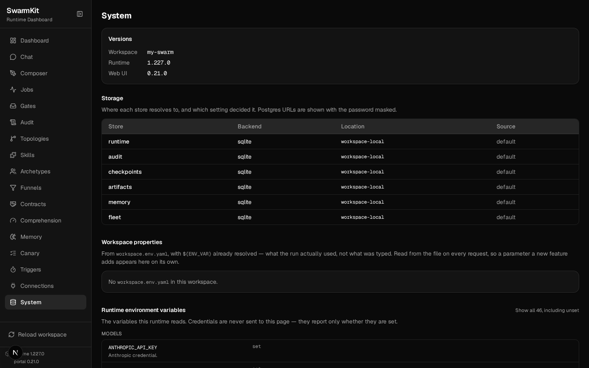

# Level 11: Serve & HTTP API

Run the workspace as a service: submit runs over HTTP, stream their progress, hold conversations,
edit artifacts, meter usage — and lock the door.

## What you'll learn

- `swarmkit serve` and what it hosts (the API, the portal, an MCP endpoint)
- Jobs: submit, stream, poll, history, usage
- The conversation API (what the portal's Chat page uses)
- Reading and writing artifacts over `/api/…`, validated on the way in
- API-key auth: minting a key, tiers, what a client sees
- Concurrency and timeouts, and calling topologies as MCP tools

The finished workspace is `examples/tutorials/11-serve-api/` — Level 10 plus a `server:` block.
Every response below is from a real serve on that workspace.

## Start it

```bash
swarmkit serve . --port 8000
```

```
swarmkit-runtime 1.227.0 · web portal 0.21.0
INFO  MCP endpoint mounted at /mcp
INFO  web portal mounted at /
INFO  storage:
        runtime      sqlite
        …
```

One process: the REST API, the portal at `/`, an MCP endpoint at `/mcp/`, and the workspace's
MCP servers started once and kept warm across runs. The OpenAPI document is at `/openapi.json`.

```bash
curl -s localhost:8000/health
```

```json
{"status":"ok","workspace":"my-swarm","runtime_version":"1.227.0","webui_version":"0.21.0"}
```

## Read the workspace

```bash
curl -s localhost:8000/topologies
curl -s localhost:8000/skills            # [{"id": "content-filter", "category": "decision"}, …]
curl -s localhost:8000/archetypes
curl -s localhost:8000/validate          # {"valid": true, "workspace_id": "my-swarm", "topologies": [...], ...}
```

```json
["analysis","content-team","explain","files","hello","librarian","parallel-research","pipeline","review-team","structured-review"]
```

`/api/topologies/{id}` returns one topology resolved (archetypes and skills expanded);
`/api/topologies/{id}/yaml` returns the file as written. `/system` and `/capabilities` describe the
server itself — versions, which store each kind resolves to, the providers available.

## Jobs

### Submit

```bash
curl -s -X POST localhost:8000/run/hello \
  -H 'content-type: application/json' \
  -d '{"input": "In one sentence, why should a team write things down?"}'
```

```json
{
  "job_id": "df2055ce675d",
  "status": "pending",
  "topology": "hello",
  "input": "In one sentence, why should a team write things down?",
  "created_at": "2026-09-17T14:45:11.637843+00:00",
  "output": null,
  "usage_cost_usd": null
}
```

Non-blocking: you get the job back the instant it is queued. The body also takes `max_steps`,
`labels`, `correlation_id`, `parent_job_id` (Level 16) and `attachments` (Level 19).

### Stream

```bash
curl -N localhost:8000/jobs/df2055ce675d/stream
```

```
data: Job started for topology 'hello'

data: [assistant] thinking... (kimi-k2.5)

data: [assistant] done (9.9s)

data: Job completed successfully

data: [done] status=completed
```

Server-sent events, one line per progress event — the same lines `swarmkit run` prints. The
stream ends with `[done] status=…`; `completed`, `failed`, `stopped` or `deferred` (parked on a
human gate, Level 7).

### Poll

```bash
curl -s localhost:8000/jobs/df2055ce675d
```

```json
{
  "job_id": "df2055ce675d",
  "status": "completed",
  "topology": "hello",
  "output": "Writing things down creates a shared, referenceable record that improves communication, alignment, and accountability across the team.",
  "input": "In one sentence, why should a team write things down?",
  "created_at": "2026-09-17T14:45:11.637843+00:00",
  "completed_at": "2026-09-17T14:46:24.744720+00:00",
  "source": "serve",
  "usage_input_tokens": 220,
  "usage_output_tokens": 74,
  "usage_cost_usd": 0.00036309
}
```

`POST /jobs/{id}/stop` stops a running job; `POST /jobs/{id}/resume` continues a deferred one;
`GET /observability/runs/{id}/trace` is the Level 8 trace as JSON.

### History and usage

```bash
curl -s localhost:8000/jobs/history       # every run, from the durable store — survives a restart
curl -s localhost:8000/usage/df2055ce675d # one job
curl -s localhost:8000/usage              # everything, by model
```

```json
{
  "summary": {"total_calls": 1, "total_input_tokens": 220, "total_output_tokens": 72, "total_cost_usd": 0.000331},
  "by_model": [
    {"model": "moonshotai/kimi-k2.5", "calls": 1, "input_tokens": 220, "output_tokens": 72, "cost_usd": 0.000331}
  ]
}
```

The portal's **Jobs** page is `/jobs` (running now) and `/jobs/history`:



## Conversations

The store behind Level 9's `swarmkit chat` and the portal's Chat page:

```bash
curl -s -X POST localhost:8000/conversations -H 'content-type: application/json' -d '{"topology": "hello"}'
```

```json
{"id":"81e128ed","topology":"hello"}
```

```bash
curl -N -X POST localhost:8000/conversations/81e128ed/messages \
  -H 'content-type: application/json' -d '{"message": "What is the weather in Kyoto?"}'
```

```
data: {"type": "progress", "text": "[assistant] thinking... (kimi-k2.5)"}

data: {"type": "progress", "text": "[assistant] calling get-weather {\"city\": \"Kyoto\"}"}

data: {"type": "progress", "text": "[assistant] got results: get-weather (130B) | waiting for model... (turn 1)"}

data: {"type": "progress", "text": "[assistant] done (18.2s)"}

data: {"type": "done", "output": "The weather in Kyoto is currently **22°C** and **partly cloudy**, with **65%** humidity.", "turns": 2, "conversation_id": "81e128ed", "events": [...], "usage": {...}, "trace": {...}}
```

A message is an SSE stream too — JSON events here, ending with `done` carrying the output, the
usage and the turn's trace. `GET /conversations` lists them; `GET /conversations/{id}` returns the
turns. Each turn is also a job (`81e128ed:1` in the history above, correlated by the conversation
id).

## Editing artifacts over the API

The portal's Composer and the YAML editors save through these; so can you:

```bash
curl -s -X POST localhost:8000/api/topologies -H 'content-type: application/json' \
  -d '{"yaml": "apiVersion: swarmkit/v1\nkind: Topology\nmetadata:\n  name: quick-answer\n  version: 0.1.0\nagents:\n  root:\n    id: assistant\n    role: root\n    archetype: friendly-assistant\n"}'
```

```json
{"valid":true,"topologies":["analysis", …, "quick-answer", …],"skills":[…],"archetypes":[…]}
```

The file is `topologies/quick-answer.yaml` on disk, and the running server reloaded — the
topology is live without a restart. `PUT /api/topologies/quick-answer` with `{"yaml": …}`
replaces it. Invalid content is refused with the schema error, and nothing is written:

```json
{"valid":false,"errors":[{"code":"schema.enum-mismatch","message":"topology @ /agents/root/role: 'boss' is not one of ['root', 'leader', 'worker']"}]}
```

`DELETE /api/topologies/quick-answer` removes the file. `/api/skills/{id}`,
`/api/archetypes/{id}`, `/api/funnels/{id}` and `/api/contracts/{id}` follow the same pattern;
`/api/schema/{artifact_type}` returns the JSON Schema an editor validates against.

## Authentication

Bound to loopback, an unauthenticated serve is fine. A non-loopback bind with no auth refuses to
start unless you pass `--insecure` — an open API cannot happen by accident.

### 1. Mint a key

```bash
swarmkit auth token app --tier run --client-name "My app" --env-var APP_TOKEN
```

```
# 1. Export the secret (shown once — store it securely):
export APP_TOKEN=<secret>

# 2. Add this under server.auth.config.keys in workspace.yaml:
        - key_ref: env:APP_TOKEN
          client_id: app
          client_name: My app
          tier: run

# 3. Restart `swarmkit serve` (auth config is read at startup).
```

Nothing is stored; the secret is shown once and the workspace file gets a *reference* to it.

### 2. Configure

```yaml
# workspace.yaml — the server block
server:
  jobs:
    max_concurrent: 2           # a third simultaneous run is refused with 429, not queued forever
    timeout_seconds: 600        # a run past this is marked failed
  mcp:
    enabled: true               # every topology is a tool at /mcp/
  auth:
    provider: api_key
    config:
      keys:
        - key_ref: env:APP_TOKEN    # a reference, never the literal — minted by `swarmkit auth token`
          client_id: app
          client_name: My app
          tier: run               # read | run | admin — or explicit `scopes`
```

### 3. Restart and call

```bash
export APP_TOKEN=…
swarmkit serve . --port 8000
```

```bash
curl -s localhost:8000/topologies                      # {"error":"Missing or invalid API key"}   401
curl -s localhost:8000/auth-info                       # {"mode":"api_key"}   — public, so a client knows what to ask for
curl -s -H "Authorization: Bearer $APP_TOKEN" localhost:8000/whoami
```

```json
{"client_id":"app","client_name":"My app","provider":"api_key","scopes":["serve:read","serve:run"],"mode":"api_key"}
```

Tiers are cumulative: `read` sees, `run` submits, `admin` reloads and edits. A `run` token on an
admin route:

```bash
curl -s -X POST -H "Authorization: Bearer $APP_TOKEN" localhost:8000/api/reload
```

```json
{"error":"Insufficient scope: requires serve:admin"}   403
```

Every `run`/`admin` call is audited with the acting `client_id`. The portal asks for the key once
and keeps it in the browser:



### JWT

```yaml
server:
  auth:
    provider: jwt
    config:
      issuer: https://your-idp/
      audience: swarmkit
      jwks_url: https://your-idp/.well-known/jwks.json   # optional; discovered from the issuer otherwise
      scopes_claim: scope                                 # which claim carries the tiers
```

Tokens are verified against the issuer's JWKS; `/auth-info` advertises the issuer and audience so
a client can start the login. (Not exercised in this workspace — it needs an identity provider.)

## Concurrency

`max_concurrent: 2`, three submissions at once:

```bash
for i in 1 2 3; do curl -s -o /dev/null -w "%{http_code} " -X POST -H "Authorization: Bearer $APP_TOKEN" \
  -H 'content-type: application/json' localhost:8000/run/hello -d '{"input":"Say hello in five words."}'; done
```

```
200 200 429
```

The third is refused, not queued: a caller sees back-pressure immediately and decides what to do.
`timeout_seconds` marks a run that overstays as failed and frees its slot.

## Topologies as MCP tools

With `server.mcp.enabled`, every topology is a tool on `/mcp/` (streamable HTTP), so an AI
assistant — Claude Desktop, Cursor, another swarm — can call your workspace. With the SDK's client:

```python
from mcp import ClientSession
from mcp.client.streamable_http import streamablehttp_client

headers = {"Authorization": f"Bearer {APP_TOKEN}"}
async with streamablehttp_client("http://localhost:8000/mcp/", headers=headers) as (r, w, _):
    async with ClientSession(r, w) as s:
        await s.initialize()
        print([t.name for t in (await s.list_tools()).tools])
        res = await s.call_tool("run_hello", {"input": "Say hello in five words."})
        print(res.content[0].text)
```

```
['run_analysis', 'run_content-team', 'run_explain', 'run_files', 'run_hello', 'run_librarian', 'run_parallel-research', 'run_pipeline', 'run_review-team', 'run_structured-review', 'submit_pipeline_event']
Hello! How are you today?
```

The same bearer token applies — the endpoint sits behind serve's auth like every other route.
Level 14 covers `swarmkit mcp-serve`, the stdio form for editors.

## The System page

`/system` — versions, which store each kind resolves to and why, the environment variables the
runtime reads (set or unset, never the values):



## Next

[Level 12: Triggers & Canary](12-triggers-canary.md) — runs on a schedule, runs on a webhook, and rolling out a new topology version safely.
