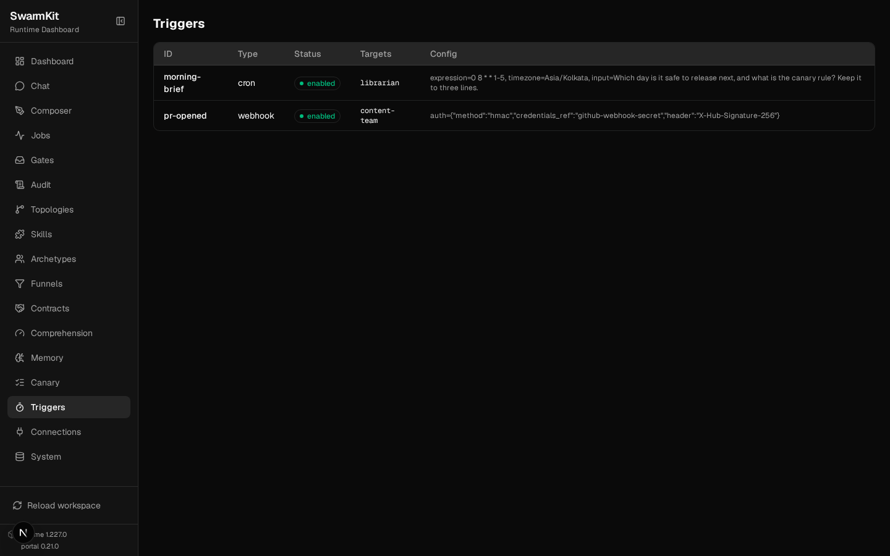

# Level 12: Triggers & Canary Deployments

Runs that start themselves — on a schedule, or when something outside calls — and a new version
of a topology that earns its traffic before it gets all of it.

## What you'll learn

- Cron triggers: an expression, a timezone, an input
- Webhook triggers: a signed `POST /hooks/{topology}` that starts a run
- Two versions of one topology, side by side on disk
- Canary routing by weight, metrics per version, automatic promotion
- Manual promote and rollback (and why they need `admin`)

The finished workspace is `examples/tutorials/12-triggers-canary/` — Level 11 plus a `triggers/`
directory, a second `hello`, and a `canary` block. Everything below ran against a real serve.

## Triggers

Triggers live in `triggers/`, one file each, and the scheduler inside `swarmkit serve` runs them.
A trigger names its **targets** (topologies to run) and carries type-specific `config`.

### 1. A cron trigger

```yaml
# triggers/morning-brief.yaml
apiVersion: swarmkit/v1
kind: Trigger
metadata:
  id: morning-brief
  name: Morning brief
  description: Every weekday at 08:00 IST, ask the librarian for the day's release status.
type: cron
targets:
  - librarian
config:
  expression: "0 8 * * 1-5"    # standard five-field cron
  timezone: Asia/Kolkata
  input: "Which day is it safe to release next, and what is the canary rule? Keep it to three lines."
```

`expression` is evaluated in `timezone`; `input` is what the run is asked. Start serve and the
scheduler picks it up:

```
INFO  TriggerScheduler started (poll_interval=30s, 2 trigger(s))
```

A fired trigger is an ordinary job — it goes through the same path as `POST /run`, so it gets the
canary version below, the capacity limit, and a row in the history with its source:

```
INFO  Trigger fired topology='hello' job_id=126910def1ff source='trigger:every-minute'
```

```bash
curl -s -H "Authorization: Bearer $APP_TOKEN" localhost:8000/jobs/history | head
```

```
126910def1ff  hello@0.4.0  trigger:every-minute  completed
```

(That one was a `* * * * *` trigger added for the demonstration and removed again — the
`morning-brief` above fires at 08:00 IST, which is the point.)

### 2. A webhook trigger

```yaml
# triggers/pr-opened.yaml
apiVersion: swarmkit/v1
kind: Trigger
metadata:
  id: pr-opened
  name: PR opened
  description: A GitHub webhook — a signed POST starts a content-team run.
type: webhook
targets:
  - content-team
config:
  auth:
    method: hmac
    credentials_ref: github-webhook-secret   # a workspace `credentials` entry — a reference, never the literal
    header: X-Hub-Signature-256              # GitHub's signing header (the default for hmac)
```

```yaml
# workspace.yaml — the credential it refers to
credentials:
  github-webhook-secret:
    source: env
    config:
      env: GITHUB_WEBHOOK_SECRET
```

The route is `POST /hooks/<target topology>`. The caller cannot hold a serve API key (GitHub does
not), so a webhook trigger that declares `config.auth` is admitted past the API-key gate and
verified by its own method instead — and one that declares none stays behind the gate.

```bash
BODY='{"action": "opened", "pull_request": {"number": 42, "title": "Add retry to the uploader"}}'
SIG=$(printf '%s' "$BODY" | openssl dgst -sha256 -hmac "$GITHUB_WEBHOOK_SECRET" | awk '{print $2}')

curl -s -X POST localhost:8000/hooks/content-team -H 'content-type: application/json' -d "$BODY"
curl -s -X POST localhost:8000/hooks/content-team -H 'content-type: application/json' \
  -H "X-Hub-Signature-256: sha256=$SIG" -d "$BODY"
```

```
{"detail":"Invalid webhook signature"}   401
{"job_id": "cf2e80f2b187", "status": "pending", "topology": "content-team",
 "input": "{\"action\": \"opened\", \"pull_request\": {\"number\": 42, \"title\": \"Add retry to the uploader\"}}"}
```

A body with an `input` field is passed as that string; any other JSON body is passed as JSON text.
A `credentials_ref` whose secret is not set refuses the delivery (503) rather than accepting it
unsigned.

| `method` | Checks |
|---|---|
| `hmac` | `sha256=<hex>` over the body in `header` (default `X-Hub-Signature-256`) — GitHub, Gitea, most CI |
| `bearer` | `Authorization: Bearer <secret>` |
| `api_key` | the secret itself in `header` (default `X-API-Key`) |

The **Triggers** page lists them:



## Canary deployments

### 3. Two versions of one topology

Put every version of a topology in a subdirectory named after it. Same `metadata.name`, different
`metadata.version`; the file named after the topology is the one `hello` means by default:

```
topologies/hello/
├── hello.yaml           # metadata.version: 0.3.0 — `hello`, and `hello@0.3.0`
└── hello-v0.4.0.yaml    # metadata.version: 0.4.0 — `hello@0.4.0`
```

```yaml
# topologies/hello/hello-v0.4.0.yaml
apiVersion: swarmkit/v1
kind: Topology
metadata:
  name: hello              # same name as hello.yaml — a second VERSION of it, not a second topology
  version: 0.4.0
  description: The canary candidate — the assistant answers with a one-line source note.
agents:
  root:
    id: assistant
    role: root
    archetype: friendly-assistant
    prompt:
      system: |
        You are a friendly, helpful assistant. Answer clearly and concisely, then end with one
        line starting "Source:" that says where the answer came from (a tool, or general knowledge).
    skills_additional:
      - quality-check
    intent_monitoring:
      enabled: true
      threshold: 0.75
      on_drift: warn
```

```bash
swarmkit validate .
```

```
  topologies: 12  (analysis, content-team, explain, files, hello, hello@0.3.0, hello@0.4.0, librarian, …)
```

`swarmkit run . hello@0.4.0 --input …` runs a specific version directly.

### 4. Route by weight

```yaml
# workspace.yaml — under server:
  canary:
    routes:
      - topology: hello
        versions:
          - version: "0.3.0"
            weight: 80
          - version: "0.4.0"
            weight: 20
            promote_when:
              min_runs: 5              # promote after 5 runs of 0.4.0 …
              error_rate_below: 0.2    # … with under 20% failures …
              drift_below: 0.9         # … and a mean drift score under 0.9
              window_minutes: 60
```

Now `POST /run/hello` picks a version per request. Eight submissions:

```
a45975a7338a version 0.3.0
cefde238ef67 version 0.3.0
d325e468c07d version 0.4.0
66206070d7a4 version 0.3.0
52ff28a1d9dc version 0.4.0
c8fb25fcf090 version 0.3.0
991828991615 version 0.3.0
aaa5ad560dcc version 0.4.0
```

Each job records which version it ran (`version` on the job, in the history, in the portal). A
0.4.0 answer:

```
The capital of Japan is Tokyo.
Source: General knowledge
```

### 5. Metrics per version

```bash
curl -s -H "Authorization: Bearer $APP_TOKEN" localhost:8000/canary
```

```json
{
  "routes": [{
    "topology": "hello",
    "versions": [
      {"version": "0.3.0", "weight": 80,
       "metrics": {"total_runs": 5, "failed_runs": 0, "error_rate": 0.0, "avg_drift": 0.4226}},
      {"version": "0.4.0", "weight": 20,
       "metrics": {"total_runs": 3, "failed_runs": 0, "error_rate": 0.0, "avg_drift": 0.5286},
       "promote_when": {"min_runs": 5, "error_rate_below": 0.2, "drift_below": 0.9, "window_minutes": 60}}
    ]
  }],
  "promotions": []
}
```

`error_rate` is failed runs over runs in the window; `avg_drift` is the mean of the
`intent.drift` scores the version's runs recorded (Level 8) — so the canary criterion can say
"the new prompt must not wander more than the old one".


### 6. Promotion

Two more runs later, 0.4.0 reached five and met the criteria. The router promoted it on the spot:

```json
{
  "routes": [{"topology": "hello", "versions": [
    {"version": "0.3.0", "weight": 0,   "metrics": {"total_runs": 13, …}},
    {"version": "0.4.0", "weight": 100, "metrics": {"total_runs": 5, "error_rate": 0.0, "avg_drift": 0.5286}, …}
  ]}],
  "promotions": [{
    "topology": "hello",
    "promoted_version": "0.4.0",
    "old_weights": "{'0.3.0': 80, '0.4.0': 20}",
    "metrics": "runs=5, error_rate=0.000, avg_drift=0.529",
    "timestamp": "2026-09-17T15:26:02.724791+00:00"
  }]
}
```

By hand — both need the `admin` tier (a `run` token gets `403 Insufficient scope: requires
serve:admin`):

```bash
curl -s -X POST -H "Authorization: Bearer $OPS_TOKEN" localhost:8000/canary/hello/promote \
  -H 'content-type: application/json' -d '{"version": "0.4.0"}'
curl -s -X POST -H "Authorization: Bearer $OPS_TOKEN" localhost:8000/canary/hello/rollback
```

```
{"promoted":true,"topology":"hello","version":"0.4.0"}      → weights 0.3.0: 0, 0.4.0: 100
{"rolled_back":true,"topology":"hello"}                      → weights 0.3.0: 100, 0.4.0: 0
```

Rollback sends everything to the first listed version. Both are runtime decisions: weights live in
the running server and go back to `workspace.yaml`'s numbers on restart. When a canary has won,
make it the stable version in the file — rename the files, or make `0.4.0` the first entry with
weight 100 — and drop the route.

## Your workspace so far

```
my-swarm/
├── workspace.yaml               # server.canary, credentials.github-webhook-secret, an admin key
├── triggers/
│   ├── morning-brief.yaml       # cron
│   └── pr-opened.yaml           # webhook, hmac
└── topologies/
    └── hello/
        ├── hello.yaml           # 0.3.0
        └── hello-v0.4.0.yaml    # 0.4.0
```

## Next

[Level 13: Authoring & Review](13-authoring-review.md) — create artifacts by describing them, and review what a swarm proposes.
