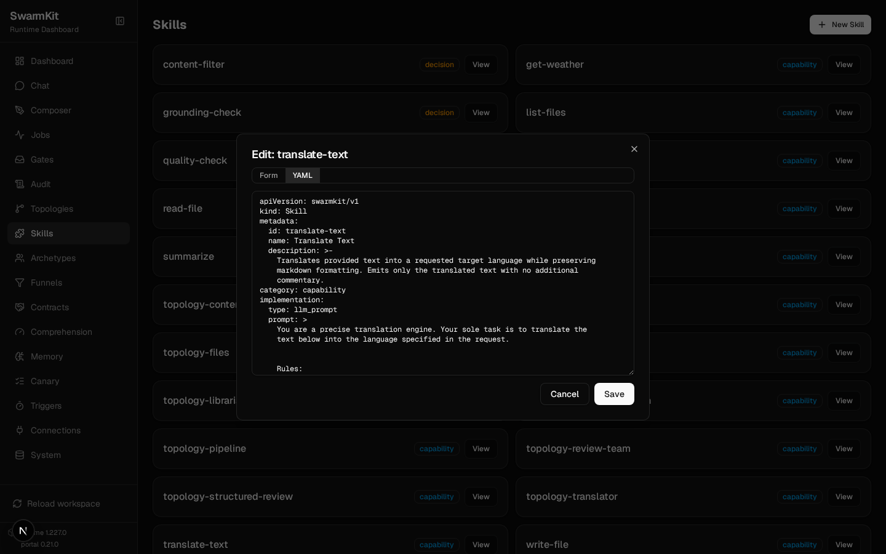
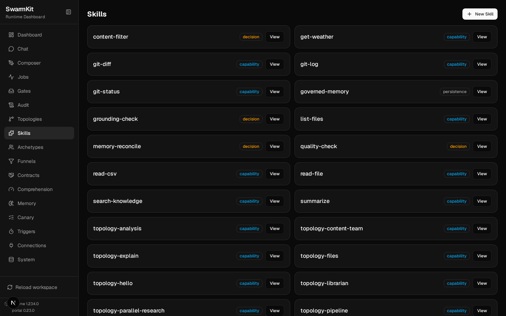
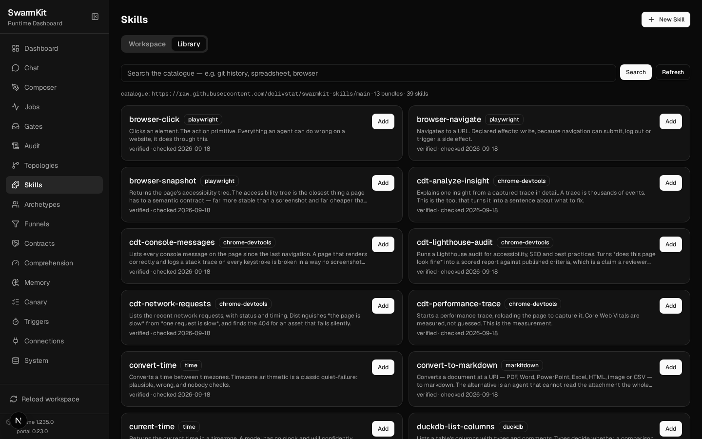
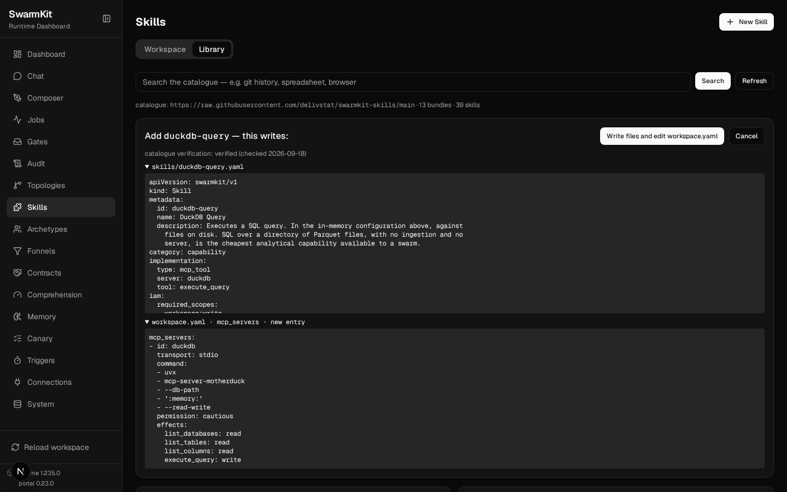

# Level 13: Authoring & Review

Twelve levels of YAML by hand. This is the level where you describe what you want and the
runtime writes it — and where the runtime tells you what it is missing.

## What you'll learn

- `swarmkit author skill|topology|archetype|mcp-server` — one agent, a conversation, a file
- `swarmkit init` — a workspace from a description
- `swarmkit edit` and `--thorough` — the skill-authoring **swarm**, and what it needs
- `swarmkit skill search|add|import|check` — the catalogue, and Agent Skills files
- The skill gap log: how a workspace learns what it lacks (`swarmkit gaps`)
- The review queue: what lands there and how you answer it

The finished workspace is `examples/tutorials/13-authoring-review/` — Level 12 plus a skill and a
topology that were not typed. Every transcript is a real session on OpenRouter.

## Authoring is a conversation

Every authoring command is the same loop: you describe, the agent asks what it needs to know,
proposes a plan, and writes files only after you approve — then validates the workspace with them
in place. It never edits YAML behind your back; it shows the plan first.

### 1. Author a skill

```bash
swarmkit author skill .
```

```
SwarmKit skill authoring — let's build your swarm.
Model: moonshotai/kimi-k2.5
Workspace: …/13-authoring-review

> A skill called translate-text: an llm_prompt skill that translates the text it is given into
  the language named in the request, keeping the formatting. Category capability.

Great idea — a translation skill is a clean addition to the swarm. Before I generate the YAML,
two quick clarifying questions:
1. **Source language**: Should the skill auto-detect the source language from the text, or will
   the caller always provide the source language explicitly?
2. **Output style**: Should the skill emit **only** the translated text (no preambles like
   "Here is the translation…"), or is a short wrapper acceptable?

> Any language, named in the request. Keep markdown formatting. Plain translated text out,
  nothing else. Write it.

I'll create these files:
  skills/translate-text.yaml
Create these files?
[Y/n] > y
Wrote 1 files: skills/translate-text.yaml. valid — 12 topologies, 21 skills, 7 archetypes, 0 errors.
```

The file it wrote — a real `llm_prompt` skill, schema-valid, with a prompt that encodes the two
answers:

```yaml
# skills/translate-text.yaml — written by `swarmkit author skill`
apiVersion: swarmkit/v1
kind: Skill
metadata:
  id: translate-text
  name: Translate Text
  description: Translates provided text into a requested target language while preserving markdown formatting. Emits only the translated text with no additional commentary.
category: capability
implementation:
  type: llm_prompt
  prompt: |
    You are a precise translation engine. Your sole task is to translate the text below into the language specified in the request.

    Rules:
    - Detect the source language automatically.
    - Translate into the requested target language exactly as named.
    - Preserve all markdown formatting, including headings, lists, links, code blocks, tables, and emphasis.
    - Do not add any preamble, explanation, notes, or surrounding markdown code fences unless the original text contained them.
    - Output ONLY the translated text.
provenance:
  authored_by: human
  version: 1.0.0
```

`authored_by: human` is right: you approved it. The agent drafts; a person publishes (design
§12). It is an ordinary file from here — the portal's **Skills** page opens it as a form or as
YAML like any other:



### 2. Author a topology that uses it

```bash
swarmkit author topology .
```

```
> A topology called translator: a single root agent with id translator using the
  friendly-assistant archetype, with the translate-text skill added via skills_additional. Its
  system prompt override: translate whatever the user sends into the language they name, using
  the translate-text skill.

  root:
    id: translator
    role: root
    archetype: friendly-assistant
    skills_additional:
      - translate-text
    prompt:
      system: "Translate whatever the user sends into the language they name, using the translate-text skill."

**Questions before I generate:**
1. Would you like **intent drift monitoring** enabled?
2. Any **model override** (provider/name), or use the archetype's defaults?

> That's right. Write it.

Create these files?
[Y/n] > y
Wrote 1 files: topologies/translator.yaml. valid — 13 topologies, 22 skills, 7 archetypes, 0 errors.
```

It knew the workspace: `friendly-assistant` exists, `translate-text` was written a minute ago,
`skills_additional` is the right key. And it runs:

```bash
swarmkit run . translator --input "Into French: **Release notes** — the uploader now retries three times before giving up."
```

```
  tools: ['summarize', 'get-weather', 'translate-text']
  [translator] calling translate-text {"input": "Release notes — the uploader now retries three times before giving up."}
[translator] done (69.9s)
Notes de version — le téléchargeur réessaie maintenant trois fois avant d'abandonner.
```

`swarmkit author archetype .` and `swarmkit author mcp-server .` are the same conversation for
the other two kinds (the latter writes a Python server file plus its `mcp_servers` entry).

### 3. A workspace from nothing

```bash
swarmkit init fresh
```

```
> A swarm that reads a support ticket and drafts a reply: one root agent, OpenRouter, model
  moonshotai/kimi-k2.5, no tools yet. Keep it minimal.

I'll create these files:
  topologies/support.yaml
  workspace.yaml
Create these files?
[Y/n] > y
Wrote 2 files: workspace.yaml, topologies/support.yaml. valid — 1 topologies, 1 skills, 0 archetypes, 0 errors.
```

```
fresh/
├── workspace.yaml            # mock governance, sqlite checkpoints
├── workspace.env.yaml        # machine-specific values go here, not in workspace.yaml
└── topologies/
    └── support.yaml          # one root agent, kimi-k2.5, a support-reply system prompt
```

`swarmkit run fresh support --input "I've reset my password three times and never get the email."`
runs it. Minimal was the request; a fuller description gets archetypes and skills too — the plan
is shown before anything is written, and "no" sends you back to the conversation.

## Take one from the catalogue

Not every skill needs writing. [`swarmkit-skills`](https://github.com/delivstat/swarmkit-skills)
is a catalogue of MCP servers with the config already worked out and **checked nightly** — the
`mcp_servers` block, the permission tier, an `effects` map per tool — and `swarmkit skill` is the
command over it (runtime **1.235.0**; the portal tab, 1.236.0).

```bash
swarmkit skill search "git history"
```

```
git-log                  git            Returns commit history. History answers *why* a line looks the way it
```

Adding a catalogue skill writes to **two places** — the skill file, and an `mcp_servers` entry in
`workspace.yaml` — so it shows both and asks. `--dry-run` prints them and writes nothing:

```bash
swarmkit skill add git-log --dry-run
```

```
# catalogue verification: verified (checked 2026-09-18)
# skills/git-log.yaml (new)
apiVersion: swarmkit/v1
kind: Skill
metadata:
  id: git-log
  name: Git Log
  description: Returns commit history. History answers *why* a line looks the way
    it does. An agent without it re-litigates decisions already made.
category: capability
implementation:
  type: mcp_tool
  server: git
  tool: git_log
iam:
  required_scopes:
  - workspace:read
provenance:
  authored_by: human
  version: 1.0.0
  requires_runtime: '>=1.199.0'
  registry: swarmkit-skills

# mcp_servers entry (added to workspace.yaml)
mcp_servers:
- id: git
  transport: stdio
  command:
  - uvx
  - mcp-server-git
  - --repository
  - ${SWARMKIT_GIT_REPO}
  permission: readonly
  effects:
    git_status: read
    git_diff: read
    git_log: read
    git_show: read

dry run — nothing written.
```

A whole bundle is one command; the `mcp_servers` edit keeps your comments (it goes through the
same service the portal's Connections page uses) and a second run changes nothing:

```bash
swarmkit skill add git --yes
diff workspace.before.yaml workspace.yaml
swarmkit skill add git --yes
swarmkit validate .
```

```
wrote skills/git-status.yaml, skills/git-diff.yaml, skills/git-log.yaml and mcp_servers updated.
60a61,73
>   - id: git
>     transport: stdio
>     command:
>       - uvx
>       - mcp-server-git
>       - --repository
>       - ${SWARMKIT_GIT_REPO}
>     permission: readonly
>     effects:
>       git_status: read
>       git_diff: read
>       git_log: read
>       git_show: read
wrote no new files.
no errors, 0 warnings
```

`swarmkit skill list` says what the workspace holds and who holds it; `check` starts every
`mcp_tool` skill's server the way a run would and asks whether the tool is still there:

```bash
swarmkit skill list
SWARMKIT_GIT_REPO=. swarmkit skill check
```

```
content-filter           decision     llm_prompt                   bound:pre_input
get-weather              capability   mcp_tool → weather           hello/assistant, translator/translator
git-diff                 capability   mcp_tool → git               held by nobody
git-log                  capability   mcp_tool → git               held by nobody
git-status               capability   mcp_tool → git               held by nobody
…
ok      git-diff                 git:git_diff
ok      git-log                  git:git_log
ok      git-status               git:git_status
ok      list-files               docs-reader:list_files
ok      read-csv                 docs-reader:read_csv
ok      read-file                filesystem:read_file
ok      search-knowledge         knowledge-search:search_knowledge
ok      write-file               filesystem:write_file
```

"Held by nobody" is the next step, not a problem: grant `git-log` to an agent
(`skills_additional`, Level 4) and it is in the tool list. The portal's **Skills** page lists the
three the moment they land:



An **Agent Skills** `SKILL.md` — the format Anthropic and others publish instructions in — imports
as an `llm_prompt` skill, the body as the prompt, verbatim:

```bash
swarmkit skill import https://raw.githubusercontent.com/anthropics/skills/main/skills/docx/SKILL.md
```

```
wrote skills/docx.yaml (docx, llm_prompt).
```

And `remove` refuses while something holds the skill — a grant is a decision someone made:

```bash
swarmkit skill remove get-weather
swarmkit skill remove docx
```

```
error: 'get-weather' is held by hello/assistant, translator/translator — remove the grant first
removed skills/docx.yaml.
```

`swarmkit skill list --available` is the whole catalogue with its verification dates;
`show <id>` prints an entry. The same operations are `GET /api/skill-catalogue`,
`POST /api/skills/add`, `POST /api/skills/import` and `GET /api/skills/check` on `swarmkit serve`
— and the portal's **Skills → Library** tab is that API with a search box: every catalogue entry
with its bundle and verification date, an **Add** that shows both fragments before it writes
anything, a paste box for a `SKILL.md`, and a **Check** button. Adding needs an `admin` key, the
same as `reload`.





## The authoring swarm

`swarmkit author … --thorough` and `swarmkit edit` do not use one agent. They run the
**skill-authoring** reference topology: a conversation leader that plans, a knowledge searcher
that reads the workspace and the SwarmKit docs, a schema drafter, a validator, a test writer and
a publisher — a swarm that grows a swarm, gated by the same review as any other run.

It needs three things in the workspace, all from the runtime's reference set:

```bash
cp <swarmkit>/reference/topologies/skill-authoring.yaml topologies/
cp <swarmkit>/reference/archetypes/{authoring-supervisor,conversation-leader,knowledge-searcher,schema-drafter,artifact-validator,test-writer,artifact-publisher}.yaml archetypes/
cp <swarmkit>/reference/skills/{get-schema,list-reference-skills,query-swarmkit-docs,read-workspace-file,run-tests,validate-workspace,write-workspace-file}.yaml skills/
```

```yaml
# workspace.yaml — the server those skills call
mcp_servers:
  - id: swarmkit-knowledge
    transport: stdio
    command: ["swarmkit", "knowledge-server"]
```

`swarmkit knowledge-server` (Level 10) serves the design notes, schemas and reference skills, and
reads and writes workspace files for the swarm. **Today it runs from a SwarmKit source checkout** —
it locates the corpus by walking up to the repository — so the swarm mode is for people working
with the repo; a `pip install swarmkit-runtime` alone gets the single-agent commands above. That
is a gap, and it is stated here rather than papered over.

With those in place:

```bash
swarmkit edit . --input "Grant the translate-text skill to the friendly-assistant archetype (add it under defaults.skills). Change nothing else."
```

```
[conversation-leader] created task plan: 3 tasks
  - explore-workspace -> knowledge-searcher
  - filesystem-explore -> knowledge-searcher
  - __auto_synthesize__ -> self (after: explore-workspace, filesystem-explore)
[knowledge-searcher] calling validate-workspace {…}
[knowledge-searcher] calling list-reference-skills {}
  task 'explore-workspace' completed (4 findings)
[conversation-leader] updated task plan: 8 total, 3 pending
[conversation-leader] executing task batch: read-archetype-file
…
```

It is slow. This one-line change ran for 25 minutes on kimi-k2.5 — explore, plan, read the file,
draft the modification, validate it against the schema, then hand it to the publisher — and was
still at the publisher when the session's time limit stopped it. The single agent did the
equivalent in under a minute. Reach for the swarm when a change touches several files at once or
should be checked by someone other than the agent that drafted it, and give it the time.

## The gap log

An agent that reaches for a tool it does not have has named something the workspace lacks. When
a model *calls* `translate-text` on an agent that does not hold it, the runtime answers the call
with the tools the agent does hold (so the turn continues), writes a `skill.gap` audit event, and
records the gap:

```bash
swarmkit logs . --last 1 | grep gap
swarmkit gaps .
```

```
  assistant                skill.gap
  translate-text           agent 'assistant' called a tool it does not hold (3x) → author a 'translate-text' skill (swarmkit author skill) and grant it to 'assistant', or tell the agent in its prompt that it has no such tool
```

(Asked the same thing, kimi-k2.5 answered honestly — "I don't have a translate-text tool" — and
recorded nothing; the log catches models that *try*, which is what makes a gap real. The rows
above came from a scripted call on the mock provider.)

That row is the start of the growth cycle (design §12): a gap surfaces, a person decides whether
it is a capability worth having, authors it through the conversation above, and grants it. The
runtime never grants itself a skill. `swarmkit gaps --inert` is the other direction: decision
skills that are bound and have never once fired (Level 7's "wired is not fired").

## The review queue

`swarmkit review list .` is the inbox for decisions a run is waiting on:

| What arrives | From | You answer with |
|---|---|---|
| a multi-party approval on an artifact | a funnel's `approve` layer (Levels 7, 18) | `swarmkit review resolve <id> --by <you> --approve` |
| a harness asking permission for a capability | a harness executor (Level 17) | `swarmkit review approve <id>` / `reject` |
| a harness asking a question | a harness executor (Level 17) | `swarmkit review answer <id> "…"` |

`swarmkit review show <id>` prints the item; the portal's **Gates** page is the same queue. A
decision skill's `needs-revision` verdict does *not* land here — it sends the answer back to the
agent for another attempt (Level 7). Review is for the decisions that are a person's.

## Your workspace so far

```
my-swarm/
├── skills/
│   ├── translate-text.yaml      # authored
│   ├── git-log.yaml             # from the catalogue (+ git-status, git-diff; `mcp_servers: git`)
├── topologies/
│   └── translator.yaml          # authored
└── .swarmkit/
    └── store.sqlite             # the gap log lives here with everything else
```

## Next

[Level 14: Packaging & Distribution](14-packaging.md) — publish the workspace, install one, and expose it to an AI IDE.
