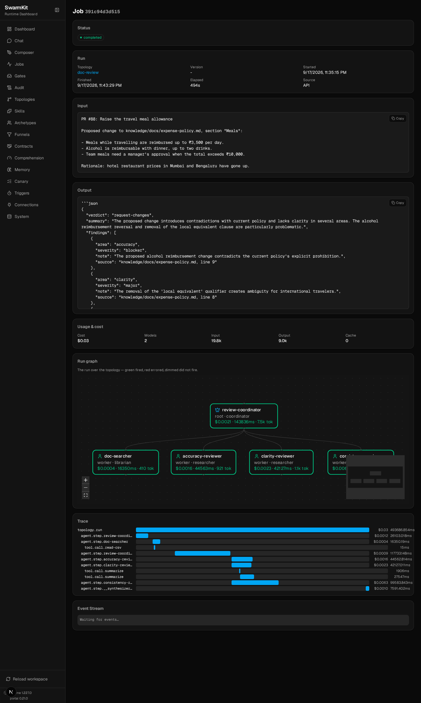

# Level 15: Production Example

One workspace that uses everything from Levels 1–14, doing a job a team would actually pay for:
reviewing a proposed change to the company handbook, on a webhook, with a structured verdict.

!!! tip "A real delivery workspace, on video"
    The workspace below is the tutorial workspace grown up. For a **video walkthrough of a real
    delivery workspace** — [Funnels](../reference/funnel.md), multi-party approval and integration
    [Contracts](../reference/contract.md) in the composer — see the
    **[SDLC walkthrough →](../sdlc-example/)** (source: `examples/sdlc-pipeline`). Recorded while
    SwarmKit still bundled a sequencer; the artifact tour is current, the stage-graph sections are
    historical.

## What it does

A pull request against `knowledge/docs/` arrives as a signed webhook. A coordinator plans the
review: a researcher establishes what the handbook says today, citing files; three reviewers judge
the change for accuracy, clarity and consistency against those findings; the coordinator returns
one JSON verdict that a bot can post on the PR. Every step is gated, metered, remembered and
traceable.

```
GitHub PR webhook ──▶ swarmkit serve (API key · HMAC · 2 concurrent · 20 min cap)
                          │
                    review-coordinator   (deepseek writes · kimi drives tools · scope + task plan)
                          ├── doc-searcher          (librarian: search-knowledge, read-csv)
                          ├── accuracy-reviewer     (after research)
                          ├── clarity-reviewer      (after research)
                          └── consistency-reviewer  (after research)
                          │
                    synthesis (deepseek) ──▶ {"verdict", "summary", "findings": [...]}   ← output_schema
                          │
              content-filter · quality-check · grounding-check · memory · drift · audit
```

The finished workspace is `examples/tutorials/15-production-example/`. The transcript below is a
real run on OpenRouter.

## The topology

Everything the levels taught, on one root:

```yaml
# topologies/doc-review.yaml
apiVersion: swarmkit/v1
kind: Topology
metadata:
  name: doc-review
  version: 1.0.0
  description: >
    Reviews a proposed change to the company handbook: one researcher checks the change against
    what the handbook already says, three reviewers judge accuracy, clarity and consistency, and
    the coordinator returns one structured verdict.
runtime:
  planning:
    scope_required: true              # Level 6: the coordinator must write a scope before synthesis
    two_phase: true
  synthesis:
    provider: openrouter
    model: deepseek/deepseek-chat-v3-0324
    prompt: |
      You are synthesizing a documentation review from a researcher and three reviewers.
      Return ONLY a JSON object of this shape, no prose around it:
      {"verdict": "approve" | "request-changes",
       "summary": "<two sentences>",
       "findings": [{"area": "accuracy" | "clarity" | "consistency",
                     "severity": "blocker" | "major" | "minor",
                     "note": "<one sentence>",
                     "source": "<handbook file the note relies on, or 'proposed change'>"}]}
      A blocker means the change must not merge as written.
governance:
  decision_skills:
    - id: grounding-check            # Level 10: the verdict must cite what it relies on
      trigger: post_output
      scope: "*"
      required: false
agents:
  root:
    id: review-coordinator
    role: root
    archetype: coordinator            # Level 6: dual model — deepseek writes, kimi drives tools
    intent_monitoring:                # Level 8
      enabled: true
      threshold: 0.75
      on_drift: warn
    output_schema:                    # Level 7: the verdict is validated before it leaves
      type: object
      required: [verdict, summary, findings]
      properties:
        verdict: {type: string, enum: [approve, request-changes]}
        summary: {type: string}
        findings:
          type: array
          items:
            type: object
            required: [area, severity, note]
            properties:
              area: {type: string, enum: [accuracy, clarity, consistency]}
              severity: {type: string, enum: [blocker, major, minor]}
              note: {type: string}
              source: {type: string}
    prompt:
      system: |
        You coordinate a review of a proposed handbook change. The input is a pull request:
        a title and the proposed text. Plan the review as tasks and put the FULL proposed text
        in every task description — a worker sees only its task. First the researcher
        (doc-searcher) finds what the handbook currently says on the topic, citing files;
        then the three reviewers (after the research), each judging one aspect against the
        researcher's findings. Then synthesize the verdict.
    children:
      - id: doc-searcher
        role: worker
        archetype: librarian          # Level 10: search-knowledge, read-csv, list-files
        prompt:
          system: |
            You research the handbook for a documentation review. Search for every section the
            proposed change touches or contradicts and report what the handbook says today,
            with the source file for each fact. Do not judge the change; report the facts.
      - id: accuracy-reviewer
        role: worker
        archetype: researcher
        prompt:
          system: |
            You review a proposed handbook change for ACCURACY against the researcher's
            findings: does it contradict a current rule, a number, a deadline, a name? Return a
            structured list of findings, three at most, each with the handbook source.
      - id: clarity-reviewer
        role: worker
        archetype: researcher
        prompt:
          system: |
            You review a proposed handbook change for CLARITY: ambiguity, undefined terms,
            missing numbers or conditions a reader would need. Return a structured list of
            findings, three at most.
      - id: consistency-reviewer
        role: worker
        archetype: researcher
        prompt:
          system: |
            You review a proposed handbook change for CONSISTENCY with the rest of the handbook:
            tone, terminology, currency and units, cross-references that would go stale. Return a
            structured list of findings, three at most, each with the handbook source.
```

Around it, unchanged from the levels that introduced them: the workspace's `content-filter`
(`pre_input`) and `quality-check` (`post_output`) bindings, `memory-reader` / `memory-writer`,
`governance.limits` circuit breakers, the `knowledge-search` and `docs-reader` servers, API-key
auth with `max_concurrent: 2` and a 20-minute job cap, the canary route on `hello`, and the
webhook trigger below.

One thing the earlier levels did *not* say, learned here: a task plan hands each worker only its
task text, so the coordinator's prompt tells it to put the full proposed change in every task.
Without that line the reviewers were asked to judge a change they had never seen.

## The trigger

```yaml
# triggers/doc-pr.yaml
apiVersion: swarmkit/v1
kind: Trigger
metadata:
  id: doc-pr
  name: Handbook PR opened
  description: A signed webhook from the docs repository starts a doc-review run.
type: webhook
targets:
  - doc-review
config:
  auth:
    method: hmac
    credentials_ref: github-webhook-secret
    header: X-Hub-Signature-256
```

## Run it

The PR under review — a change to the meals section that raises the allowance and reverses the
alcohol rule:

```
PR #88: Raise the travel meal allowance

Proposed change to knowledge/docs/expense-policy.md, section "Meals":

- Meals while travelling are reimbursed up to ₹3,500 per day.
- Alcohol is reimbursable with dinner, up to two drinks.
- Team meals need a manager's approval when the total exceeds ₹10,000.

Rationale: hotel restaurant prices in Mumbai and Bengaluru have gone up.
```

```bash
swarmkit run . doc-review --input "$(cat pr.txt)"
```

```
[review-coordinator] created task plan: 1 tasks
  - research-current-policy -> doc-searcher
[review-coordinator] executing task batch: research-current-policy
  [doc-searcher] calling search-knowledge {"query": "travel meal allowance expense policy", "limit": 10}
[doc-searcher] done (39.9s)
  task 'research-current-policy' completed (5 findings)
   - Travel meal reimbursements are capped at ₹2,500 per day (or local equivalent), as per `knowledge/docs/expense-policy.md`
[review-coordinator] scope created: 4 requirements, 5 constraints
[review-coordinator] created task plan: 5 tasks
  Auto-added: synthesis task '__auto_synthesize__' depends on [research-current-policy, accuracy-review, clarity-review, consistency-review]
  - accuracy-review -> accuracy-reviewer (after: research-current-policy)
  - clarity-review -> clarity-reviewer (after: research-current-policy)
  - consistency-review -> consistency-reviewer (after: research-current-policy)
[review-coordinator] executing task batch: accuracy-review, clarity-review, consistency-review
  task 'clarity-review' completed (3 findings)
  task 'accuracy-review' completed (5 findings)
  task 'consistency-review' completed (3 findings)
[synthesizer] 5 results, 9,722 chars total context. Calling deepseek/deepseek-chat-v3-0324...
[synthesizer] tokens: 2,224 in / 284 out / 2,508 total (8.5s)
```

The verdict:

```json
{
  "verdict": "request-changes",
  "summary": "The proposed changes contain several critical inaccuracies and inconsistencies with current policy, particularly regarding alcohol reimbursement and international travel allowances. Significant clarifications and policy alignment are needed before approval.",
  "findings": [
    {"area": "accuracy",    "severity": "blocker", "note": "The proposed alcohol reimbursement directly contradicts the current explicit prohibition.", "source": "knowledge/docs/expense-policy.md"},
    {"area": "accuracy",    "severity": "major",   "note": "The proposed meal allowance omits the 'or local equivalent' clause, creating ambiguity for international travel.", "source": "knowledge/docs/expense-policy.md"},
    {"area": "clarity",     "severity": "major",   "note": "The 'up to two drinks' clause lacks definition of drink standards and interaction with daily meal limits.", "source": "proposed change"},
    {"area": "consistency", "severity": "major",   "note": "The proposal does not address how alcohol reimbursement interacts with the existing receipt threshold requirement.", "source": "knowledge/docs/expense-policy.md"}
  ]
}
```

The blocker is the right call — the handbook says alcohol is not reimbursable, and the PR quietly
reverses that — and each note names the file it relies on, which is what the grounding gate and
the researcher's citations were for.

```
── run summary ──
  review-coordinator       root      21337ms
  doc-searcher             worker    39937ms
  review-coordinator       root     110937ms
  clarity-reviewer         worker    44184ms
  accuracy-reviewer        worker    77980ms
  consistency-reviewer     worker   112153ms
  skills called: 3
  total events: 47
```

About eight minutes end to end, three of them the parallel reviewers; the rest is planning,
synthesis, and the judges around every agent. That is what the 20-minute job cap is for.

## Deployed

```bash
export APP_TOKEN=… OPS_TOKEN=… GITHUB_WEBHOOK_SECRET=…
swarmkit serve . --port 8000
```

A delivery from the docs repository:

```bash
BODY='{"input": "PR #88: Raise the travel meal allowance …"}'
SIG=$(printf '%s' "$BODY" | openssl dgst -sha256 -hmac "$GITHUB_WEBHOOK_SECRET" | awk '{print $2}')
curl -s -X POST localhost:8000/hooks/doc-review -H 'content-type: application/json' \
  -H "X-Hub-Signature-256: sha256=$SIG" -d "$BODY"
```

```json
{"job_id": "391c94d3d515", "status": "pending", "topology": "doc-review"}
```

The bot that posted the webhook polls `GET /jobs/391c94d3d515` and, on `completed`, posts
`output` — the JSON above — as the PR comment. The run's page in the portal shows the five agents,
which fired, what each cost, and the span waterfall:



## What happened, level by level

| Step | Level |
|---|---|
| The webhook was verified against the workspace credential and admitted past the API-key gate | 11, 12 |
| `content-filter` judged the PR text before any agent saw it | 7 |
| `memory-reader` put earlier reviews of this policy in front of the coordinator | 9 |
| The coordinator wrote a scope and a task plan; the runtime ran the plan, research first | 6 |
| The researcher searched the handbook through the MCP server and cited files | 5, 10 |
| Three reviewers ran in parallel with the tool model, each on its own task | 4, 6 |
| Each answer was scored by `quality-check`; the verdict was validated against `output_schema` and checked for grounding | 7, 10 |
| Drift was scored on every final answer; the circuit breakers watched steps and cost | 7, 8 |
| The whole run is one job with a trace, an audit trail, a cost, and a memory entry | 8, 9, 11 |

## What's next

Level 16 is where a run like this becomes one stage of something longer — a change that needs a
person's approval before it merges, tracked under a ticket. Levels 17–22 each take one shipped
capability further: harness executors, funnels, command packs, agents calling agents,
operations, the fleet.
