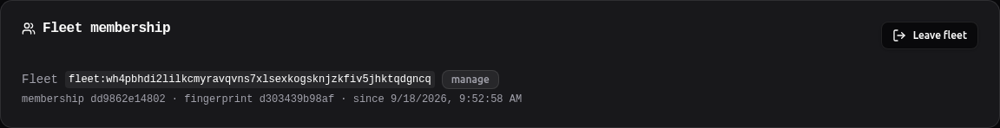
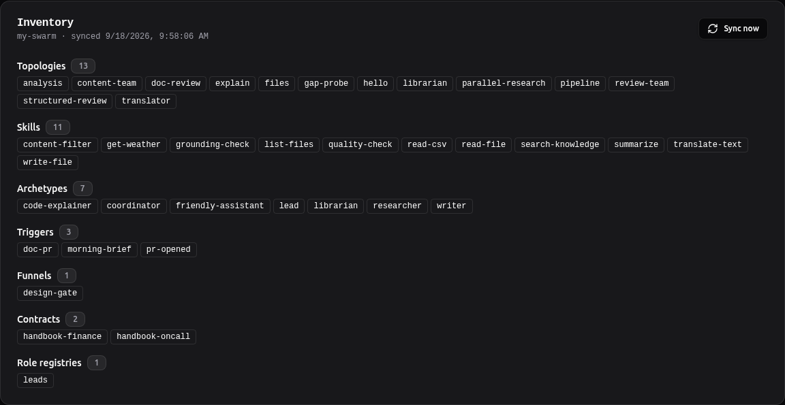
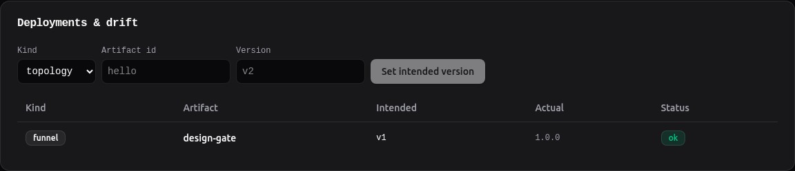
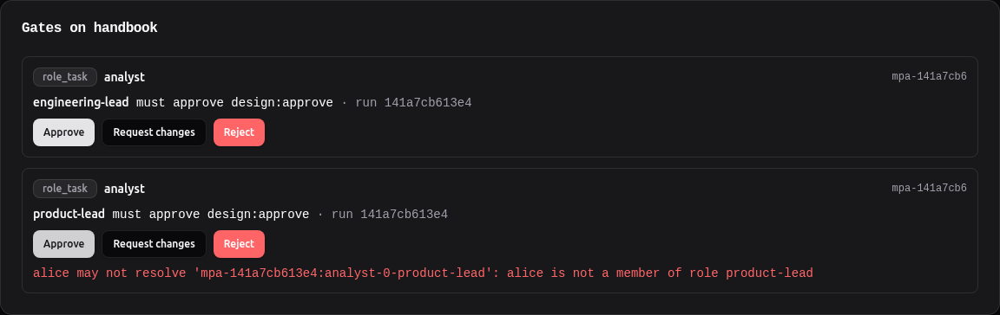
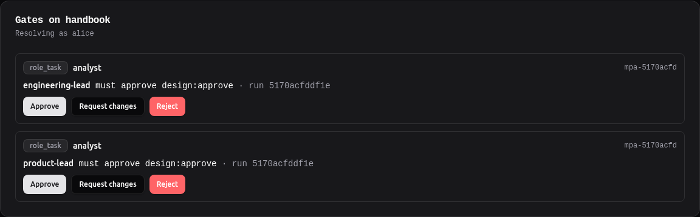
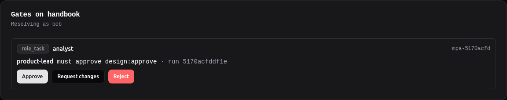
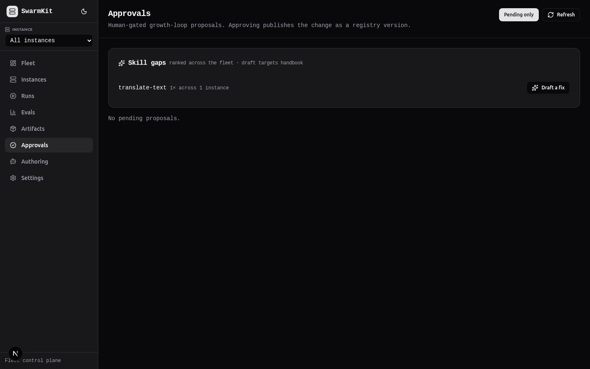
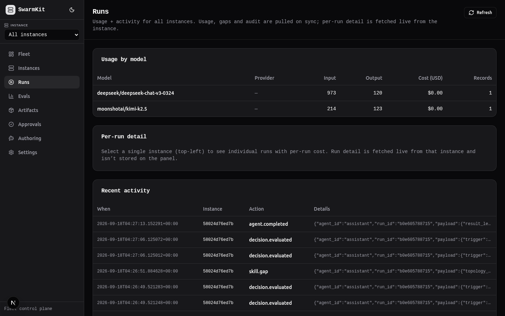
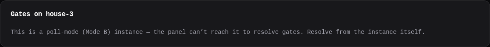
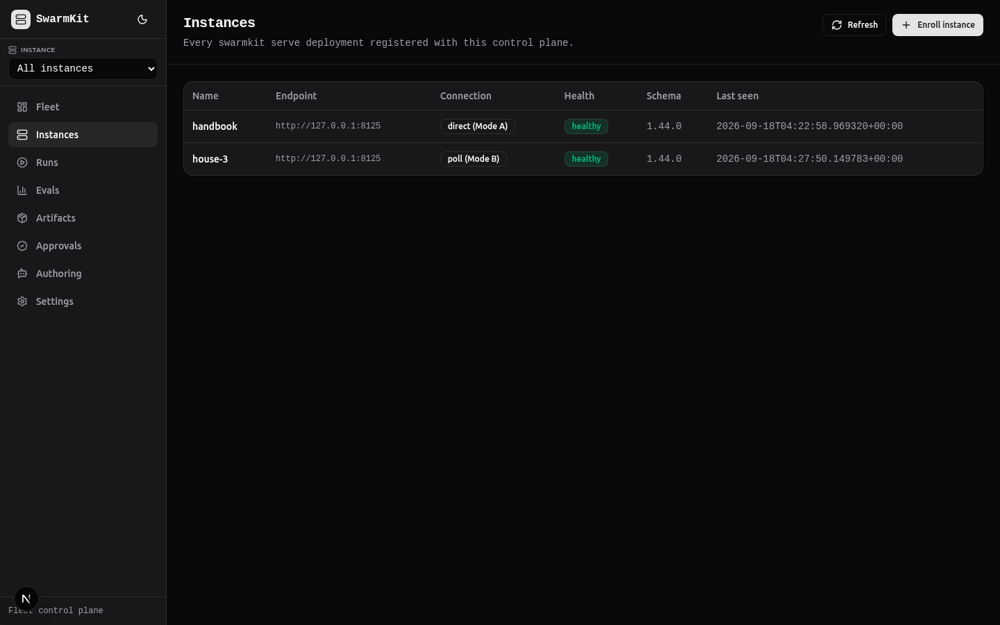

# Level 22: Running a fleet

Many `swarmkit serve` instances under one self-hosted control plane: enrolment in both
directions, the observed inventory, a registry that deploys without rewriting your files, a
funnel gate resolved from one inbox, and the gaps a fleet mines from what its agents reached for.

## What you'll learn

- What the control plane is (and is not): a separate app *over* the serve contract, never a dependency of it
- Two ways an instance joins: **Mode A** (the panel reaches the instance) and **Mode B** (`swarmkit connect`, outbound-only)
- The fleet seam on every instance: `/capabilities`, `/fleet/state`, enrolment tokens, membership keys
- Adopt → deploy → drift, and why a deploy leaves your comments alone
- A multi-party gate resolved from the panel — and what the panel *cannot* do for you
- Gap mining: `skill.gap` on an instance becomes a ranked row on the fleet
- OpenTelemetry: traces to Jaeger, metrics to Prometheus, the Grafana dashboard

The workspace is `examples/tutorials/22-fleet/` — Level 16 plus one topology, `gap-probe`.
Everything below ran against runtime 1.230.0, control-plane 0.48.0 and fleet UI 0.12.0; the
transcripts are what they printed.

<video controls preload="none" playsinline muted poster="../../img/tutorials/22-instances.png" style="width:100%;border-radius:8px">
  <source src="../../img/fleet/fleet-tour.mp4" type="video/mp4">
  <a href="../../img/fleet/fleet-tour.mp4">Download the walkthrough (MP4)</a>
</video>

## The idea

One instance is the OSS on-ramp: `swarmkit serve` with its portal. Operating *many* — a Minder box
in every house, a serve per team — needs a place that sees them all, and that place must not become
a control plane you hand to a vendor. So it is a second self-hostable package,
`swarmkit-control-plane`, an independent application and a client of the serve API: it depends on
the contract, never on the runtime's code ([Fleet control plane](../design-notes/fleet-control-plane.md)).

Each instance keeps its own authority. The panel can *ask* an instance to deploy a registry
version or resolve a gate; every such mutation is a request the instance authorises and audits
with the acting principal, on both sides.

## Build it

### 1. Bring up the panel

```bash
pip install swarmkit-control-plane
export SWARMKIT_CONTROL_PLANE_SECRET_KEY=$(python -c "from cryptography.fernet import Fernet; print(Fernet.generate_key().decode())")
swarmkit-control-plane --data-dir ~/.swarmkit/fleet --port 8843 --cors-origin http://127.0.0.1:3000
```

The fleet UI is a separate static app; `deploy/control-plane/docker-compose.yml` hosts panel and UI
together behind one origin (`docker compose -f deploy/control-plane/docker-compose.yml up -d --build`,
then `http://localhost:8080`). This walkthrough ran the UI from the repository
(`pnpm dev` in `packages/control-plane-ui`, `NEXT_PUBLIC_CONTROL_PLANE_API=http://127.0.0.1:8843`).

Without `--operator-token` the panel runs **open** — fine on a laptop, not on a network. Before
exposing it: `--operator-token=<secret>` (repeatable) and/or `--oidc-issuer` + `--oidc-audience` for
human logins. The secret key must be **fixed**: the fleet identity and every membership credential
are encrypted with it, and an ephemeral key means the panel cannot read its own registry after a
restart.

### 2. Enrol an instance (Mode A)

The panel can reach this instance, so it is enrolled with an endpoint and the key it will act
with. Choose that key deliberately: the panel resolves gates *as this identity* (§5 below), so it
is Alice's — a member of `engineering-lead` in `roles/leads.yaml` (Level 16).

```bash
curl -s -X POST localhost:8843/instances -H content-type:application/json -d '{"name":"handbook","endpoint":"http://127.0.0.1:8125","token_ref":"env:ALICE_TOKEN","tier":"run"}'
```

```json
{
 "id": "58024d76ed7b", "name": "handbook", "connection": "direct", "tier": "run", "schema_version": "1.44.0",
 "capabilities": {
  "serve_version": "1.230.0", "workspace_id": "my-swarm",
  "topologies": ["analysis", "content-team", "doc-review", "explain", "files", "gap-probe", "hello", "librarian", "parallel-research", "pipeline", "review-team", "structured-review", "translator"],
  "features": {"auth": "api_key", "compression": "off", "canary": true, "a2a": false}
 }
}
```

Enrolment already read `/capabilities`. A `run`-tier key can read state, start runs and resolve
gates; it cannot deploy. Deploying is a **fleet membership**, human-issued on the instance:

```bash
swarmkit fleet enroll-token . --scope manage --ttl 900
```

```
# Enrollment token (scope: manage, valid 900s, single-use):
<the token>

# Hand this to the fleet operator. In the fleet UI, open this instance and use
# 'Register' (Fleet enrollment) — paste the token there. Works once, then expires.
# NOTE: 'manage' lets the fleet deploy artifacts to this instance.
```

```bash
curl -s -X POST localhost:8843/instances/58024d76ed7b/register -d '{"enroll_token":"<the token>"}'
```

```json
{"membership_id": "dd9862e14802", "scope": "manage", "fingerprint": "d303439b98af",
 "counts": {"topologies": 13, "skills": 11, "archetypes": 7, "triggers": 3, "funnels": 1, "contracts": 2, "roles": 1}}
```

The panel presented its signed identity, the instance pinned it and issued a membership key
(stored encrypted on the panel, never shown), and the first sync happened. On the instance:

```bash
swarmkit fleet memberships .
```

```
FLEET_ID                                                        SCOPE     FINGERPRINT     IDENTITY
fleet:sxouvlbrsr4vzdfq5t2l7flbcoa5sptyj4sjtbh3iibafkww5b2a      manage    df788eecfcc6    pinned
fleet:wh4pbhdi2lilkcmyravqvns7xlsexkogsknjzkfiv5jhktqdgncq      manage    d303439b98af    pinned
```

Two rows: a panel from an earlier session, and this one. Memberships persist on the instance until
ejected (`DELETE /fleet/membership/{id}`) — the instance, not the panel, holds that list.



### 3. The inventory

A sync pulls `/fleet/state`: every artifact with its content, its content hash, and the file as
written. After the first pull it is a **delta** — the names-and-hashes manifest, then only the
bodies that changed:

```bash
curl -s -X POST localhost:8843/instances/58024d76ed7b/sync
```

```json
{"counts": {"topologies": 13, "skills": 11, "archetypes": 7, "triggers": 3, "funnels": 1, "contracts": 2, "roles": 1},
 "delta": {"mode": "delta", "fetched": 0, "reused": 38, "removed": 0},
 "pulled_usage": 0, "pulled_gaps": 0, "pulled_audit": 0}
```



Funnels, contracts and role registries are inventory too (runtime 1.230.0). The three `pulled_*`
counts are §6.

### 4. Adopt, deploy, drift

An observed artifact becomes a **registry version** by adopting it — content-addressed, with its
provenance recording which instance it came from:

```bash
curl -s -X POST localhost:8843/instances/58024d76ed7b/adopt -d '{"kind":"funnel","artifact_id":"design-gate"}'
```

```json
{"kind": "funnel", "artifact_id": "design-gate", "version": "v1", "content_hash": "de614a73ec0d…", "adopted_from": "58024d76ed7b"}
```

A deploy pushes a version to an instance over the membership credential, signed with the panel's
identity (the instance verifies the signature against the pinned key before writing anything):

```bash
curl -s -X POST localhost:8843/instances/58024d76ed7b/deploy -d '{"kind":"funnel","artifact_id":"design-gate","version":"v1"}'
diff design-gate.before.yaml funnels/design-gate.yaml && echo byte-identical
curl -s localhost:8843/instances/58024d76ed7b/drift
```

```
{"status": "ok", "version": "v1", "mode": "direct"}
byte-identical
[{"kind":"funnel","id":"design-gate","intended_version":"v1","actual_version":"1.0.0","status":"ok"}]
```

`byte-identical` is the point: the registry kept the file as adopted — comments, key order — and
the instance wrote that text once it parsed to the signed content. Drift compares **content
hashes**, which is why the registry's `v1` and the file's own `1.0.0` agree; edit the file on the
instance and the next sync flips it to `drift`.



Role registries are inventory and adoptable but **not** deployable: `iam:modify` is a scope
reserved for humans (design §8.7), and a fleet push is not that approval.

### 5. A gate, from the panel

Level 16's `analysis` topology parks on the `design-gate` funnel until two leads approve. Start it:

```bash
curl -s -X POST -H "Authorization: Bearer $APP_TOKEN" localhost:8125/run/analysis -d '{"input":"Should we raise the travel meal allowance from 2,500 to 3,500 rupees per day?","correlation_id":"HB-91"}'
curl -s -H "Authorization: Bearer $APP_TOKEN" localhost:8125/jobs/141a7cb613e4
```

```json
{"job_id": "141a7cb613e4", "status": "deferred", "error": "awaiting review: gate '141a7cb613e4:analyst' awaits approval — role-tasks opened on the review queue"}
```

The instance's gate card shows both role-tasks. The panel resolves as **Alice** — the key it was
enrolled with. Approving the `product-lead` task is refused by the instance, and the card says why;
approving the `engineering-lead` task is counted:



```bash
curl -s -H "Authorization: Bearer $APP_TOKEN" localhost:8125/gates/141a7cb613e4:analyst
```

```json
{"status": "pending", "outstanding": ["product-lead (design:approve)"], "distinct_approvers": ["alice"]}
```

That is what a panel acting as one identity can do: cast *Alice's* approval and nothing else. Bob
resolves his own role-task with his own key (Level 16), and the run resumes:

```bash
curl -s -X POST -H "Authorization: Bearer $BOB_TOKEN" localhost:8125/review/mpa-141a7cb613e4:analyst-0-product-lead/resolve -d '{"outcome":"approve","comment":"numbers check out"}'
curl -s -H "Authorization: Bearer $APP_TOKEN" localhost:8125/gates/141a7cb613e4:analyst
curl -s -H "Authorization: Bearer $APP_TOKEN" localhost:8125/jobs/141a7cb613e4
```

```json
{"gate_id": "141a7cb613e4:analyst", "status": "approved", "resolved": true, "distinct_approvers": ["alice", "bob"], "outstanding": []}
{"job_id": "141a7cb613e4", "status": "completed", "correlation_id": "HB-91", "output": "{\n  \"findings\": [\n    \"Hotel prices in Mumbai and Bengaluru have increased significantly…"}
```

Harness gates (Level 17's permission and input requests) resolve from the same card, with
approve / reject / an answer.

### 5b. Approve as yourself

The enrolment key is the panel's identity, not a person's. When operators sign into the panel with
OIDC, the panel knows who clicked — and an instance can be told to believe it. That is a separate,
human-issued membership scope, `approve-as`: the panel signs an assertion of the operator's subject
with its fleet identity (the key the instance pinned at register), the instance verifies it, and
the **role registry** still decides whether that subject is a member of the role. The card says up
front who a click will count as.

This run used a local OpenID provider (`packages/control-plane/demos/local_idp.py`) so the whole
flow — the fleet UI's real sign-in, the panel's JWT verification, the assertion — runs on a laptop:

```bash
IDP_USER=alice IDP_ISSUER=http://127.0.0.1:8556 uv run uvicorn local_idp:app --app-dir packages/control-plane/demos --port 8556
swarmkit-control-plane --data-dir ~/.swarmkit/fleet --port 8843 --cors-origin http://127.0.0.1:3000 \
  --oidc-issuer http://127.0.0.1:8556 --oidc-audience swarmkit-fleet
# the fleet UI: NEXT_PUBLIC_OIDC_AUTHORITY=http://127.0.0.1:8556 NEXT_PUBLIC_OIDC_CLIENT_ID=swarmkit-fleet-ui NEXT_PUBLIC_OIDC_AUDIENCE=swarmkit-fleet
```

Enrol the instance with the **application's** key this time — deliberately not a person's:

```bash
curl -s -H "Authorization: Bearer $ALICE_JWT" -X POST localhost:8843/instances -d '{"name":"handbook","endpoint":"http://127.0.0.1:8125","token_ref":"env:APP_TOKEN","tier":"run"}'
curl -s -H "Authorization: Bearer $ALICE_JWT" localhost:8843/instances/fb81aa82cad0/review | jq .resolves_as
```

```json
{"kind": "instance-key", "reason": "the instance holds no membership for this fleet — register it"}
```

```bash
swarmkit fleet enroll-token . --scope approve-as --ttl 900
```

```
# Enrollment token (scope: approve-as, valid 900s, single-use):
<the token>
# NOTE: 'approve-as' lets the fleet deploy AND resolve multi-party approvals as the
# signed-in operator it asserts (their OIDC subject must be a role member).
```

```bash
curl -s -H "Authorization: Bearer $ALICE_JWT" -X POST localhost:8843/instances/fb81aa82cad0/register -d '{"enroll_token":"<the token>"}'
curl -s -H "Authorization: Bearer $ALICE_JWT" localhost:8843/instances/fb81aa82cad0/review | jq .resolves_as
```

```json
{"membership_id": "151264116841", "scope": "approve-as", "fingerprint": "0702cd84ac3c"}
{"kind": "subject", "subject": "alice"}
```

Now the fleet UI. Alice signs in, the card says **Resolving as alice**, she approves the
engineering-lead task; then Bob signs in and approves the other:

<video controls preload="none" playsinline muted poster="../../img/tutorials/22-sign-in.png" style="width:100%;border-radius:8px">
  <source src="../../img/fleet/approve-as-alice.mp4" type="video/mp4">
  <a href="../../img/fleet/approve-as-alice.mp4">Download (MP4)</a>
</video>





```bash
curl -s -H "Authorization: Bearer $APP_TOKEN" localhost:8125/gates/5170acfddf1e:analyst
curl -s -H "Authorization: Bearer $APP_TOKEN" localhost:8125/jobs/5170acfddf1e
curl -s -H "Authorization: Bearer $APP_TOKEN" localhost:8125/review/all | jq '.[] | select(.run_id=="5170acfddf1e") | {role, status, resolved_by}'
```

```json
{"gate_id": "5170acfddf1e:analyst", "status": "approved", "resolved": true, "distinct_approvers": ["alice", "bob"], "outstanding": []}
{"job_id": "5170acfddf1e", "status": "completed", "correlation_id": "HB-92"}
{"role": "engineering-lead", "status": "approved", "resolved_by": "alice"}
{"role": "product-lead",     "status": "approved", "resolved_by": "bob"}
```

Two people, two clicks in one panel, one enrolment key that belongs to neither of them — and the
instance counted the people. The instance's audit records both the person and the fleet that
relayed the click (`via_fleet`). Without OIDC on the panel, or without `approve-as` on the
instance, the card reads "Resolving as the enrolment key" with the reason, and nothing is asserted
([design 28](https://github.com/delivstat/swarmkit/blob/main/design/details/control-plane/28-operator-identity-to-instance.md)).

### 6. Gaps, mined

`gap-probe` is an assistant whose prompt insists on a `translate-text` tool the workspace never
granted it. The model called it anyway; the runtime answered with the tools the agent *does* hold,
wrote a `skill.gap` audit event and recorded the gap (Level 13):

```bash
curl -s -X POST -H "Authorization: Bearer $APP_TOKEN" localhost:8125/run/gap-probe -d '{"input":"Translate into French: the invoice is due on Friday."}'
```

```
{"detail":"Max concurrent jobs reached. Try again later."}     # 429 — max_concurrent: 2, and two runs were up
# …a minute later
{"job_id": "b0e605788715", "status": "pending", "topology": "gap-probe"}
```

```bash
swarmkit gaps .
```

```
  translate-text   agent 'assistant' called a tool it does not hold (1x) → author a 'translate-text' skill (swarmkit author skill) and grant it to 'assistant', or tell the agent in its prompt that it has no such tool
```

The next sync pulls the gap log and the audit tail — after a per-instance cursor, so each event
travels once — alongside usage:

```bash
curl -s -X POST localhost:8843/instances/58024d76ed7b/sync
curl -s localhost:8843/gaps
curl -s "localhost:8843/audit?limit=6"
```

```json
{"delta": {"mode": "delta", "fetched": 0, "reused": 38, "removed": 0}, "pulled_usage": 2, "pulled_gaps": 1, "pulled_audit": 33}
[{"capability":"translate-text","occurrences":1,"instances":1,"last_seen":"2026-09-18T04:26:51+00:00","description":"author a 'translate-text' skill (swarmkit author skill) and grant it to 'assistant', …"}]
```

```
{"ts": "2026-09-18T04:27:13", "instance_id": "58024d76ed7b", "action": "agent.completed",    "run_id": "b0e605788715"}
{"ts": "2026-09-18T04:27:06", "instance_id": "58024d76ed7b", "action": "decision.evaluated", "run_id": "b0e605788715"}
{"ts": "2026-09-18T04:26:51", "instance_id": "58024d76ed7b", "action": "skill.gap",          "run_id": "b0e605788715"}
```

On the fleet, a gap is ranked by how often it recurs and across how many instances; **Draft a fix**
starts the growth loop (design §12) — the authoring swarm on an instance drafts the skill, an eval
tests it, a human approves it into the registry, and a deploy distributes it:





### 7. Enrol an instance that cannot be reached (Mode B)

A Minder box behind NAT joins **outbound-only**. The operator mints a join code on the panel; the
instance's connector uses it once, pulls its own state from local serve, and posts it:

```bash
curl -s -X POST localhost:8843/fleet/join-code -d '{"name":"house-3","tier":"run"}'
```

```json
{"join_code":"<code>","tier":"run","expires_in":900}
```

```bash
swarmkit connect http://127.0.0.1:8843 --join-code <code> --name house-3 \
  --serve-url http://127.0.0.1:8125 --serve-token env:OPS_TOKEN --tier run --once
```

```
connector: joining fleet at http://127.0.0.1:8843 via join code
connector: joined fleet as instance 7b21754a0d77 (tier=run)
```

`--serve-token` is the local serve's key; every tutorial workspace has API-key auth on, so without
it the connector's own `/fleet/state` read is a 401. The join issues a poll credential the
connector holds in memory; for a long-running connector, mint one on the instance's page and pass
it explicitly:

```bash
swarmkit connect http://127.0.0.1:8843 --instance-id 7b21754a0d77 --panel-token env:PANEL_TOKEN \
  --serve-url http://127.0.0.1:8125 --serve-token env:OPS_TOKEN --tier run --interval 2
```

From then on the panel drives it through a **command queue** — the connector polls, executes each
command against local serve over loopback, and reports the result:

```bash
curl -s -X POST localhost:8843/instances/7b21754a0d77/commands -d '{"verb":"run","args":{"topology_name":"hello","body":{"input":"Say hello in five words."}}}'
curl -s localhost:8843/instances/7b21754a0d77/commands
```

```json
{"cmd_id": "00547ab722a8", "verb": "run", "status": "queued"}
{"cmd_id": "00547ab722a8", "verb": "run", "status": "done", "output": {"job_id": "edbd9a5e6c18", "status": "pending", "topology": "hello@0.3.0"}}
```

(`hello@0.3.0`: the instance's canary router (Level 12) chose the version — the panel asked for
`hello`.) The verbs a `run`-tier connector may execute are the runtime's table, mirrored in the
panel and checked by a contract test: `capabilities`, `usage`, `job-status`, `validate`, `run`;
`reload` and `deploy` need `admin`. The UI says "poll mode" wherever a live operation is not
possible, rather than pretending:



```bash
curl -s localhost:8843/instances
```

```json
{"id": "58024d76ed7b", "name": "handbook", "connection": "direct", "tier": "run", "health": "healthy"}
{"id": "7b21754a0d77", "name": "house-3",  "connection": "poll",   "tier": "run", "health": "healthy"}
```



### 8. Make it observable

```bash
# each instance — env vars, or ~/.swarmkit/config.yaml for a persistent setting
export SWARMKIT_OTEL_EXPORTER=otlp
export SWARMKIT_OTEL_ENDPOINT=http://collector:4318/v1/traces
```

Traces (one per run, one span per agent and tool call) go to Jaeger; `swarmkit_runs_total`,
governance decisions and token counts to Prometheus; `deploy/observability` ships the collector and
a Grafana **SwarmKit Fleet** dashboard, and the panel's Settings page links to both when started
with `--jaeger-url` / `--grafana-url`. The Runs page's per-run detail — the span waterfall — is
fetched live from the instance that ran it; nothing in the trace is stored on the panel.

## Run it

The whole demo fleet — observability, control plane, three example instances, enrolled
automatically — is one compose file:

```bash
cp deploy/fleet/.env.example deploy/fleet/.env      # set SWARMKIT_CONTROL_PLANE_SECRET_KEY
docker compose -f deploy/fleet/docker-compose.yml up -d --build
curl -s http://localhost:8080/api/instances | python -m json.tool
```

| Service | URL |
|---|---|
| Fleet UI | http://localhost:8080 |
| Jaeger | http://localhost:16686 |
| Grafana | http://localhost:3001 |
| Prometheus | http://localhost:9090 |

Then `just demo-fleet-identity` (the instance's signed identity, enrolment and key rotation) and
`just demo-signed-deploy` (a registry deploy: signed, human-gated, audited on both sides).

## What happened

- No instance handed over authority: the panel holds a membership key with a scope, and every
  mutation it triggers is a request the instance authorises with the acting principal — Alice's
  approval counted, Alice's approval *as product-lead* refused; and with `approve-as`, the people
  who signed in, not the key the panel holds.
- A deploy is a signed, content-addressed push that writes your file back as you wrote it, and
  drift is a hash comparison against what the last sync observed.
- The fleet learns what its agents lack from the instances themselves: `skill.gap` → `/gaps` →
  the ranked list a person turns into a proposal.
- A NAT'd instance is a first-class member through an outbound connector and a command queue,
  with the same verb table and tiers as the runtime.

## Learn more

- [Fleet control plane](../design-notes/fleet-control-plane.md) · [Fleet compose](../design-notes/fleet-compose.md)
- `design/details/control-plane/27-fleet-signals-and-kinds.md` — the September 2026 audit and what it changed; `28-operator-identity-to-instance.md` — approve as yourself
- `deploy/control-plane/README.md` — auth, runbook, backup; `deploy/fleet/README.md` — the demo fleet
- [Telemetry configuration](../reference/telemetry.md) · [Serve mode](../reference/serve.md) (the `/fleet/*` seam)
